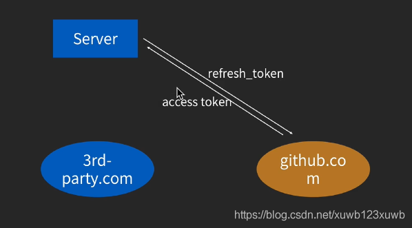

# 方式一、Basic【token】
collapsed:: true
	- ## 格式
		- Authorization: Basic username:password(Base64ed)     【把用户名密码经过base64编码 与Basic用空格分开】
	- ## 例如
		- Authorization: Basic xxxxxx  【xxxxxx  就是 用户名密码经过base64编码 与Basic用空格分开 】
	- ## 缺点：
		- token泄密风险 因为是base64编码的   拿到token 可以解码    【还算安全的  缺点都还好】
		- 1、传输时 使用http 可能被截获  【解决方法 使用https】
		- 2、token  存在手机里可能被破解 【用户手机root了 ，，自己放弃安全 也还好】
- # 方式二、Bearer【token】
	- ## 格式：
		- Authorization: Bearer  xxxxxx  【xxxxxx  这个token是OAuth2流程  授权方给你的  你存起来就行了 通过 OAuth2 的授权流程获取】
- # 三、OAuth2授权工作原理：
  collapsed:: true
	- ## **使用 OAuth前 准备工作：**
		- 在[[#red]]==**第三⽅⽹站（比如掘金）**==向授权⽅⽹站（github）申请第三⽅授权合作，拿到 client id 和 client secret
		- 申请回来的client id 是给浏览器或者客户端用的
		- client secret 是给第三方网站比如掘金的服务器用的
	- # 授权流程
		- 1  ⽤户在使⽤第三⽅⽹站【比如掘金】时，点击「通过 第三方 (如 GitHub) 授权」按钮，这时候 页面会从掘金 跳到 github ;   并给github 传⼊   client id 【当初掘金在 github 申请合作时  给的】作为⾃⼰的身份标识
		- 2  github根据 client id ，将掘金的信息【比如图标名字】和掘金需要的⽤户权 限展示给⽤户，并询问⽤户是否同意授权
		- 3  ⽤户点击「同意授权」按钮后，github 将⻚⾯跳转回掘金，并给掘金网页传入  Authorization code 作为⽤户认可的凭证。
		- 4 掘金这个 ⽹站将 Authorization code 发送回⾃⼰的服务器
		- 5  服务器将 Authorization code 和⾃⼰的 client secret ⼀并发送给授权⽅的 服务器【这个用来获取token必须使用https】，授权⽅服务器在验证通过后，返回 access token 【这个就作为用户授权的令牌，服务器就可以随时获得用户在github上的信息了 比如头像名字】   。
		  OAuth授权  流程结 束
	- # 授权完成后开始登陆：【这个就不属于 OAuth授权  流程      属于第三方登录 】
		- 1、掘金的服务器（或者有时客户端也会）就可 以使⽤ access token 作为⽤户授权的令牌，向授权⽅⽹站github  发送请求【把token 放在 header 为 Authorization: Bearer  token 里  】来获取⽤户信息或操作⽤户账户；
		- 2、服务器拿到用户信息后，给用户在自己服务器这里 创建账户， 把注册后的信息，token 一并 返给给掘金网页，完成登录
- # 四、[[OAuth2之微信登录授权流程]]
- # 五、刷新Token
  collapsed:: true
	- 
	- 服务器 去找 微信 去刷新 token     目的安全；