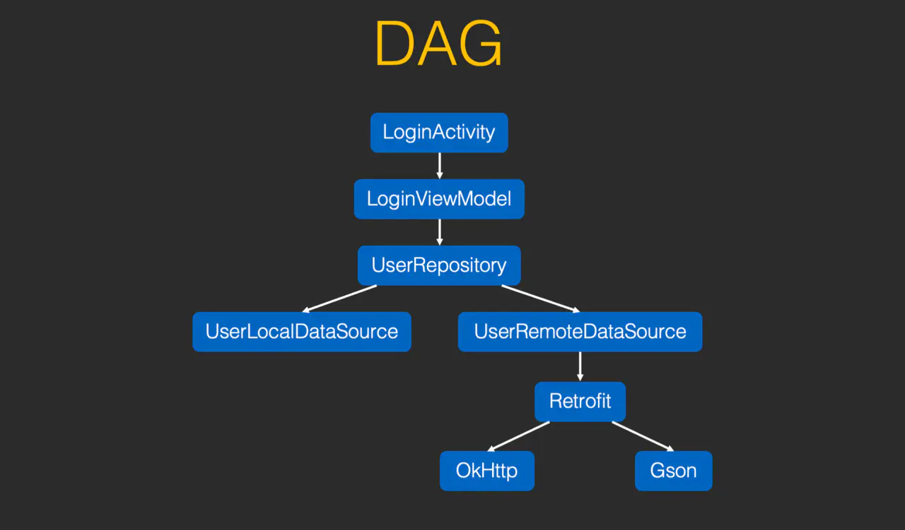
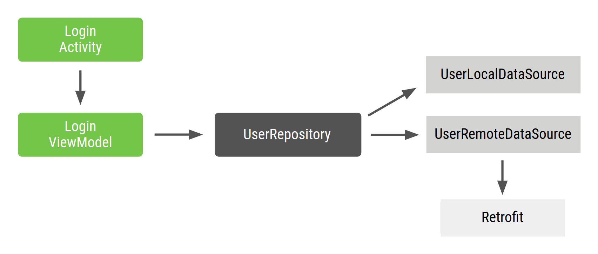

- ## 依赖注入方式
	- 下面我们以一个登录页面为例，登录页面LoginActivity内部变量引用如下图：
	  collapsed:: true
		- 
	- LoginActivity中需要引用LoginViewModel，LoginViewModel内部包含了UserRepository,Repository呢需要传入2中数据来源：UserLocalDataSource和UserRemoteDataSource
	  collapsed:: true
		- 
	- LoginActivity 是登录流程的入口点，用户与 Activity 进行交互。因此，LoginActivity 需要创建 LoginViewModel 及其所有依赖项。
	- 以Repository看一下Repository类的2种设置DataSource方式：
	  collapsed:: true
		- ```
		  class UserRepository{
		    //方式1：内部直接初始化DataSource
		    val userLocalDataSource = UserLocalDataSource()
		    val userRemoteDataSource = UserRemoteDataSource()
		    //...todo...
		    fun getUserDataFromLocal(userID:String){
		      var user = userLocalDataSource.loadUserById(userID)
		      //...
		    }
		  }
		  ```