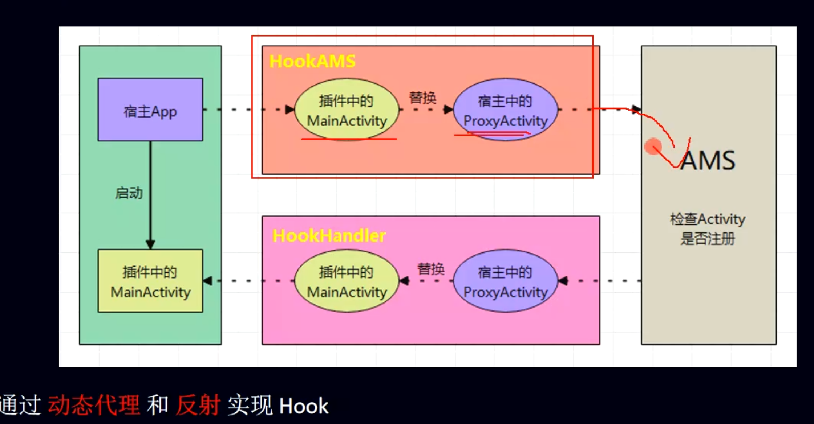

# 前提，熟悉[[Activity启动流程]]
- # 准备工作
	- 1，一个注册在清单的[[#red]]==**占位activity**==：StubActivity
	- 2、一个目标activity（比如插件APK里的Activity），偷梁换柱待启动这个
- # 思路：比如startActivity简单流程，寻找hook点
	- 
	- -> AMS(验证activity是否注册)
		- 由Activity的启动流程
		- 这一步不能传未注册的activity（TargetActivity）需要传StubActivity，会被检测到
		- 传注册的activity，AMS检测启动结果一定是res sucess 成功的
		- [[#red]]==**Hook点传个已注册的activity**==，具体操作就是动态代理，[[#red]]==**hook ActivityManager**==,修改Intent中传入的Activity
		  collapsed:: true
			- ```java
			      private static final String TARGET_INTENT = "target_intent";
			  
			      public static void hookAMS() {
			          try {
			              // 获取 singleton 对象
			              Field singletonField = null;
			              if (Build.VERSION.SDK_INT < Build.VERSION_CODES.O) { // 小于8.0
			                  Class<?> clazz = Class.forName("android.app.ActivityManagerNative");
			                  singletonField = clazz.getDeclaredField("gDefault");
			              } else {
			                  Class<?> clazz = Class.forName("android.app.ActivityManager");
			                  singletonField = clazz.getDeclaredField("IActivityManagerSingleton");
			              }
			  
			              singletonField.setAccessible(true);
			              Object singleton = singletonField.get(null);
			  
			              // 获取 系统的 IActivityManager 对象
			              Class<?> singletonClass = Class.forName("android.util.Singleton");
			              Field mInstanceField = singletonClass.getDeclaredField("mInstance");
			              mInstanceField.setAccessible(true);
			              final Object mInstance = mInstanceField.get(singleton);
			  
			              Class<?> iActivityManagerClass = Class.forName("android.app.IActivityManager");
			  
			              // 创建动态代理对象
			              Object proxyInstance = Proxy.newProxyInstance(Thread.currentThread().getContextClassLoader(),
			                      new Class[]{iActivityManagerClass}, new InvocationHandler() {
			                          @Override
			                          public Object invoke(Object proxy, Method method, Object[] args) throws Throwable {
			                              // do something
			                              // Intent的修改 -- 过滤
			                              /**
			                               * IActivityManager类的方法
			                               * startActivity(whoThread, who.getBasePackageName(), intent,
			                               *                         intent.resolveTypeIfNeeded(who.getContentResolver()),
			                               *                         token, target != null ? target.mEmbeddedID : null,
			                               *                         requestCode, 0, null, options)
			                               */
			                              // 过滤
			                              if ("startActivity".equals(method.getName())) {
			                                  int index = -1;
			  
			                                  for (int i = 0; i < args.length; i++) {
			                                      if (args[i] instanceof Intent) {
			                                          index = i;
			                                          break;
			                                      }
			                                  }
			                                  // 启动插件的
			                                  Intent intent = (Intent) args[index];
			  
			                                  Intent proxyIntent = new Intent();
			                                  proxyIntent.setClassName("com.enjoy.leo_plugin",
			                                          "com.enjoy.leo_plugin.ProxyActivity");
			  
			                                  proxyIntent.putExtra(TARGET_INTENT, intent);
			  
			                                  args[index] = proxyIntent;
			                              }
			  
			                              // args  method需要的参数  --- 不改变原有的执行流程
			                              // mInstance 系统的 IActivityManager 对象
			                              return method.invoke(mInstance, args);
			                          }
			                      });
			  
			              // ActivityManager.getService() 替换成 proxyInstance
			              mInstanceField.set(singleton, proxyInstance);
			  
			          } catch (Exception e) {
			              e.printStackTrace();
			          }
			      }
			  
			  ```
	- -> 回到app进程后（Instrumentation 创建Activity）
		- 这里回到app时，activity信息是StubActivity
		- [[#red]]==**hook点：stubActivity替换回targetActivity**==,==**hook点handler**==
		  collapsed:: true
			- ```java
			  public static void hookHandler() {
			          try {
			              // 获取 ActivityThread 类的 Class 对象
			              Class<?> clazz = Class.forName("android.app.ActivityThread");
			  
			              // 获取 ActivityThread 对象
			              Field activityThreadField = clazz.getDeclaredField("sCurrentActivityThread");
			              activityThreadField.setAccessible(true);
			              Object activityThread = activityThreadField.get(null);
			  
			              // 获取 mH 对象
			              Field mHField = clazz.getDeclaredField("mH");
			              mHField.setAccessible(true);
			              final Handler mH = (Handler) mHField.get(activityThread);
			  
			              Field mCallbackField = Handler.class.getDeclaredField("mCallback");
			              mCallbackField.setAccessible(true);
			  
			              // 创建的 callback
			              Handler.Callback callback = new Handler.Callback() {
			  
			                  @Override
			                  public boolean handleMessage(@NonNull Message msg) {
			                      // 通过msg  可以拿到 Intent，可以换回执行插件的Intent
			  
			                      // 找到 Intent的方便替换的地方  --- 在这个类里面 ActivityClientRecord --- Intent intent 非静态
			                      // msg.obj == ActivityClientRecord
			                      switch (msg.what) {
			                          case 100:
			                              try {
			                                  Field intentField = msg.obj.getClass().getDeclaredField("intent");
			                                  intentField.setAccessible(true);
			                                  // 启动代理Intent
			                                  Intent proxyIntent = (Intent) intentField.get(msg.obj);
			                                  // 启动插件的 Intent
			                                  Intent intent = proxyIntent.getParcelableExtra(TARGET_INTENT);
			                                  if (intent != null) {
			                                      intentField.set(msg.obj, intent);
			                                  }
			                              } catch (Exception e) {
			                                  e.printStackTrace();
			                              }
			                              break;
			                          case 159:
			                              try {
			                                  // 获取 mActivityCallbacks 对象
			                                  Field mActivityCallbacksField = msg.obj.getClass()
			                                          .getDeclaredField("mActivityCallbacks");
			  
			                                  mActivityCallbacksField.setAccessible(true);
			                                  List mActivityCallbacks = (List) mActivityCallbacksField.get(msg.obj);
			  
			                                  for (int i = 0; i < mActivityCallbacks.size(); i++) {
			                                      if (mActivityCallbacks.get(i).getClass().getName()
			                                              .equals("android.app.servertransaction.LaunchActivityItem")) {
			                                          Object launchActivityItem = mActivityCallbacks.get(i);
			  
			                                          // 获取启动代理的 Intent
			                                          Field mIntentField = launchActivityItem.getClass()
			                                                  .getDeclaredField("mIntent");
			                                          mIntentField.setAccessible(true);
			                                          Intent proxyIntent = (Intent) mIntentField.get(launchActivityItem);
			  
			                                          // 目标 intent 替换 proxyIntent
			                                          Intent intent = proxyIntent.getParcelableExtra(TARGET_INTENT);
			                                          if (intent != null) {
			                                              mIntentField.set(launchActivityItem, intent);
			                                          }
			                                      }
			                                  }
			                              } catch (Exception e) {
			                                  e.printStackTrace();
			                              }
			                              break;
			                      }
			                      // 必须 return false
			                      return false;
			                  }
			              };
			  
			              // 替换系统的 callBack
			              mCallbackField.set(mH, callback);
			          } catch (Exception e) {
			              e.printStackTrace();
			          }
			      }
			  ```
	- -> AMS 控制 Instrumentation 执行Activity生命周期
-
- # [[查找Hook点的原则]]
- # [[插件化启动插件里的Activity，动态代理实现hook]]