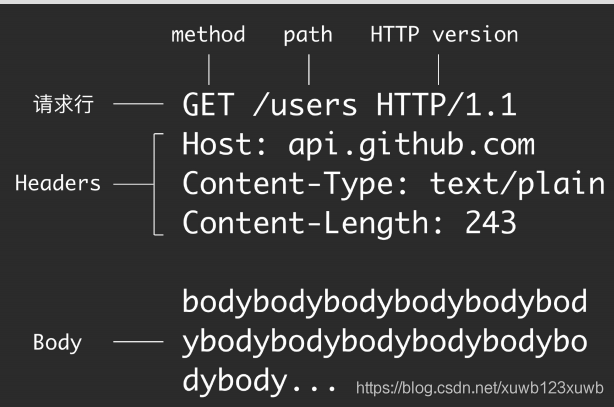

- 
- # 一、请求行
	- ## 1、[[method的请求方法]]
	- ## 2、path路径
		- 作用是让服务器定位资源的   比如/user/1      找到 userId=1 那个用户
	- ## 3、Http版本号
- # 二、请求头headers
- # 三、[[#red]]==请求体Body数据和path里的数据区别？==
	- 这里的数据是传给服务器 让他去处理 操作的；
	- 而path里的数据 是 给服务器 定位资源用的