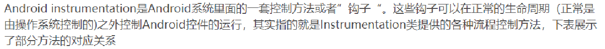

- 
- "Instrumentation" 是 Android 系统中的一个重要概念，它用于实现对应用程序组件（如 Activity、Service、BroadcastReceiver 等）的监控和控制。
- Instrumentation 允许开发者在应用程序的运行过程中插入自定义的代码，以便监测和干预应用程序的行为。它提供了一种机制，可以在不修改应用程序源代码的情况下，对应用程序进行动态的、非侵入性的操作。
- 具体来说，Instrumentation 可以用于以下方面：
- 监测应用程序组件的生命周期：通过 Instrumentation，开发者可以在应用程序组件的生命周期方法（如 onCreate()、onStart()、onPause() 等）的执行过程中插入自定义代码，以实现对应用程序的监控和记录。
- 监测应用程序的方法调用：开发者可以使用 Instrumentation 来监测应用程序内部方法的调用情况，以实现性能分析、错误追踪等功能。
- 修改应用程序的行为：Instrumentation 还允许开发者在应用程序运行过程中修改应用程序的行为。例如，可以在某个方法调用前后进行拦截和修改，或者替换原有的实现逻辑。
- Instrumentation 主要是在开发者进行应用程序的测试、调试、性能优化和监控等方面发挥作用。它通过为应用程序提供钩子（hook）点，使得开发者能够在不改变应用程序源代码的情况下，对应用程序的执行过程进行定制和控制。