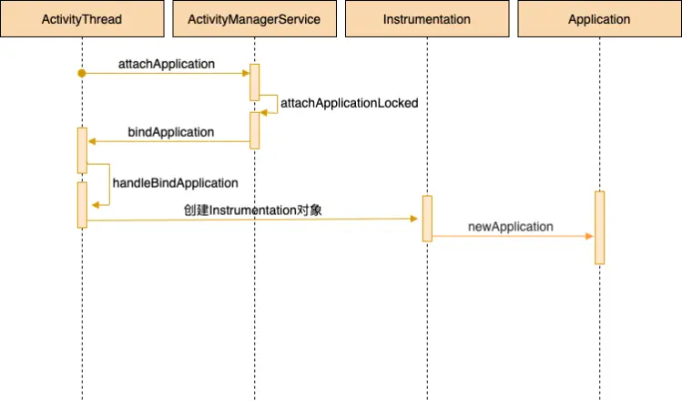

- 
- ## 接上次AMS通过socket和Zygeto进程通信，fork新进程后
- ## 1、通过反射加载ActivityThread类并执行其静态main方法，是应用程序的主入口
- ## 2、ActivityThread.main()创建app主线程ActivityThread，并调用attach方法
  collapsed:: true
	- ActivityThread.main()
	- ```java
	  public static void main(String[] args) {
	          // xxx
	          Looper.prepareMainLooper();
	  
	         
	          ActivityThread thread = new ActivityThread();
	          thread.attach(false, startSeq);
	  
	          if (sMainThreadHandler == null) {
	              sMainThreadHandler = thread.getHandler();
	          }
	  
	          Looper.loop();
	  
	          throw new RuntimeException("Main thread loop unexpectedly exited");
	      }
	  ```
- ## 3、ActivityThread.attach()的方法调用ActivityManagerService的attchApplication方法，创建Instrumentation和Application
	- Activityt.Attach
	  collapsed:: true
		- ```java
		  private void attach(boolean system) {
		      sCurrentActivityThread = this;
		      // 是否是系统进程
		      mSystemThread = system;
		      if (!system) {
		          ViewRootImpl.addFirstDrawHandler(new Runnable() {
		              @Override
		              public void run() {
		                  ensureJitEnabled();
		              }
		          });
		          // 暂时设置进程的名字为<pre-initialized>
		          android.ddm.DdmHandleAppName.setAppName("<pre-initialized>",
		                                                  UserHandle.myUserId());
		          RuntimeInit.setApplicationObject(mAppThread.asBinder());
		          // 调用AMS
		          final IActivityManager mgr = ActivityManagerNative.getDefault();
		          try {
		              mgr.attachApplication(mAppThread);
		          } catch (RemoteException ex) {}
		          // GC检测
		          BinderInternal.addGcWatcher(new Runnable() {
		              @Override public void run() {
		                  if (!mSomeActivitiesChanged) {
		                      return;
		                  }
		                  Runtime runtime = Runtime.getRuntime();
		                  long dalvikMax = runtime.maxMemory();
		                  long dalvikUsed = runtime.totalMemory() - runtime.freeMemory();
		                  if (dalvikUsed > ((3*dalvikMax)/4)) {
		                      //当已用内存超过最大内存的3/4,则请求释放内存空间
		                      mSomeActivitiesChanged = false;
		                      try {
		                          mgr.releaseSomeActivities(mAppThread);
		                      } catch (RemoteException e) {
		                      }
		                  }
		              }
		          });
		      } else {
		          // 如果是系统进程，设置名称为system_process
		          android.ddm.DdmHandleAppName.setAppName("system_process",
		                  UserHandle.myUserId());
		          // 初始化mInstrumentation和mInitialApplication
		          // 非系统进程这些对象的初始化在handleBindApplication()中进行
		          try {
		              mInstrumentation = new Instrumentation();
		              ContextImpl context = ContextImpl.createAppContext(
		                      this, getSystemContext().mPackageInfo);
		              mInitialApplication = context.mPackageInfo.makeApplication(true, null);
		              mInitialApplication.onCreate();
		          } catch (Exception e) {...}
		      }
		      DropBox.setReporter(new DropBoxReporter());
		      // 这里要快速的设置Config回调
		      ViewRootImpl.addConfigCallback(new ComponentCallbacks2() {
		          @Override
		          public void onConfigurationChanged(Configuration newConfig) {
		              synchronized (mResourcesManager) {
		                  // 快速响应onConfigurationChanged
		                  if (mResourcesManager.applyConfigurationToResourcesLocked(newConfig, null)) {
		                      if (mPendingConfiguration == null ||
		                              mPendingConfiguration.isOtherSeqNewer(newConfig)) {
		                          mPendingConfiguration = newConfig;
		                          sendMessage(H.CONFIGURATION_CHANGED, newConfig);
		                      }
		                  }
		              }
		          }
		          @Override
		          public void onLowMemory() {
		          }
		          @Override
		          public void onTrimMemory(int level) {
		          }
		      });
		  }
		  ```
	- ActivityThread.attach()的方法调用ActivityManagerService的attchApplication方法，来去创建Instrumentation和Application，[[Instrumentation]]的作用是监视应用程序和系统的所有交互，文章一开始已经介绍，所以我们一定要了解到它的创建和执行流程；
- ## 4、AMS.attchApplication,进行binder通信，出于安全考虑会校验uid权限
	- ```java
	  @Override
	      public final void attachApplication(IApplicationThread thread, long startSeq) {
	          if (thread == null) {
	              throw new SecurityException("Invalid application interface");
	          }
	          synchronized (this) {
	              int callingPid = Binder.getCallingPid();
	              final int callingUid = Binder.getCallingUid();
	              final long origId = Binder.clearCallingIdentity();
	              attachApplicationLocked(thread, callingPid, callingUid, startSeq);
	              Binder.restoreCallingIdentity(origId);
	          }
	      }
	  ```
- ## 5、AMS.attachApplicationLocked进入 thread.bindApplication(）发起跨进程调用。绑定应用进程，发送一些参数给应用进程
	- ```java
	  private final boolean attachApplicationLocked(IApplicationThread thread,
	          int pid) {
	      // 根据pid获取应用的ProcessRecord
	      ProcessRecord app;
	      if (pid != MY_PID && pid >= 0) {
	          synchronized (mPidsSelfLocked) {
	              app = mPidsSelfLocked.get(pid);
	          }
	      } else {
	          app = null;
	      }
	      ...
	          // 发起跨进程调用。绑定应用进程，发送一些参数给应用进程
	          thread.bindApplication(processName, appInfo, providers, app.instrumentationClass,
	                  profilerInfo, app.instrumentationArguments, app.instrumentationWatcher,
	                  app.instrumentationUiAutomationConnection, testMode, enableOpenGlTrace,
	                  isRestrictedBackupMode || !normalMode, app.persistent,
	                  new Configuration(mConfiguration), app.compat,
	                  getCommonServicesLocked(app.isolated),
	                  mCoreSettingsObserver.getCoreSettingsLocked());
	          updateLruProcessLocked(app, false, null);
	          app.lastRequestedGc = app.lastLowMemory = SystemClock.uptimeMillis();
	      } catch (Exception e) {
	          // 绑定失败这里会重启进程
	          app.resetPackageList(mProcessStats);
	          app.unlinkDeathRecipient();
	          startProcessLocked(app, "bind fail", processName);
	          return false;
	      }
	      // 把进程从待启动进程列表中移除
	      mPersistentStartingProcesses.remove(app);
	      mProcessesOnHold.remove(app);
	      boolean badApp = false;
	      boolean didSomething = false;
	     // 从这一步开始处理启动Activity
	      if (normalMode) {
	          try {
	              if (mStackSupervisor.attachApplicationLocked(app)) {
	                  didSomething = true;
	              }
	          } catch (Exception e) {
	              badApp = true;
	          }
	      }
	     // 处理Service
	      if (!badApp) {
	          try {
	              didSomething |= mServices.attachApplicationLocked(app, processName);
	          } catch (Exception e) {
	              badApp = true;
	          }
	      }
	      // 处理Broadcast
	      if (!badApp && isPendingBroadcastProcessLocked(pid)) {
	          try {
	              didSomething |= sendPendingBroadcastsLocked(app);
	          } catch (Exception e) {
	              badApp = true;
	          }
	      }
	  
	      ...
	      return true;
	  }
	  ```
- ## 6、从此进入app进程：1.（ApplicationThread）thread.bindApplication()
  collapsed:: true
	- 1、ApplicationTread是ActivityThread的内部类
	  collapsed:: true
		- ```java
		  private class ApplicationThread extends IApplicationThread.Stub {
		      private static final String DB_INFO_FORMAT = "  %8s %8s %14s %14s  %s";
		  
		      @Override
		      public final void bindApplication(String processName, ApplicationInfo appInfo,
		              ProviderInfoList providerList, ComponentName instrumentationName,
		              ProfilerInfo profilerInfo, Bundle instrumentationArgs,
		              IInstrumentationWatcher instrumentationWatcher,
		              IUiAutomationConnection instrumentationUiConnection, int debugMode,
		              boolean enableBinderTracking, boolean trackAllocation,
		              boolean isRestrictedBackupMode, boolean persistent, Configuration config,
		              CompatibilityInfo compatInfo, Map services, Bundle coreSettings,
		              String buildSerial, AutofillOptions autofillOptions,
		              ContentCaptureOptions contentCaptureOptions, long[] disabledCompatChanges) {
		          if (services != null) {
		              if (false) {
		                  // Test code to make sure the app could see the passed-in services.
		                  for (Object oname : services.keySet()) {
		                      if (services.get(oname) == null) {
		                          continue; // AM just passed in a null service.
		                      }
		                      String name = (String) oname;
		  
		                      // See b/79378449 about the following exemption.
		                      switch (name) {
		                          case "package":
		                          case Context.WINDOW_SERVICE:
		                              continue;
		                      }
		  
		                      if (ServiceManager.getService(name) == null) {
		                          Log.wtf(TAG, "Service " + name + " should be accessible by this app");
		                      }
		                  }
		              }
		  
		              // Setup the service cache in the ServiceManager
		              ServiceManager.initServiceCache(services);
		          }
		  
		          setCoreSettings(coreSettings);
		  
		          AppBindData data = new AppBindData();
		          data.processName = processName;
		          data.appInfo = appInfo;
		          data.providers = providerList.getList();
		          data.instrumentationName = instrumentationName;
		          data.instrumentationArgs = instrumentationArgs;
		          data.instrumentationWatcher = instrumentationWatcher;
		          data.instrumentationUiAutomationConnection = instrumentationUiConnection;
		          data.debugMode = debugMode;
		          data.enableBinderTracking = enableBinderTracking;
		          data.trackAllocation = trackAllocation;
		          data.restrictedBackupMode = isRestrictedBackupMode;
		          data.persistent = persistent;
		          data.config = config;
		          data.compatInfo = compatInfo;
		          data.initProfilerInfo = profilerInfo;
		          data.buildSerial = buildSerial;
		          data.autofillOptions = autofillOptions;
		          data.contentCaptureOptions = contentCaptureOptions;
		          data.disabledCompatChanges = disabledCompatChanges;
		          sendMessage(H.BIND_APPLICATION, data);
		      }
		  }
		  ```
	- 2、bindApplication里 sendMessage(H.BIND_APPLICATION, data)，发送给内部类Handler处理
		- ```java
		  class H extends Handler {
		  public void handleMessage(Message msg) {
		          if (DEBUG_MESSAGES) Slog.v(TAG, ">>> handling: " + codeToString(msg.what));
		          switch (msg.what) {
		              case BIND_APPLICATION:
		                  Trace.traceBegin(Trace.TRACE_TAG_ACTIVITY_MANAGER, "bindApplication");
		                  AppBindData data = (AppBindData)msg.obj;
		                  handleBindApplication(data);
		                  Trace.traceEnd(Trace.TRACE_TAG_ACTIVITY_MANAGER);
		                  break;
		          }
		          ......
		  }
		  }
		  ```
- ## 7、进入ActivityThread.handleBindApplication()最终创建Instrumentacion和Application
  collapsed:: true
	- ActivityThread.handleBindApplication
		- ```java
		  private void handleBindApplication(AppBindData data) {
		          // Register the UI Thread as a sensitive thread to the runtime.
		          VMRuntime.registerSensitiveThread();
		          // In the case the stack depth property exists, pass it down to the runtime.
		          String property = SystemProperties.get("debug.allocTracker.stackDepth");
		          if (property.length() != 0) {
		              VMDebug.setAllocTrackerStackDepth(Integer.parseInt(property));
		          }
		          if (data.trackAllocation) {
		              DdmVmInternal.enableRecentAllocations(true);
		          }
		          // Note when this process has started.
		          Process.setStartTimes(SystemClock.elapsedRealtime(), SystemClock.uptimeMillis());
		  
		          AppCompatCallbacks.install(data.disabledCompatChanges);
		          // Let libcore handle any compat changes after installing the list of compat changes.
		          AppSpecializationHooks.handleCompatChangesBeforeBindingApplication();
		  
		          mBoundApplication = data;
		          mConfiguration = new Configuration(data.config);
		          mCompatConfiguration = new Configuration(data.config);
		  
		          mProfiler = new Profiler();
		      // 创建Context上下文
		          final ContextImpl appContext = ContextImpl.createAppContext(this, data.info);
		          if (!Process.isIsolated()) {
		              ......
		          }
		  
		          .....
		  
		          // Instrumentation info affects the class loader, so load it before
		          // setting up the app context.
		          final InstrumentationInfo ii;
		          if (data.instrumentationName != null) {
		              try {
		                  ii = new ApplicationPackageManager(
		                          null, getPackageManager(), getPermissionManager())
		                          .getInstrumentationInfo(data.instrumentationName, 0);
		              } catch (PackageManager.NameNotFoundException e) {
		                  throw new RuntimeException(
		                          "Unable to find instrumentation info for: " + data.instrumentationName);
		              }
		  
		              // Warn of potential ABI mismatches.
		              if (!Objects.equals(data.appInfo.primaryCpuAbi, ii.primaryCpuAbi)
		                      || !Objects.equals(data.appInfo.secondaryCpuAbi, ii.secondaryCpuAbi)) {
		                  Slog.w(TAG, "Package uses different ABI(s) than its instrumentation: "
		                          + "package[" + data.appInfo.packageName + "]: "
		                          + data.appInfo.primaryCpuAbi + ", " + data.appInfo.secondaryCpuAbi
		                          + " instrumentation[" + ii.packageName + "]: "
		                          + ii.primaryCpuAbi + ", " + ii.secondaryCpuAbi);
		              }
		  
		              mInstrumentationPackageName = ii.packageName;
		              mInstrumentationAppDir = ii.sourceDir;
		              mInstrumentationSplitAppDirs = ii.splitSourceDirs;
		              mInstrumentationLibDir = getInstrumentationLibrary(data.appInfo, ii);
		              mInstrumentedAppDir = data.info.getAppDir();
		              mInstrumentedSplitAppDirs = data.info.getSplitAppDirs();
		              mInstrumentedLibDir = data.info.getLibDir();
		          } else {
		              ii = null;
		          }
		  
		          .....
		  
		          // Continue loading instrumentation.
		          if (ii != null) {
		              ApplicationInfo instrApp;
		              try {
		                  instrApp = getPackageManager().getApplicationInfo(ii.packageName, 0,
		                          UserHandle.myUserId());
		              } catch (RemoteException e) {
		                  instrApp = null;
		              }
		              if (instrApp == null) {
		                  instrApp = new ApplicationInfo();
		              }
		              ii.copyTo(instrApp);
		              instrApp.initForUser(UserHandle.myUserId());
		              final LoadedApk pi = getPackageInfo(instrApp, data.compatInfo,
		                      appContext.getClassLoader(), false, true, false);
		  
		              // The test context\'s op package name == the target app\'s op package name, because
		              // the app ops manager checks the op package name against the real calling UID,
		              // which is what the target package name is associated with.
		              final ContextImpl instrContext = ContextImpl.createAppContext(this, pi,
		                      appContext.getOpPackageName());
		  
		              try {
		                  final ClassLoader cl = instrContext.getClassLoader();
		                  // 创建Instrumentation 
		                  mInstrumentation = (Instrumentation)
		                      cl.loadClass(data.instrumentationName.getClassName()).newInstance();
		              } catch (Exception e) {
		                  throw new RuntimeException(
		                      "Unable to instantiate instrumentation "
		                      + data.instrumentationName + ": " + e.toString(), e);
		              }
		  
		              final ComponentName component = new ComponentName(ii.packageName, ii.name);
		              mInstrumentation.init(this, instrContext, appContext, component,
		                      data.instrumentationWatcher, data.instrumentationUiAutomationConnection);
		  
		              if (mProfiler.profileFile != null && !ii.handleProfiling
		                      && mProfiler.profileFd == null) {
		                  mProfiler.handlingProfiling = true;
		                  final File file = new File(mProfiler.profileFile);
		                  file.getParentFile().mkdirs();
		                  Debug.startMethodTracing(file.toString(), 8 * 1024 * 1024);
		              }
		          } else {
		              // 初始化mInstrumentation
		              mInstrumentation = new Instrumentation();
		              mInstrumentation.basicInit(this);
		          }
		          .....
		  
		          // Allow disk access during application and provider setup. This could
		          // block processing ordered broadcasts, but later processing would
		          // probably end up doing the same disk access.
		          Application app;
		          final StrictMode.ThreadPolicy savedPolicy = StrictMode.allowThreadDiskWrites();
		          final StrictMode.ThreadPolicy writesAllowedPolicy = StrictMode.getThreadPolicy();
		          try {
		  
		              //创建Application
		              app = data.info.makeApplication(data.restrictedBackupMode, null);
		  
		              // Propagate autofill compat state
		              app.setAutofillOptions(data.autofillOptions);
		  
		              // Propagate Content Capture options
		              app.setContentCaptureOptions(data.contentCaptureOptions);
		  
		              mInitialApplication = app;
		  
		              // 装载Providers
		              if (!data.restrictedBackupMode) {
		                  if (!ArrayUtils.isEmpty(data.providers)) {
		                      installContentProviders(app, data.providers);
		                  }
		              }
		  
		              // Do this after providers, since instrumentation tests generally start their
		              // test thread at this point, and we don\'t want that racing.
		              try {
		                  mInstrumentation.onCreate(data.instrumentationArgs);
		              }
		              catch (Exception e) {
		                  throw new RuntimeException(
		                      "Exception thrown in onCreate() of "
		                      + data.instrumentationName + ": " + e.toString(), e);
		              }
		              try {
		                  mInstrumentation.callApplicationOnCreate(app);
		              } catch (Exception e) {
		                  if (!mInstrumentation.onException(app, e)) {
		                      throw new RuntimeException(
		                        "Unable to create application " + app.getClass().getName()
		                        + ": " + e.toString(), e);
		                  }
		              }
		          } finally {
		              // If the app targets < O-MR1, or doesn\'t change the thread policy
		              // during startup, clobber the policy to maintain behavior of b/36951662
		              if (data.appInfo.targetSdkVersion < Build.VERSION_CODES.O_MR1
		                      || StrictMode.getThreadPolicy().equals(writesAllowedPolicy)) {
		                  StrictMode.setThreadPolicy(savedPolicy);
		              }
		          }
		  
		          // Preload fonts resources
		          FontsContract.setApplicationContextForResources(appContext);
		          if (!Process.isIsolated()) {
		              try {
		                  final ApplicationInfo info =
		                          getPackageManager().getApplicationInfo(
		                                  data.appInfo.packageName,
		                                  PackageManager.GET_META_DATA /*flags*/,
		                                  UserHandle.myUserId());
		                  if (info.metaData != null) {
		                      final int preloadedFontsResource = info.metaData.getInt(
		                              ApplicationInfo.METADATA_PRELOADED_FONTS, 0);
		                      if (preloadedFontsResource != 0) {
		                          data.info.getResources().preloadFonts(preloadedFontsResource);
		                      }
		                  }
		              } catch (RemoteException e) {
		                  throw e.rethrowFromSystemServer();
		              }
		          }
		      }
		  ```
	- 1、[[#red]]==**创建一个Instrumentation**==
	- 2、data.info = getPackageInfoNoCheck  获取LoadedApk对象
		- 创建LoadedApk对象,并将将新创建的LoadedApk加入到mPackages. 也就是说每个app都会创建唯一的LoadedApk对象
	- 3、ContextImpl.createAppContext  创建ContextImpl上下文
	- 4、[[#red]]==**data.info.makeApplication 通过反射创建目标应用Application对象**==
	- 5、mInstrumentation.callApplicationOnCreate
		- app.onCreate 常见的application的oncreate就是这里调用的
- ## 8、data.info.makeApplication Instrumentation 通过反射创建目标应用Application对象
  collapsed:: true
	- Instrumentation
	- ```java
	  public Application newApplication(ClassLoader cl, String className, Context context)
	              throws InstantiationException, IllegalAccessException, 
	              ClassNotFoundException {
	          Application app = getFactory(context.getPackageName())
	                  .instantiateApplication(cl, className);
	          app.attach(context);
	          return app;
	      }
	  ```
	- Application.attach()会触发其attachBaseContext(context)方法，[[#red]]==**Application的生命周期由Instrumentation触发。**==