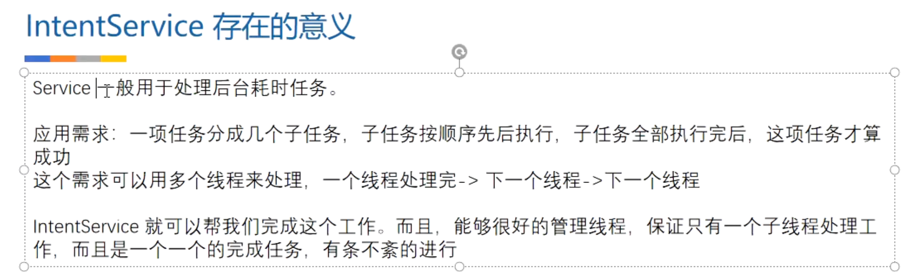

# 一、IntentService存在的意义
	- 
- # 二、源码:里边创建了HandlerThread
  collapsed:: true
	- ```java
	  public abstract class IntentService extends Service {
	      private volatile Looper mServiceLooper;
	      @UnsupportedAppUsage
	      private volatile ServiceHandler mServiceHandler;
	      private String mName;
	      private boolean mRedelivery;
	  
	      // 子线程的handler
	      private final class ServiceHandler extends Handler {
	          public ServiceHandler(Looper looper) {
	              super(looper);
	          }
	          
	         //接受一个消息，执行异步任务，所有任务执行完停止服务
	          @Override
	          public void handleMessage(Message msg) {
	              onHandleIntent((Intent)msg.obj);
	              stopSelf(msg.arg1);
	          }
	      }
	  
	      /**
	       * Creates an IntentService.  Invoked by your subclass's constructor.
	       *
	       * @param name Used to name the worker thread, important only for debugging.
	       */
	      public IntentService(String name) {
	          super();
	          mName = name;
	      }
	  
	      /**
	       * Sets intent redelivery preferences.  Usually called from the constructor
	       * with your preferred semantics.
	       *
	       * <p>If enabled is true,
	       * {@link #onStartCommand(Intent, int, int)} will return
	       * {@link Service#START_REDELIVER_INTENT}, so if this process dies before
	       * {@link #onHandleIntent(Intent)} returns, the process will be restarted
	       * and the intent redelivered.  If multiple Intents have been sent, only
	       * the most recent one is guaranteed to be redelivered.
	       *
	       * <p>If enabled is false (the default),
	       * {@link #onStartCommand(Intent, int, int)} will return
	       * {@link Service#START_NOT_STICKY}, and if the process dies, the Intent
	       * dies along with it.
	       */
	      public void setIntentRedelivery(boolean enabled) {
	          mRedelivery = enabled;
	      }
	  
	    
	      // 创建HandlerThread + handler 维护任务消息队列，可重复启动添加任务
	      @Override
	      public void onCreate() {
	          // TODO: It would be nice to have an option to hold a partial wakelock
	          // during processing, and to have a static startService(Context, Intent)
	          // method that would launch the service & hand off a wakelock.
	  
	          super.onCreate();
	          HandlerThread thread = new HandlerThread("IntentService[" + mName + "]");
	          thread.start();
	  
	          mServiceLooper = thread.getLooper();
	          mServiceHandler = new ServiceHandler(mServiceLooper);
	      }
	  
	      // 启动一次，发一次消息，子线程handler发送消息
	      @Override
	      public void onStart(@Nullable Intent intent, int startId) {
	          Message msg = mServiceHandler.obtainMessage();
	          msg.arg1 = startId;
	          msg.obj = intent;
	          mServiceHandler.sendMessage(msg);
	      }
	  
	      /**
	       * You should not override this method for your IntentService. Instead,
	       * override {@link #onHandleIntent}, which the system calls when the IntentService
	       * receives a start request.
	       * @see android.app.Service#onStartCommand
	       */
	      @Override
	      public int onStartCommand(@Nullable Intent intent, int flags, int startId) {
	          onStart(intent, startId);
	          return mRedelivery ? START_REDELIVER_INTENT : START_NOT_STICKY;
	      }
	  
	      @Override
	      public void onDestroy() {
	          mServiceLooper.quit();
	      }
	  
	      /**
	       * Unless you provide binding for your service, you don't need to implement this
	       * method, because the default implementation returns null.
	       * @see android.app.Service#onBind
	       */
	      @Override
	      @Nullable
	      public IBinder onBind(Intent intent) {
	          return null;
	      }
	  
	      /**
	       * This method is invoked on the worker thread with a request to process.
	       * Only one Intent is processed at a time, but the processing happens on a
	       * worker thread that runs independently from other application logic.
	       * So, if this code takes a long time, it will hold up other requests to
	       * the same IntentService, but it will not hold up anything else.
	       * When all requests have been handled, the IntentService stops itself,
	       * so you should not call {@link #stopSelf}.
	       *
	       * @param intent The value passed to {@link
	       *               android.content.Context#startService(Intent)}.
	       *               This may be null if the service is being restarted after
	       *               its process has gone away; see
	       *               {@link android.app.Service#onStartCommand}
	       *               for details.
	       */
	      @WorkerThread
	      protected abstract void onHandleIntent(@Nullable Intent intent);
	  }
	  
	  ```
- # 三、特点
	- 可以执行耗时任务
	- 执行完所有任务，自动停止service，内存释放
	- 它内部通过HandlerThread和Handler实现异步操作
- # 四、应用场景：上边需求的分几个子任务，按顺序执行
	- 多次启动IntentService，不会重复创建实例，内部是HandlerThread+handler维护一个消息队列、一个实例逐步执行任务。见下边使用
- # 五、使用
	- ==MyIntentService.java==
	  collapsed:: true
		- ```java
		  package com.zejian.handlerlooper;
		  
		  import android.app.IntentService;
		  import android.content.Intent;
		  import android.graphics.Bitmap;
		  import android.graphics.BitmapFactory;
		  import android.os.IBinder;
		  import android.os.Message;
		  
		  import com.zejian.handlerlooper.util.LogUtils;
		  
		  import java.io.BufferedInputStream;
		  import java.io.IOException;
		  import java.net.HttpURLConnection;
		  import java.net.URL;
		  
		  /**
		   * Created by zejian
		   * Time 16/9/3.
		   * Description:
		   */
		  public  class MyIntentService extends IntentService {
		      public static final String DOWNLOAD_URL="download_url";
		      public static final String INDEX_FLAG="index_flag";
		      public static UpdateUI updateUI;
		  
		  
		      public static void setUpdateUI(UpdateUI updateUIInterface){
		          updateUI=updateUIInterface;
		      }
		  
		      public MyIntentService(){
		          super("MyIntentService");
		      }
		  
		      /**
		       * 实现异步任务的方法
		       * @param intent Activity传递过来的Intent,数据封装在intent中
		       */
		      @Override
		      protected void onHandleIntent(Intent intent) {
		  
		          //在子线程中进行网络请求
		          Bitmap bitmap=downloadUrlBitmap(intent.getStringExtra(DOWNLOAD_URL));
		          Message msg1 = new Message();
		          msg1.what = intent.getIntExtra(INDEX_FLAG,0);
		          msg1.obj =bitmap;
		          //通知主线程去更新UI
		          if(updateUI!=null){
		              updateUI.updateUI(msg1);
		          }
		          //mUIHandler.sendMessageDelayed(msg1,1000);
		  
		          LogUtils.e("onHandleIntent");
		      }
		      //----------------------重写一下方法仅为测试------------------------------------------
		      @Override
		      public void onCreate() {
		          LogUtils.e("onCreate");
		          super.onCreate();
		      }
		  
		      @Override
		      public void onStart(Intent intent, int startId) {
		          super.onStart(intent, startId);
		          LogUtils.e("onStart");
		      }
		  
		      @Override
		      public int onStartCommand(Intent intent, int flags, int startId) {
		          LogUtils.e("onStartCommand");
		          return super.onStartCommand(intent, flags, startId);
		  
		      }
		  
		      @Override
		      public void onDestroy() {
		          LogUtils.e("onDestroy");
		          super.onDestroy();
		      }
		  
		      @Override
		      public IBinder onBind(Intent intent) {
		          LogUtils.e("onBind");
		          return super.onBind(intent);
		      }
		  
		  
		      public interface UpdateUI{
		          void updateUI(Message message);
		      }
		  
		  
		      private Bitmap downloadUrlBitmap(String urlString) {
		          HttpURLConnection urlConnection = null;
		          BufferedInputStream in = null;
		          Bitmap bitmap=null;
		          try {
		              final URL url = new URL(urlString);
		              urlConnection = (HttpURLConnection) url.openConnection();
		              in = new BufferedInputStream(urlConnection.getInputStream(), 8 * 1024);
		              bitmap= BitmapFactory.decodeStream(in);
		          } catch (final IOException e) {
		              e.printStackTrace();
		          } finally {
		              if (urlConnection != null) {
		                  urlConnection.disconnect();
		              }
		              try {
		                  if (in != null) {
		                      in.close();
		                  }
		              } catch (final IOException e) {
		                  e.printStackTrace();
		              }
		          }
		          return bitmap;
		      }
		  
		  }
		  ```
	- 通过代码可以看出，我们继承了IntentService，这里有两个方法是必须实现的，一个是构造方法，必须传递一个线程名称的字符串，另外一个就是进行异步处理的方法onHandleIntent(Intent intent) 方法，其参数intent可以附带从activity传递过来的数据。这里我们的案例主要利用onHandleIntent实现异步下载图片，然后通过回调监听的方法把下载完的bitmap放在message中回调给Activity（当然也可以使用广播完成），最后通过Handler去更新UI。下面再来看看Acitvity的代码：
	- ==activity_intent_service.xml==
	  collapsed:: true
		- ```xml
		  <?xml version="1.0" encoding="utf-8"?>
		  <LinearLayout xmlns:android="http://schemas.android.com/apk/res/android"
		      android:orientation="vertical" android:layout_width="match_parent"
		      android:layout_height="match_parent">
		  
		      <ImageView
		          android:id="@+id/image"
		          android:layout_width="match_parent"
		          android:layout_height="match_parent" />
		  </LinearLayout>
		  ```
	- ==IntentServiceActivity.java==
	  collapsed:: true
		- ```java
		  package com.zejian.handlerlooper.util;
		  
		  import android.app.Activity;
		  import android.content.Intent;
		  import android.graphics.Bitmap;
		  import android.os.Bundle;
		  import android.os.Handler;
		  import android.os.Message;
		  import android.widget.ImageView;
		  
		  import com.zejian.handlerlooper.MyIntentService;
		  import com.zejian.handlerlooper.R;
		  
		  /**
		   * Created by zejian
		   * Time 16/9/3.
		   * Description:
		   */
		  public class IntentServiceActivity extends Activity implements MyIntentService.UpdateUI{
		      /**
		       * 图片地址集合
		       */
		      private String url[] = {
		              "https://img-blog.csdn.net/20160903083245762",
		              "https://img-blog.csdn.net/20160903083252184",
		              "https://img-blog.csdn.net/20160903083257871",
		              "https://img-blog.csdn.net/20160903083257871",
		              "https://img-blog.csdn.net/20160903083311972",
		              "https://img-blog.csdn.net/20160903083319668",
		              "https://img-blog.csdn.net/20160903083326871"
		      };
		  
		      private static ImageView imageView;
		      private static final Handler mUIHandler = new Handler() {
		          @Override
		          public void handleMessage(Message msg) {
		              imageView.setImageBitmap((Bitmap) msg.obj);
		          }
		      };
		  
		      @Override
		      protected void onCreate(Bundle savedInstanceState) {
		          super.onCreate(savedInstanceState);
		          setContentView(R.layout.activity_intent_service);
		          imageView = (ImageView) findViewById(R.id.image);
		          
		          
		          Intent intent = new Intent(this,MyIntentService.class);
		          for (int i=0;i<7;i++) {//循环启动任务
		              intent.putExtra(MyIntentService.DOWNLOAD_URL,url[i]);
		              intent.putExtra(MyIntentService.INDEX_FLAG,i);
		              startService(intent);
		          }
		          MyIntentService.setUpdateUI(this);
		      }
		  
		      //必须通过Handler去更新，该方法为异步方法，不可更新UI
		      @Override
		      public void updateUI(Message message) {
		          mUIHandler.sendMessageDelayed(message,message.what * 1000);
		      }
		  }
		  ```
	- new 一个Intent创建一个IntentService实例，多次启动，执行任务，内部有HandlerThread +Handler维护任务消息队列
	- 代码比较简单，通过for循环多次去启动IntentService，然后去下载图片，注意即使我们多次启动IntentService，但IntentService的实例只有一个，这跟传统的Service是一样的，最终IntentService会去调用onHandleIntent执行异步任务。这里可能我们还会担心for循环去启动任务，而实例又只有一个，那么任务会不会被覆盖掉呢？其实是不会的，因为IntentService真正执行异步任务的是HandlerThread+Handler，每次启动都会把下载图片的任务添加到依附的消息队列中，最后由HandlerThread+Handler去执行。好~，我们运行一下代码：
	  collapsed:: true
		- 
	- 从Log可以看出onCreate只启动了一次，而onStartCommand和onStart多次启动，这就证实了之前所说的，启动多次，但IntentService的实例只有一个，这跟传统的Service是一样的，最后任务都执行完成后，IntentService自动销毁。以上便是IntentService德使用方式，怎么样，比较简单吧。接着我们就来分析一下IntentService的源码，其实也比较简单只有100多行代码。
- # 六、总结
	- 1、onHandleIntent方法也是一个异步方法。
	- 2、这里要注意的是如果后台任务只有一个的话，onHandleIntent执行完，服务就会销毁，但如果后台任务有多个的话，onHandleIntent执行完最后一个任务时，服务才销毁。
	- 3、最后我们要知道每次执行一个后台任务就必须启动一次IntentService，而IntentService内部则是通过消息的方式发送给HandlerThread的，然后由Handler中的Looper来处理消息，而Looper是按顺序从消息队列中取任务的，也就是说IntentService的[[#red]]==**后台任务时顺序执行**==的，当有多个后台任务同时存在时，这些后台任务会按外部调用的顺序排队执行
	-