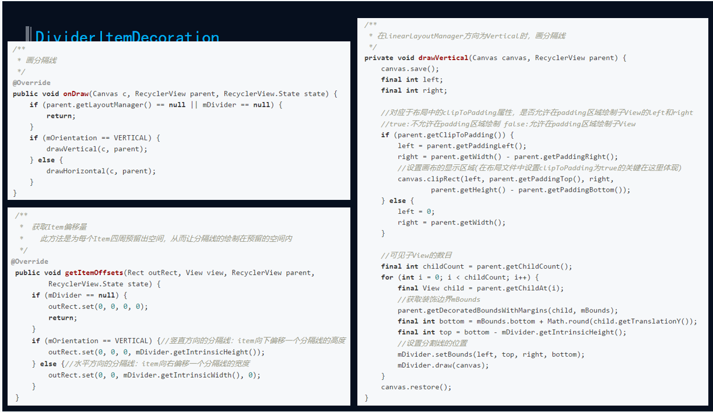

# 简介
	- ItemDecoration 允许应用给具体的View添加具体的图画或者layout的偏移，对于绘制View之间的分割线，视觉分组边界等等是非常有用的。
	  
	  当我们调用addItemDecoration()方法添加decoration的时候，RecyclerView就会调用该类的onDraw方法去绘制分隔线，也就是说：分隔线是绘制出来的。
	  
	  RecyclerView.ItemDecoration，该类为抽象类，官方目前只提供了一个实现类DividerItemDecoration。
- # 源码
	- 代码
	  collapsed:: true
		- ```java
		  
		      public abstract static class ItemDecoration {
		          /**
		            ItemView绘制之前
		            
		           * Draw any appropriate decorations into the Canvas supplied to the RecyclerView.
		           * Any content drawn by this method will be drawn before the item views are drawn,
		           * and will thus appear underneath the views.
		           *
		           * @param c Canvas to draw into
		           * @param parent RecyclerView this ItemDecoration is drawing into
		           * @param state The current state of RecyclerView
		           */
		          public void onDraw(@NonNull Canvas c, @NonNull RecyclerView parent, @NonNull State state) {
		              onDraw(c, parent);
		          }
		  
		  
		          /**
		          	itemView  绘制之后
		          
		          
		           * Draw any appropriate decorations into the Canvas supplied to the RecyclerView.
		           * Any content drawn by this method will be drawn after the item views are drawn
		           * and will thus appear over the views.
		           *
		           * @param c Canvas to draw into
		           * @param parent RecyclerView this ItemDecoration is drawing into
		           * @param state The current state of RecyclerView.
		           */
		          public void onDrawOver(@NonNull Canvas c, @NonNull RecyclerView parent,
		                  @NonNull State state) {
		              onDrawOver(c, parent);
		          }
		  
		          /**
		          	设置 item偏移量
		          
		           * Retrieve any offsets for the given item. Each field of <code>outRect</code> specifies
		           * the number of pixels that the item view should be inset by, similar to padding or margin.
		           * The default implementation sets the bounds of outRect to 0 and returns.
		           *
		           * <p>
		           * If this ItemDecoration does not affect the positioning of item views, it should set
		           * all four fields of <code>outRect</code> (left, top, right, bottom) to zero
		           * before returning.
		           *
		           * <p>
		           * If you need to access Adapter for additional data, you can call
		           * {@link RecyclerView#getChildAdapterPosition(View)} to get the adapter position of the
		           * View.
		           *
		           * @param outRect Rect to receive the output.
		           * @param view    The child view to decorate
		           * @param parent  RecyclerView this ItemDecoration is decorating
		           * @param state   The current state of RecyclerView.
		           */
		          public void getItemOffsets(@NonNull Rect outRect, @NonNull View view,
		                  @NonNull RecyclerView parent, @NonNull State state) {
		              getItemOffsets(outRect, ((LayoutParams) view.getLayoutParams()).getViewLayoutPosition(),
		                      parent);
		          }
		      }
		  
		  ```
	- 先看系统实现的DividerItemDecoration源码怎么写的
	  collapsed:: true
		- 
		- 代码
		  collapsed:: true
			- ```java
			  public class DividerItemDecoration extends RecyclerView.ItemDecoration {
			      public static final int HORIZONTAL = LinearLayout.HORIZONTAL;
			      public static final int VERTICAL = LinearLayout.VERTICAL;
			  
			      private static final String TAG = "DividerItem";
			      private static final int[] ATTRS = new int[]{ android.R.attr.listDivider };
			  
			      private Drawable mDivider;
			  
			      /**
			       * Current orientation. Either {@link #HORIZONTAL} or {@link #VERTICAL}.
			       */
			      private int mOrientation;
			  
			      private final Rect mBounds = new Rect();
			  
			      /**
			       * Creates a divider {@link RecyclerView.ItemDecoration} that can be used with a
			       * {@link LinearLayoutManager}.
			       *
			       * @param context Current context, it will be used to access resources.
			       * @param orientation Divider orientation. Should be {@link #HORIZONTAL} or {@link #VERTICAL}.
			       */
			      public DividerItemDecoration(Context context, int orientation) {
			          final TypedArray a = context.obtainStyledAttributes(ATTRS);
			          mDivider = a.getDrawable(0);
			          if (mDivider == null) {
			              Log.w(TAG, "@android:attr/listDivider was not set in the theme used for this "
			                      + "DividerItemDecoration. Please set that attribute all call setDrawable()");
			          }
			          a.recycle();
			          setOrientation(orientation);
			      }
			  
			      /**
			       * Sets the orientation for this divider. This should be called if
			       * {@link RecyclerView.LayoutManager} changes orientation.
			       *
			       * @param orientation {@link #HORIZONTAL} or {@link #VERTICAL}
			       */
			      public void setOrientation(int orientation) {
			          if (orientation != HORIZONTAL && orientation != VERTICAL) {
			              throw new IllegalArgumentException(
			                      "Invalid orientation. It should be either HORIZONTAL or VERTICAL");
			          }
			          mOrientation = orientation;
			      }
			  
			      /**
			       * Sets the {@link Drawable} for this divider.
			       *
			       * @param drawable Drawable that should be used as a divider.
			       */
			      public void setDrawable(@NonNull Drawable drawable) {
			          if (drawable == null) {
			              throw new IllegalArgumentException("Drawable cannot be null.");
			          }
			          mDivider = drawable;
			      }
			  
			      /**
			       * @return the {@link Drawable} for this divider.
			       */
			      @Nullable
			      public Drawable getDrawable() {
			          return mDivider;
			      }
			  
			      @Override
			      public void onDraw(Canvas c, RecyclerView parent, RecyclerView.State state) {
			          if (parent.getLayoutManager() == null || mDivider == null) {
			              return;
			          }
			          if (mOrientation == VERTICAL) {
			              drawVertical(c, parent);
			          } else {
			              drawHorizontal(c, parent);
			          }
			      }
			  
			      /**
			         垂直方向绘制
			      */
			      private void drawVertical(Canvas canvas, RecyclerView parent) {
			          canvas.save();
			          final int left;
			          final int right;
			          //noinspection AndroidLintNewApi - NewApi lint fails to handle overrides.
			          if (parent.getClipToPadding()) { // true的话 不能在PaddingLeft绘制 
			              left = parent.getPaddingLeft();
			              right = parent.getWidth() - parent.getPaddingRight();
			              canvas.clipRect(left, parent.getPaddingTop(), right,
			                      parent.getHeight() - parent.getPaddingBottom());
			          } else { // false  可以在PaddingLeft绘制
			              left = 0;
			              right = parent.getWidth();
			          }
			  
			          final int childCount = parent.getChildCount();
			          for (int i = 0; i < childCount; i++) {
			              final View child = parent.getChildAt(i);
			              parent.getDecoratedBoundsWithMargins(child, mBounds);
			              final int bottom = mBounds.bottom + Math.round(child.getTranslationY());
			              final int top = bottom - mDivider.getIntrinsicHeight();
			              // 使用drawable 的 setBounds 找到边界 绘制
			              mDivider.setBounds(left, top, right, bottom);
			              mDivider.draw(canvas);
			          }
			          canvas.restore();
			      }
			  
			      private void drawHorizontal(Canvas canvas, RecyclerView parent) {
			          canvas.save();
			          final int top;
			          final int bottom;
			          //noinspection AndroidLintNewApi - NewApi lint fails to handle overrides.
			          if (parent.getClipToPadding()) {
			              top = parent.getPaddingTop();
			              bottom = parent.getHeight() - parent.getPaddingBottom();
			              canvas.clipRect(parent.getPaddingLeft(), top,
			                      parent.getWidth() - parent.getPaddingRight(), bottom);
			          } else {
			              top = 0;
			              bottom = parent.getHeight();
			          }
			  
			          final int childCount = parent.getChildCount();
			          for (int i = 0; i < childCount; i++) {
			              final View child = parent.getChildAt(i);
			              parent.getLayoutManager().getDecoratedBoundsWithMargins(child, mBounds);
			              final int right = mBounds.right + Math.round(child.getTranslationX());
			              final int left = right - mDivider.getIntrinsicWidth();
			              mDivider.setBounds(left, top, right, bottom);
			              mDivider.draw(canvas);
			          }
			          canvas.restore();
			      }
			  
			    
			      // 设置 item 下偏移量 空出 分割线的高度
			      @Override
			      public void getItemOffsets(Rect outRect, View view, RecyclerView parent,
			              RecyclerView.State state) {
			          if (mDivider == null) {
			              outRect.set(0, 0, 0, 0);
			              return;
			          }
			          if (mOrientation == VERTICAL) {
			              outRect.set(0, 0, 0, mDivider.getIntrinsicHeight());
			          } else {
			              outRect.set(0, 0, mDivider.getIntrinsicWidth(), 0);
			          }
			      }
			  }
			  
			  ```
	- Item偏移设置，效果可以参考[[outRect]]
- # ItemDecoration分割线这三个函数
	- ## 1、onDraw，在RecyclerView itemView绘制前绘制的
	  collapsed:: true
		- 代码
			- ```java
			          /**
			            ItemView绘制之前
			            
			           * Draw any appropriate decorations into the Canvas supplied to the RecyclerView.
			           * Any content drawn by this method will be drawn before the item views are drawn,
			           * and will thus appear underneath the views.
			           *
			           * @param c Canvas to draw into
			           * @param parent RecyclerView this ItemDecoration is drawing into
			           * @param state The current state of RecyclerView
			           */
			          public void onDraw(@NonNull Canvas c, @NonNull RecyclerView parent, @NonNull State state) {
			              onDraw(c, parent);
			          }
			  ```
	- ## 2、onDrawOver,在RecyclerView itemView绘制后绘制的
	  collapsed:: true
		- ```java
		          /**
		          	itemView  绘制之后
		          
		          
		           * Draw any appropriate decorations into the Canvas supplied to the RecyclerView.
		           * Any content drawn by this method will be drawn after the item views are drawn
		           * and will thus appear over the views.
		           *
		           * @param c Canvas to draw into
		           * @param parent RecyclerView this ItemDecoration is drawing into
		           * @param state The current state of RecyclerView.
		           */
		          public void onDrawOver(@NonNull Canvas c, @NonNull RecyclerView parent,
		                  @NonNull State state) {
		              onDrawOver(c, parent);
		          }
		  ```
	- ## 3、getItemOffsets 设置RecyclerView itemView的偏移量[[outRect]]
- # [[自定义ItemDecoration实现吸顶]]
- # [[分割线原理]]