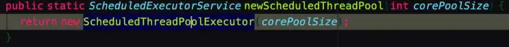

## 1、newCachedThreadPool
	- 可缓存线程池，核心线程池为0。如果空闲线程超过存活时间，可回收空闲线程。容量为int的最大值，使用时要特别注意
	- ```java
	  // 参数一 线程池的默认数 【也是空闲线程回收到默认数就不再回收了，也是这个数】  
	  参数二 线程池线程最大数   
	  
	  new ThreadPoolExecutor(0, Integer.MAX_VALUE, 60L, TimeUnit.SECONDS,  new SynchronousQueue<Runnable>());
	  ```
- ## 2、newSingleThreadExecutor()   创建一个单线程的线程池
	- ```java
	      public static ExecutorService newSingleThreadExecutor() {
	          return new FinalizableDelegatedExecutorService
	              (new ThreadPoolExecutor(1, 1,
	                                      0L, TimeUnit.MILLISECONDS,
	                                      new LinkedBlockingQueue<Runnable>()));
	      }
	  ```
	- 最大线程核心线程都是1，只会创建1个线程去干活。可以保证按顺序执行
- ## 3、newFixedThreadPool（） 创建固定线程个数的线程池
	- ```java
	      public static ExecutorService newFixedThreadPool(int nThreads) {
	          return new ThreadPoolExecutor(nThreads, nThreads,
	                                        0L, TimeUnit.MILLISECONDS,
	                                        new LinkedBlockingQueue<Runnable>());
	      }
	  ```
	- 使用场景   一次性集成处理爆发任务
		- 比如某一个时期处理大量图片，   创建一个固定个数的线程池  处理完后 再把他们回收
		- 
- ## 4、newScheduledThreadPool
	- {:height 73, :width 686}
	- 支持定时及周期性任务执行。