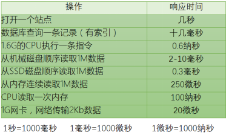
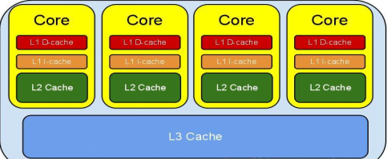
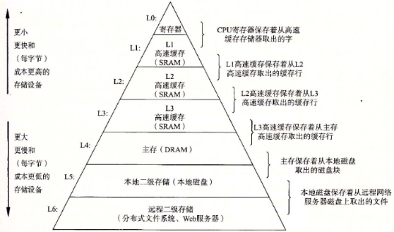
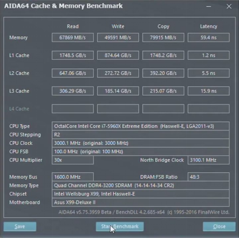

- Java内存模型即Java Memory Model，简称JMM。JMM定义了Java 虚拟机(JVM)在计算机内存(RAM)中的工作方式。JVM是整个计算机虚拟模型，所以JMM是隶属于JVM的。Java1.5版本对其进行了重构，现在的Java仍沿用了Java1.5的版本。Jmm遇到的问题与现代计算机中遇到的问题是差不多的。
- 物理计算机中的并发问题，物理机遇到的并发问题与虚拟机中的情况有不少相似之处，物理机对并发的处理方案对于虚拟机的实现也有相当大的参考意义。
- 根据《Jeff Dean在Google全体工程大会的报告》我们可以看到
- 
- 计算机在做一些我们平时的基本操作时，需要的响应时间是不一样的。
- （以下案例仅做说明，并不代表真实情况。）
- 如果从内存中读取1M的int型数据由CPU进行累加，耗时要多久？
- 做个简单的计算，1M的数据，Java里int型为32位，4个字节，共有1024*1024/4 = 262144个整数 ，则CPU 计算耗时：262144 *0.6 = 157 286 纳秒，而我们知道从内存读取1M数据需要250000纳秒，两者虽然有差距（当然这个差距并不小，十万纳秒的时间足够CPU执行将近二十万条指令了），但是还在一个数量级上。但是，没有任何缓存机制的情况下，意味着每个数都需要从内存中读取，这样加上CPU读取一次内存需要100纳秒，262144个整数从内存读取到CPU加上计算时间一共需要262144*100+250000 = 26 464 400 纳秒，这就存在着数量级上的差异了。
- 而且现实情况中绝大多数的运算任务都不可能只靠处理器“计算”就能完成，处理器至少要与内存交互，如读取运算数据、存储运算结果等，这个I/O操作是基本上是无法消除的（无法仅靠寄存器来完成所有运算任务）。早期计算机中cpu和内存的速度是差不多的，但在现代计算机中，cpu的指令速度远超内存的存取速度,由于计算机的存储设备与处理器的运算速度有几个数量级的差距，所以现代计算机系统都不得不加入一层读写速度尽可能接近处理器运算速度的高速缓存（Cache）来作为内存与处理器之间的缓冲：将运算需要使用到的数据复制到缓存中，让运算能快速进行，当运算结束后再从缓存同步回内存之中，这样处理器就无须等待缓慢的内存读写了。
- 
- 
- 在计算机系统中，寄存器划是L0级缓存，接着依次是L1，L2，L3（接下来是内存，本地磁盘，远程存储）。越往上的缓存存储空间越小，速度越快，成本也更高；越往下的存储空间越大，速度更慢，成本也更低。从上至下，每一层都可以看做是更下一层的缓存，即：L0寄存器是L1一级缓存的缓存，L1是L2的缓存，依次类推；每一层的数据都是来至它的下一层，所以每一层的数据是下一层的数据的子集。
- 
- 在现代CPU上，一般来说L0， L1，L2，L3都集成在CPU内部，而L1还分为一级数据缓存（Data Cache，D-Cache，L1d）和一级指令缓存（Instruction Cache，I-Cache，L1i），分别用于存放数据和执行数据的指令解码。每个核心拥有独立的运算处理单元、控制器、寄存器、L1、L2缓存，然后一个CPU的多个核心共享最后一层CPU缓存L3