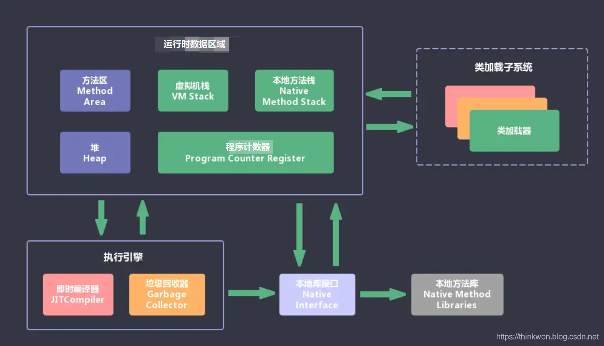

- # 一、JVM组成
	- 
	- ## JVM包含两个子系统和两个组件。
		- ## 两个子系统:
			- ## [[ClassLoader]](类装载)：
				- 根据给定的全限定名类名(如：java.lang.Object)来装载class文件到Runtime data area中的method area。
			- ## Execution engine（执行引擎）：
				- 执行classes中的指令。
		- ## 两个组件:
			- ## Native Interface(本地接口)：
				- 与native libraries交互，是其它编程语言交互的接口。
			- ## Runtime data area：[[JVM运行时数据区详解]]
				- (运行时数据区域)这就是我们常说的JVM的内存。
-
- # [[JVM常量池梳理]]
-
-
-
- # [[JVM虚拟机面试题]]