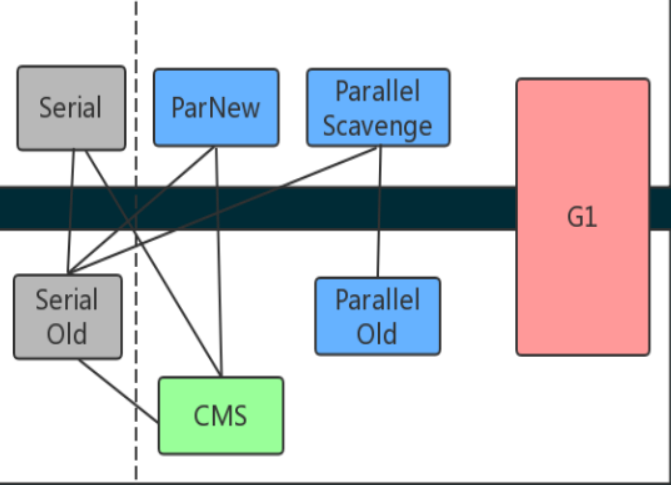
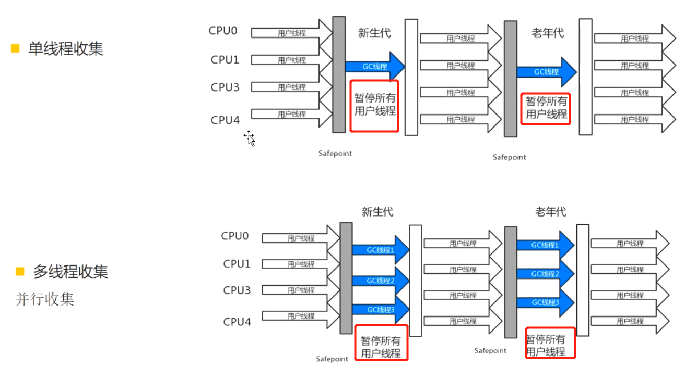
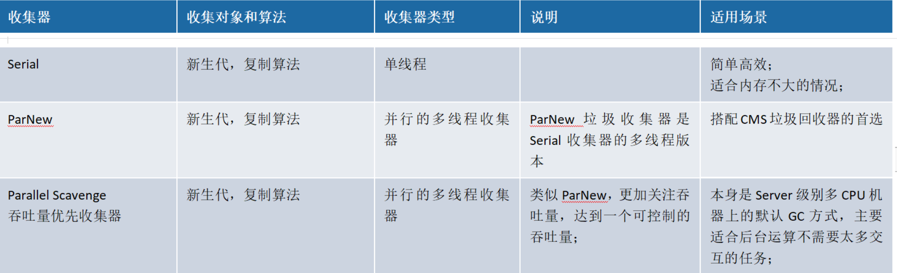
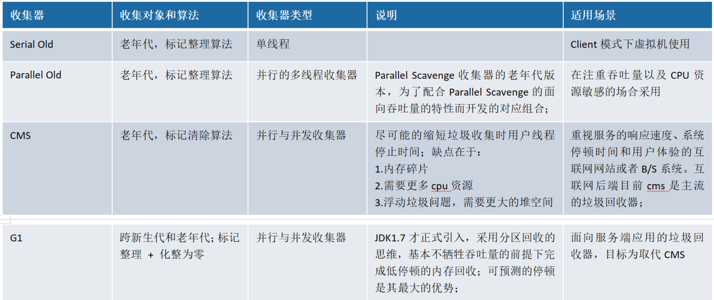
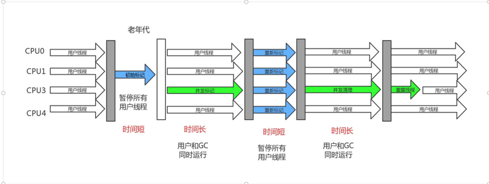
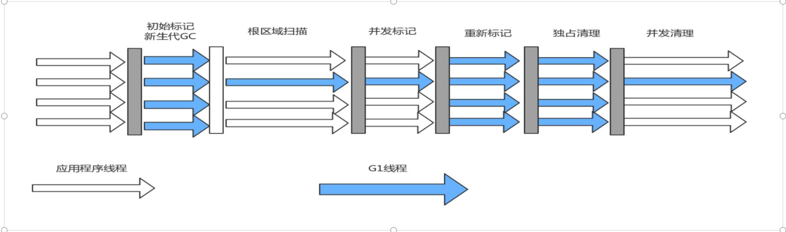
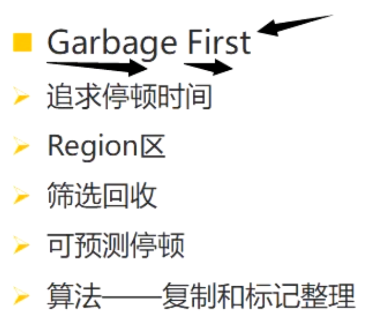

# **分代收集的思想**
	- 在[[#red]]==**新生代中**==，每次垃圾收集时都发现有大批对象死去，只有少量存活，那就[[#red]]==**选用复制算法**==，只需要付出少量存活对象的复制成本就可以完成收集。
	- 而[[#red]]==**老年代**==中因为对象存活率高、没有额外空间对它进行分配担保，就必须[[#red]]==**使用“标记—清理”或者“标记—整理”算法**==来进行回收。
- # 垃圾回收器的划分
	- 不同垃圾回收器负责不同的区域，但是新生代和老年代的垃圾回收器又是一一对应的
	- ## 负责新生代的
		- Serial                         ParNew              Parallel Scavenge         G1
	- ## 负责老年代的
		- Serial Old                  CMS                   Parallel Old                    G1
	- **请记住下图的垃圾收集器和之间的连线关系。**[[#red]]==**线连接就可以匹配**==
		- 
- # 不同线程垃圾回收示意图
	- 
	- ## 单线程(Serial/Serial Old)
		- 需要暂停用户线程的
	- ## 多线程 并行
		- 需要暂停用户线程的
	- ## 多线程并发垃圾回收器（CMS）
		- 部分时间，是和用户线程并行的
- # 垃圾收集器
  collapsed:: true
	- 
	- 
	- ## 并行：垃圾收集的多线程的同时进行。
	- ## 并发：垃圾收集的多线程和应用的多线程同时进行。
	-
	- 注：吞吐量=运行用户代码时间/(运行用户代码时间+ 垃圾收集时间)
	- 垃圾收集时间= 垃圾回收频率 * 单次垃圾回收时间
	-
- #  **垃圾回收器工作示意图**
  collapsed:: true
	- ## **Serial/Serial Old**
		- 最古老的，[[#red]]==**单线程**==，独占式，成熟，适合单CPU  服务器
		- -XX:+UseSerialGC 新生代和老年代都用串行收集器
		- -XX:+UseParNewGC 新生代使用ParNew，老年代使用Serial Old
		- -XX:+UseParallelGC 新生代使用ParallerGC，老年代使用Serial Old
	- ## **ParNew **
		- 和Serial基本没区别，唯一的区别：多线程，多CPU的，停顿时间比Serial少
		- -XX:+UseParNewGC 新生代使用ParNew，老年代使用Serial Old
	- ## **Parallel Scavenge（ParallerGC）/Parallel Old**
		- 关注吞吐量的垃圾收集器，高吞吐量则可以高效率地利用CPU时间，尽快完成程序的运算任务，主要适合在后台运算而不需要太多交互的任务。
		- 所谓吞吐量就是CPU用于运行用户代码的时间与CPU总消耗时间的比值，即吞吐量=运行用户代码时间/（运行用户代码时间+垃圾收集时间），虚拟机总共运行了100分钟，其中垃圾收集花掉1分钟，那吞吐量就是99%
	- ## **Concurrent Mark Sweep （CMS）**
	  collapsed:: true
		- 
		- 收集器是一种以[[#red]]==**获取最短回收停顿时间为目标**==的收集器。目前很大一部分的Java应用集中在互联网站或者B/S系统的服务端上，这类应用尤其[[#red]]==**重视服务的响应速度**==，希望系统停顿时间最短，以给用户带来较好的体验。CMS收集器就非常符合这类应用的需求。
		- ## 回收过程
			- 从名字（包含“Mark Sweep”）上就可以看出，CMS收集器是[[#red]]==**基于“标记—清除”算法**==实现的，它的运作过程相对于前面几种收集器来说更复杂一些，整个过程分为4个步骤，包括：
				- [[#red]]==**1、初始标记-短暂**==，仅仅只是标记一下GC Roots能直接关联到的对象，速度很快。==**暂停用户线程**==
				- [[#red]]==**2、并发标记-和用户的应用程序同时进行**==，进行GC Roots追踪的过程
				- [[#red]]==**3、重新标记-短暂**==
					- 为了修正并发标记期间因用户程序继续运作而导致标记产生变动的那一部分对象的标记记录，这个阶段的停顿时间一般会比初始标记阶段稍长一些，但远比并发标记的时间短。==**暂停用户线程**==
				- [[#red]]==**4、并发清除**==
					- 由于整个过程中耗时最长的并发标记和并发清除过程收集器线程都可以与用户线程一起工作，所以，从总体上来说，CMS收集器的内存回收过程是与用户线程一起并发执行的。
				- -XX:+UseConcMarkSweepGC ，表示新生代使用ParNew，老年代的用CMS
		- ## 特点:
			- 缺点：
				- CPU敏感
				- 浮动垃圾
					- 由于CMS并发清理阶段用户线程还在运行着，伴随程序运行自然就还会有新的垃圾不断产生，这一部分垃圾出现在标记过程之后，CMS无法在当次收集中处理掉它们，只好留待下一次GC时再清理掉。这一部分垃圾就称为“浮动垃圾”。
				- 内存碎片
			- 优点：
				- GC时停顿时间短，响应速度快
	- ## **G1**
		- 
		- -XX:+UseG1GC
		- 
		- **并行与并发**：
			- G1能充分利用多CPU、多核环境下的硬件优势，使用多个CPU（CPU或者CPU核心）来缩短Stop-The-World停顿的时间，部分其他收集器原本需要停顿Java线程执行的GC动作，G1收集器仍然可以通过并发的方式让Java程序继续执行。
		- **分代收集**：
			- 与其他收集器一样，分代概念在G1中依然得以保留。虽然G1可以不需要其他收集器配合就能独立管理整个GC堆，但它能够采用不同的方式去处理新创建的对象和已经存活了一段时间、熬过多次GC的旧对象以获取更好的收集效果。
		- **空间整合**：
			- 与CMS的“标记—清理”算法不同，G1从整体来看是基于“标记—整理”算法实现的收集器，从局部（两个Region之间）上来看是基于“复制”算法实现的，但无论如何，这两种算法都意味着G1运作期间不会产生内存空间碎片，收集后能提供规整的可用内存。这种特性有利于程序长时间运行，分配大对象时不会因为无法找到连续内存空间而提前触发下一次GC。
		- **内存布局：**
			- 在G1之前的其他收集器进行收集的范围都是整个新生代或者老年代，而G1不再是这样。使用G1收集器时，Java堆的内存布局就与其他收集器有很大差别，它将整个Java堆划分为多个大小相等的独立区域（Region），虽然还保留有新生代和老年代的概念，但新生代和老年代不再是物理隔离的了，它们都是一部分Region（不需要连续）的集合。
		- ## 新生代GC
			- 回收Eden区和survivor区，回收后，所有eden区被清空，存在一个survivor区保存了部分数据。老年代区域会增多，因为部分新生代的对象会晋升到老年代。
		- ## 并发标记周期
			- **初始标记：**短暂，仅仅只是标记一下GC Roots能直接关联到的对象，速度很快，产生一个全局停顿，都伴随有一次新生代的GC。
			- **根区域扫描：**扫描survivor区可以直接到达的老年代区域。
			- **并发标记阶段：**扫描和查找整个堆的存活对象，并标记。
			- **重新标记：**会产生全局停顿，对并发标记阶段的结果进行修正。
			- **独占清理**：会产生全局停顿，对GC回收比例进行排序，供混合收集阶段使用
			- **并发清理**：识别并清理完全空闲的区域，并发进行
		- 混合收集
			- 对含有垃圾比例较高的Region进行回收。
			- G1当出现内存不足的的情况，也可能进行的FullGC回收。
		- G1中重要的参数：
			- -XX:MaxGCPauseMillis 指定目标的最大停顿时间，G1尝试调整新生代和老年代的比例，堆大小，晋升年龄来达到这个目标时间。
			- -XX:ParallerGCThreads：设置GC的工作线程数量
- # **Stop The World现象 **
	- gc时暂定业务线程
	- 缺点：JVM回收时。表现卡
	- GC收集器和我们GC调优的目标就是尽可能的减少STW的时间和次数。