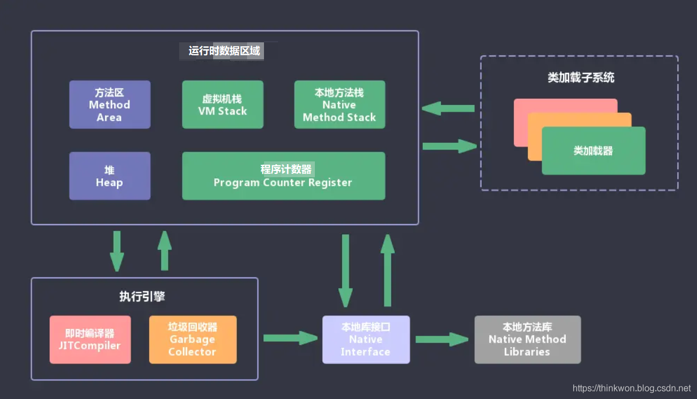
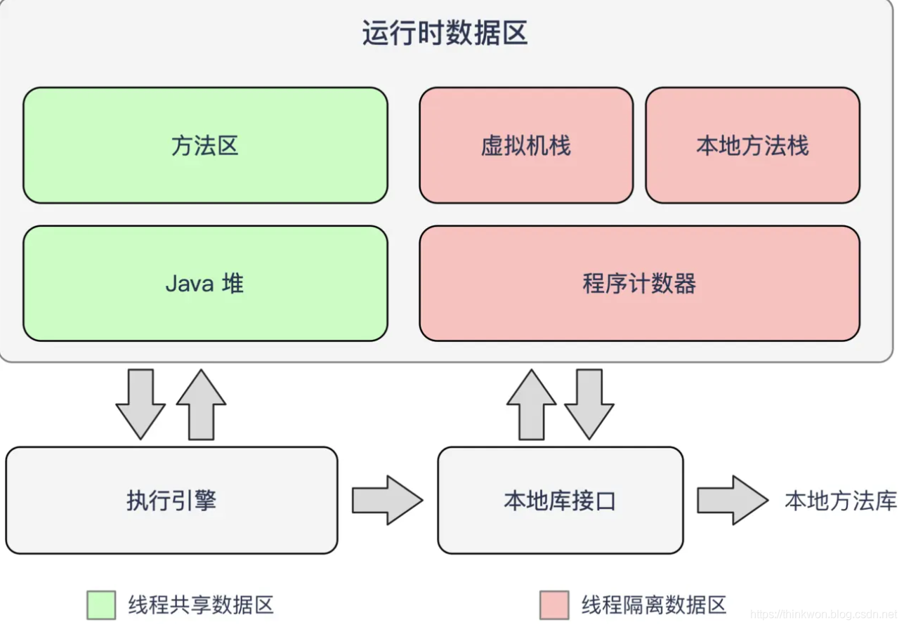

- # 一、java内存区域
	- ## 1-1、说一下 JVM 的主要组成部分及其作用？
		- ### 首先JVM的组成：
			- ### 组成图
				- 
			- ### JVM包含两个子系统和两个组件。
			  collapsed:: true
				- 两个子系统为Class loader(类装载)、Execution engine(执行引擎)；
					- Class loader(类装载)：根据给定的全限定名类名(如：java.lang.Object)来装载class文件到Runtime data area中的method area。
					- Execution engine（执行引擎）：执行classes中的指令。
				- 两个组件为Runtime data area(运行时数据区)、Native Interface(本地接口)。
					- Native Interface(本地接口)：与native libraries交互，是其它编程语言交互的接口。
					- Runtime data area(运行时数据区域)：这就是我们常说的JVM的内存。
		- ### 各部分的作用
		  collapsed:: true
			- 1、首先通过编译器把 Java 代码转换成字节码.class
			- 2、[[#red]]==类加载器（ClassLoader）==再把字节码加载到内存中，将其放在运行时数据区（Runtime data area）的方法区内，而字节码文件只是 JVM 的一套指令集规范，并不能直接交给底层操作系统去执行，因此需要
			- 3、[[#red]]==特定的命令解析器执行引擎（Execution Engine），将字节码翻译成底层系统指令，再交由 CPU 去执行==
			- 4、而这个过程中需要[[#red]]==调用其他语言的本地库接口（Native Interface）==来实现整个程序的功能。
		- ### 下面是Java程序运行机制详细说明
			- Java程序运行机制步骤
				- 
				- 1、利用[[#red]]==IDE==集成开发工具[[#red]]==编写Java源代码.java==
				- 2、再[[#red]]==利用编译器(javac命令)==将源代码[[#red]]==编译成字节码文件.class==
				- 3、[[#red]]==运行字节码的工作是由解释器==(java命令)来完成的。
				- 4、类加载器又将这些.class文件加载到JVM中。
					- 4-1、[[#red]]==类的加载==指的是[[#red]]==将类的.class文件中的二进制数据读入到内存中==，将其[[#red]]==放在运行时数据区的方法区==内
					- 4-2、然后在[[#red]]==堆区创建一个 java.lang.Class对象==，[[#red]]==用来封装类在方法区内的数据结构。==
	- ## 1-2、说一下 JVM 运行时数据区
	  collapsed:: true
		- **Java 虚拟机在执行 Java 程序的过程中会把它所管理的内存区域划分为若干个不同的数据区域**。
			- 
			- 不同虚拟机的运行时数据区可能略微有所不同，但都会遵从 Java 虚拟机规范， Java 虚拟机规范规定的区域分为以下 5 个部分：
				- **1、程序计数器（Program Counter Register）：**[[#red]]==当前线程所执行的字节码的行号指示器，字节码解析器的工作是通过改变这个计数器的值==，来选取下一条需要执行的字节码指令，分支、循环、跳转、异常处理、线程恢复等基础功能，都需要依赖这个计数器来完成；
				- **2、Java 虚拟机栈（Java Virtual Machine Stacks）：**用于存储[[#red]]==局部变量表、操作数栈、动态链接、方法出口等信息；==
				- 3、**本地方法栈（Native Method Stack）：**与虚拟机栈的作用是一样的，只不过虚拟机栈是服务 Java 方法的，而[[#red]]==本地方法栈是为虚拟机调用 Native 方法服务的==；
				- **4、Java 堆（Java Heap）：**Java 虚拟机中内存最大的一块，是被所有线程共享的，几乎所有的[[#red]]==**对象实例都在这里分配内存；**==
				- 5、**方法区（Methed Area）：**用于存储已被虚拟机[[#red]]==加载的类信息、常量、静态变量==、即时编译后的代码等数据。
- # 二、HotSpot虚拟机对象探秘
- # 三、JVM虚拟机和Android虚拟机的区别
	- [[#red]]==**1、jdk默认的HotSpot，以及android的Dalvik、ART都是虚拟机**==
	- [[#red]]==**2、java虚拟机都是基于栈的，android虚拟机是基于寄存器，**==。
-
- # 四、成员变量，局部变量，静态变量在内存中哪一块？
  collapsed:: true
	- 1、成员变量（也叫实例变量）跟随对象，在堆内存中
	- 2、局部变量跟随方法，在虚拟机栈中
	- 3、静态变量（也叫类变量，可以被类直接调用）在方法区（永久代，JDK1.8以后叫元空间）
- 参考：
	- [Java虚拟机(JVM)面试题（2020最新版）](https://thinkwon.blog.csdn.net/article/details/104390752)