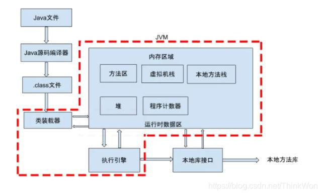

## 1、说一下 JVM 的主要组成部分及其作用？
	- ### 首先JVM的组成：
		- ### 组成图
			- {:height 385, :width 658}
		- ### JVM包含两个子系统和两个组件。
			- 两个子系统为[[ClassLoader]](类装载)、Execution engine(执行引擎)；
				- Class loader(类装载)：根据给定的全限定名类名(如：java.lang.Object)来装载class文件到Runtime data area中的method area。
				- Execution engine（执行引擎）：执行classes中的指令。
			- 两个组件为Runtime data area(运行时数据区)、Native Interface(本地接口)。
				- Native Interface(本地接口)：与native libraries交互，是其它编程语言交互的接口。
				- Runtime data area(运行时数据区域)：这就是我们常说的JVM的内存。
	- ### 各部分的作用
	  collapsed:: true
		- 1、首先通过编译器把 Java 代码转换成字节码.class
		- 2、[[#red]]==类加载器（ClassLoader）==再把字节码加载到内存中，将其放在运行时数据区（Runtime data area）的方法区内，而字节码文件只是 JVM 的一套指令集规范，并不能直接交给底层操作系统去执行，因此需要
		- 3、[[#red]]==特定的命令解析器执行引擎（Execution Engine），将字节码翻译成底层系统指令，再交由 CPU 去执行==
		- 4、而这个过程中需要[[#red]]==调用其他语言的本地库接口（Native Interface）==来实现整个程序的功能。
	- ### 下面是Java程序运行机制详细说明
	  collapsed:: true
		- Java程序运行机制步骤
			- 
			- 1、利用[[#red]]==IDE==集成开发工具[[#red]]==编写Java源代码.java==
			- 2、再[[#red]]==利用编译器(javac命令)==将源代码[[#red]]==编译成字节码文件.class==
			- 3、[[#red]]==运行字节码的工作是由解释器==(java命令)来完成的。
			- 4、类加载器又将这些.class文件加载到JVM中。
				- 4-1、[[#red]]==类的加载==指的是[[#red]]==将类的.class文件中的二进制数据读入到内存中==，将其[[#red]]==放在运行时数据区的方法区==内
				- 4-2、然后在[[#red]]==堆区创建一个 java.lang.Class对象==，[[#red]]==用来封装类在方法区内的数据结构。==
- ## 2、说一下 JVM 运行时数据区（或者说内存结构）
	- **Java 虚拟机在执行 Java 程序的过程中会把它所管理的内存区域划分为若干个不同的数据区域**。
		- 
		- 不同虚拟机的运行时数据区可能略微有所不同，但都会遵从 Java 虚拟机规范， Java 虚拟机规范规定的区域分为以下 5 个部分：
			- **1、程序计数器（Program Counter Register）：**[[#red]]==当前线程所执行的字节码的行号指示器，字节码解析器的工作是通过改变这个计数器的值==，==**来选取下一条需要执行的字节码指令**==，分支、循环、跳转、异常处理、线程恢复等基础功能，都需要依赖这个计数器来完成；
			- **2、Java 虚拟机栈（Java Virtual Machine Stacks）：**用于存储[[#red]]==局部变量表、操作数栈、动态链接、方法出口等信息；==
			- 3、**本地方法栈（Native Method Stack）：**与虚拟机栈的作用是一样的，只不过虚拟机栈是服务 Java 方法的，而[[#red]]==本地方法栈是为虚拟机调用 Native 方法服务的==；
			- **4、Java 堆（Java Heap）：**Java 虚拟机中内存最大的一块，是被所有线程共享的，几乎所有的[[#red]]==**对象实例都在这里分配内存；**==
			- 5、**方法区（Methed Area）：**用于存储已被虚拟机[[#red]]==加载的类信息、常量、静态变量==、即时编译后的代码等数据。
- ## 2、JVM虚拟机和Android虚拟机的区别
	- [[#red]]==**1、jdk默认的HotSpot，以及android的Dalvik、ART都是虚拟机**==
	- [[#red]]==**2、java虚拟机都是基于操作数栈的，android虚拟机是基于寄存器，**==。
- ## 8、[[操作数栈与寄存器]]
- ## 3、成员变量，局部变量，静态变量在内存中哪一块？
  collapsed:: true
	- 1、成员变量（也叫实例变量）跟随对象，在堆内存中
	- 2、局部变量跟随方法，在虚拟机栈中
	- 3、静态变量（也叫类变量，可以被类直接调用）在方法区（永久代，JDK1.8以后叫元空间）
- ## 5、堆和栈的区别
  collapsed:: true
	- ## 1、功能不同
	  collapsed:: true
		- ## 栈:
			- [[#red]]==**以栈帧的方式存储方法调用的过程，并存储方法调用过程中基本数据类型的变量**==（int、short、long、byte、float、double、boolean、char等）以及对象的[[#red]]==**引用变量**==，其内存分配在栈上，变量出了作用域就会自动释放；
		- ## 堆：
			- 而堆内存用来[[#red]]==**存储Java中的对象**==。无论是成员变量，局部变量，还是类变量，它们指向的对象都存储在堆内存中
	- ## 2、**线程独享还是共享**
	  collapsed:: true
		- ## 栈：
			- 栈内存归属于单个线程，每个线程都会有一个栈内存，其存储的变量只能在其所属线程中可见，即栈内存可以理解成线程的私有内存
		- ## 堆：
			- 堆内存中的对象对所有线程可见。堆内存中的对象可以被所有线程访问。
	- ## 3、空间大小
	  collapsed:: true
		- 栈的内存要远远小于堆内存，栈的深度是有限制的，可能发生StackOverFlowError问题
- # 6、 [[程序计数器作用-面试]]
- # 7、程序计数器：JVM内存区域唯一不会OOM的地方
  collapsed:: true
	- 因为很小的内存空间，几乎可以忽略不记
- # 9、方法区和堆都是线程共享，为什么不用一份呢？
	- 堆中存放对象、数组，频繁回收，方法区偏静态的，难回收，。动静分离，便于垃圾回收的高效
- # 10、方法区的名字更替
  collapsed:: true
	- 任何版本都有方法区，不同版本实现不一样而已。
	- 小于1.7实现叫永久代（堆中）。
		- 不仅回收堆，还要回收永久代（常量，class）比较难回收。实际垃圾回收回收这2个没有做区分
	- 大于1.8叫元空间（存入直接内存中）
		- 好处：方便扩展
		- 坏处：挤压堆空间
- # 11、方法区中的类，会在哪个时候卸载，回收？
  collapsed:: true
	- 1、类所有的实例，都要被回收
	- 2、加载该类的classLoad已经被回收
	- 3、该类java.lang.class对象，没有任何地方被引用。无法通过反射访问该类的方法。
	- 3个条件同时满足，可被回收，但是可被禁用
		- {:height 68, :width 719}
- # 12、[[运行时数据区哪些会OutOfMemory]]
- # 13、[[虚拟机优化技术]]
- # 14、可达性分析法，GCRoot引用链无可达的对象，一定会被回收吗？
  collapsed:: true
	- 可以用finalize，拯救下，重写这个object方法，让该对象有被引用，这个方法会被jvm调用。可能有延时性，不准确，如果调用了，该对象就能躲过一劫，躲不过第二次GC
		- 
- # 16、一个对象所占内存为8字节的整数。
- # 17、**[[对象的各种引用]]**他们的区别？
- # 19、在分代模式，为什么新生代，要分为Eden区from ，to，区。比例为8:1:1。
  collapsed:: true
	- 
	- 据统计90%对象，使用完就会被回收，所以eden区只存放新生对象。只要进行垃圾回收，存活的就不会再Eden区了。没有年龄
	- from 和 to 是复制回收算法，需要1:1空间，from区满了，把存活的对象复制到to区，对象年龄+1（age存放在对象头中）把from区清空。反之亦然。这里年龄最大15，达到之后进入老年代
- # 18、[[对象分配策略-面试]]
- # 22、描述new一个对象的流程？
	- [[虚拟机中对象的创建过程]]
- # 23、java对象会不会分配在栈中？
	- 栈上分配
	- [[对象分配策略-面试]]
- # 24、如何判断一个对象是否被回收，有哪些算法，实际虚拟机用的最多的是什么？
	- [[判断对象的存活算法]]
	- 答出 引用计数法，缺点相互引用的问题
	- 实际虚拟机用的最多的是可达性分析法
- # 25、Gc收集算法有哪些，他们的特点是什么？
	- [[垃圾回收算法]]这三个还有对应的特点
- # 26、JVM中一次完整的GC流程是怎样的？对象如何晋级到老年代？
	- GC对应着对象的分配，对象优先在Eden区进行分配，Eden区不够了，会进行一次minor GC 或者 Young Gc,
	- 对象进入From 或者 to 区，空间不够了再进行一次minor GC 或者 Young Gc, 再进入to区或者from区。直到1、年龄达到15,       2 相同年龄对象的个数 超过Server区一半。则进入老年代
	- ## 如何进入老年代？
		- 1、大对象直接进入（长的字符串，数组）
		- 2、空间分配担保（动态年龄判断，当达到交换区的一半 也可以）
- # 27、final、finally、finallize区别
	- final：不可变修饰符
	- finally，try catch finally 异常处理最后执行的方法,用于资源关闭等
	- finalize：
		- 垃圾回收器确定该对象没有更多引用，由对象的垃圾回收器调用此方法
- # 29、Stop the world stw现象，停止一切用户线程。
	- 垃圾回收机制，开启垃圾回收线程，进行GC时，需要stw，停止用户线程，先进行清理，防止一边清理一边产生垃圾。
- # 30、对象的生命周期#card
	- 1. 创建
	  为对象分配内存空间
	  构造对象
	  2. 应用
	  此时 对象至少被一个强引用持有
	- 3. 不可见
		- 没有强引用
	- 4. 不可达 
	  5. 收集 
	  finalize()
- # 20、JVM常量池都有哪几种，以及区别？
	- 详见[[JVM常量池梳理]]
	- ## 方法区：
		- [[class文件常量池]]也叫静态常量池
			- 个数：
				- 每个class的字节码文件中都有一个常量池，多个class就对应多个
			- 存放内容：
				- 字面量 符号引用
		- [[运行时常量池]]
			- 个数：
				- 方法区内只有一个
			- 存放内容
				- 字面量 将符号引用 变成直接引用
	- ## 堆区
		- [[字符串常量池]]
			- 存放内容
				- 存储字面量对应   字符串对象及其引用
		- [[基本类型包装类常量池]]
- # 21、运行时常量池和class文件常量池区别？
	- 1、存在的个数不同
		- class文件常量池是一个 class一个，运行时常量池，整个方法区就一个
	- 2、虽然都存符号引用，
		- 如果是类的
			- class文件常量池就存的 符号引用：类的全限定名
			- 运行时常量池 需要转换成 直接引用：具体对象的引用
- # 28、String s= new String("xxx")创建了几个对象？
	- 2个
	- 字符串常量池 一个字面量对象
	- 堆中一个。new出来的对象
- # [[字符串内存上的面试题]]
- # 参考：
	- [Java虚拟机(JVM)面试题（2020最新版）](https://thinkwon.blog.csdn.net/article/details/104390752)
-