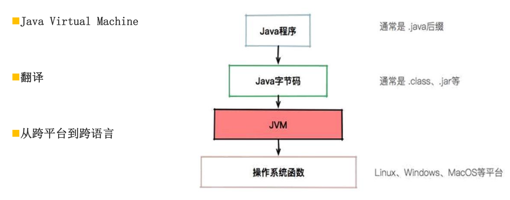
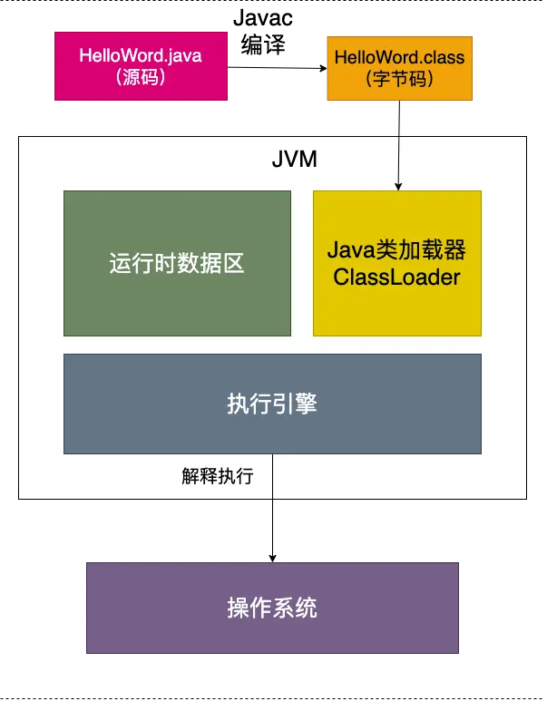

- # 一、前言
  collapsed:: true
	- 开发中我们经常会碰到OOM（Out of Memory）的问题,即内存不够用了、内存溢出了。一般来说，对象都在堆内存中，栈中只有对象的引用，所以当发生内存溢出了大多数第一时间想到的就是堆内存。那么在虚拟机中，除了堆和栈还有什么内存，也会OOM吗？他们是怎么划分的，或者都存储了什么东西，以及如何管理的，了解了这些，我们在开发中就可能最大限度避免内存溢出的问题。
- # 二、虚拟机与操作系统的关系
  collapsed:: true
	- 
	- 在了解JVM内存管理之前，我们先简单介绍一下虚拟机与操作系统的关系。Linux\Windows、MacOS等操作系统，它们识别（运行）的是机器码：010101… 而我们写的java代码实际上都是字符串，是不能直接运行在操作系统上的。必须编译成虚拟机识别的字节码（.class）,字节码也不能直接交给CPU执行，他必须要经过一个解释器，解释器是Java虚拟机执行引擎的一个组件，专门负责把每一条JVM指令解释成机器码，机器码就可以交给CPU执行了。可以说虚拟机就类似于一个“翻译软件”。
	- [[#red]]==**jdk默认的HotSpot，以及android的Dalvik、ART都是虚拟机**==，当然安卓中的虚拟机和Java虚拟机还是有区别的，比如[[#red]]==**java虚拟机都是基于栈的，android虚拟机是基于寄存器，**==后面再讲。
- # 三、jvm运行过程
  collapsed:: true
	- 一个java文件从编码到执行需要经过下面几个阶段
	  1、编译阶段：首先.java文件经过javac编译成.class文件
	  2、加载阶段：然后.class文件经过类的加载器加载到JVM内存，即运行时数据区。
	  3、解释阶段：class字节码经过字节码解释器解释成操作系统可识别的指令码。
	  4、执行阶段：执行引擎向硬件设备发送指令码执行操作。
	- {:height 781, :width 603}
- # 四、运行时数据区
	- Java虚拟机在执行java程序的过程中会把他管理的内存划分为若干个不同的数据区。
	- 经典图：
		- 
	- 线程共享：方法区、堆
	- 线程私有：虚拟机栈、本地方法栈、程序计数器
	- # 线程私有
		- # 1. [[运行时数据区-程序计数器]]
		- # 2. [[运行时数据区-虚拟机栈]]
		- # 3. [[运行时数据区-本地方法栈]]
	- # 线程共享
		- # 4. [[运行时数据区-方法区]]
		- # 5. [[运行时数据区-堆]]
	- # 6. [[直接内存]]
	- # 举例：通过一个例子解释运行时数据区的内存分配
		- 代码：
			- ```java
			  public class Test{
			     public static String CatName = "miaomiao";
			     public static String DogName = "wangcai";
			     public static void main(){
			           Animal cat = new Animal()
			           cat.setName(CatName)
			           cat.setAge(2)
			           
			           for(int i =0;i<15;i++){
			              System.gc();
			           }
			     
			           Animal dog = new Animal()
			           dog.setName(DogName)
			           dog.setAge(3)
			     }
			  }
			  ```
		- 先看看这段代码加载到内存中的有哪些东西：
			- 类：Test.clas、Animal.class
			- 静态变量：CatName、DogName
			- 对象实例：Animal1、Animal2
			- 对象的引用：cat、dog
			- 栈帧：main（）方法
			- 局部变量：2、3
		- 分配结果：
			- {:height 454, :width 656}
- # 五、[[运行时数据区哪些会OutOfMemory]]
- # 五、参考资料：
	- 《深入理解Java虚拟机》
	- [Java虚拟机JVM的本地方法栈](https://blog.51cto.com/u_14201949/2825620)
	- [快速了解什么是HotSpot](https://blog.csdn.net/weixin_43791695/article/details/118617395?ops_request_misc=%257B%2522request%255Fid%2522%253A%2522167187169216800186542391%2522%252C%2522scm%2522%253A%252220140713.130102334..%2522%257D&request_id=167187169216800186542391&biz_id=0&utm_medium=distribute.pc_search_result.none-task-blog-2~all~top_click~default-1-118617395-null-null.142%5Ev68%5Econtrol,201%5Ev4%5Eadd_ask,213%5Ev2%5Et3_control1&utm_term=HotSpot&spm=1018.2226.3001.4187)