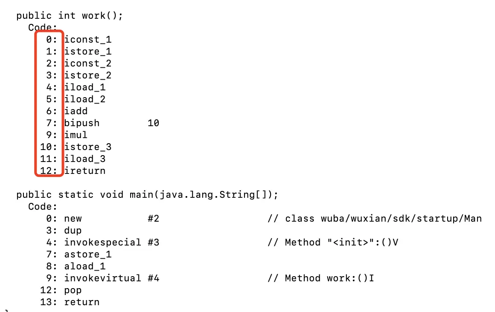
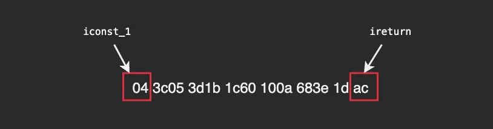
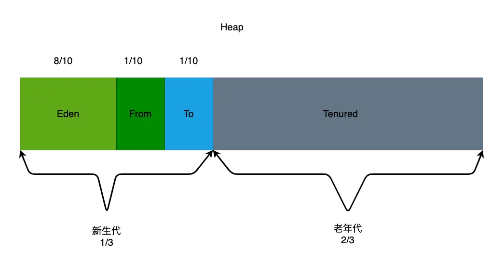

- # 前言
	- 开发中我们经常会碰到OOM（Out of Memory）的问题,即内存不够用了、内存溢出了。一般来说，对象都在堆内存中，栈中只有对象的引用，所以当发生内存溢出了大多数第一时间想到的就是堆内存。那么在虚拟机中，除了堆和栈还有什么内存，也会OOM吗？他们是怎么划分的，或者都存储了什么东西，以及如何管理的，了解了这些，我们在开发中就可能最大限度避免内存溢出的问题。
- # 虚拟机与操作系统的关系
  collapsed:: true
	- 在了解JVM内存管理之前，我们先简单介绍一下虚拟机与操作系统的关系。Linux\Windows、MacOS等操作系统，它们识别（运行）的是机器码：010101… 而我们写的java代码实际上都是字符串，是不能直接运行在操作系统上的。必须编译成虚拟机识别的字节码（.class）,字节码也不能直接交给CPU执行，他必须要经过一个解释器，解释器是Java虚拟机执行引擎的一个组件，专门负责把每一条JVM指令解释成机器码，机器码就可以交给CPU执行了。可以说虚拟机就类似于一个“翻译软件”。jdk默认的HotSpot，以及android的Dalvik、ART都是虚拟机，当然安卓中的虚拟机和Java虚拟机还是有区别的，比如java虚拟机都是基于栈的，android虚拟机是基于寄存器，后面再讲。
- # jvm运行过程
  collapsed:: true
	- 一个java文件从编码到执行需要经过下面几个阶段
	  1、编译阶段：首先.java文件经过javac编译成.class文件
	  2、加载阶段：然后.class文件经过类的加载器加载到JVM内存，即运行时数据区。
	  3、解释阶段：class字节码经过字节码解释器解释成操作系统可识别的指令码。
	  4、执行阶段：执行引擎向硬件设备发送指令码执行操作。
	- {:height 781, :width 603}
- # 运行时数据区
	- Java虚拟机在执行java程序的过程中会把他管理的内存划分为若干个不同的数据区。
	- 经典图：
	  collapsed:: true
		- 
	- 线程共享：方法区、堆
	  线程私有：虚拟机栈、本地方法栈、程序计数器
	- # 1. 程序计数器
	  collapsed:: true
		- 在 JVM 规范中，每个线程都有它自己的程序计数器，他的生命周期与线程的生命周期是一致的,程序计数器会存储当前线程正在执行的 Java 方法的 JVM 指令偏移地址,字节码解释器工作时就是通过改变这个计数器的值来选取下一条需要执行的字节码指令。
		- 我们知道在多线程程序中cpu为每个线程分配了时间片，时间到了就会切到下一个线程，直到重新获取时间片，程序计数器就能让cpu知道上次执行到哪了。
		- 列子：
		  collapsed:: true
			- ```
			  public class Man {
			      public Man() {
			      }
			  
			      public int work() {
			          int x = 1;
			          int y = 2;
			          int z = (x + y) * 10;
			          return z;
			      }
			  
			      public static void main(String[] args) {
			          Man man = new Man();
			          man.work();
			      }
			  }
			  
			  ```
		- 通过javap反编译字节码发现在字节码的左边有一个行号标识，它其实就是指令的偏移地址。
		  collapsed:: true
			- 
		- 在字节码code里，指令iconst_1对应的字节码是“04”，ireturn是“ac”，每个指令占两位，iconst_1、ireturn对应的位置就是0、12，与上面标记的是一致的。
		- work()方法的原始字节码
		  collapsed:: true
			- 
		- 程序计数器在虚拟机内存中是一块很小的内存空间，几乎可以忽略不记,也是运行速度最快的存储区域。是唯一一个不会 OutOfMemoryError 的区域
	- # 2. 虚拟机栈
	  collapsed:: true
		- 虚拟机栈是存储当前线程运行方法所需的数据、指令、返回地址的一个栈结构，每个线程都对应一个虚拟机栈。方法每调用一次就会创建一个栈帧入虚拟机栈，执行完出栈，出栈后栈中的所有对象都会被释放。
		- 虚拟机栈结构图：
		  collapsed:: true
			- 
		- 每个线程的虚拟机栈都可能有多个栈帧，栈帧又包含局部变量表、操作数栈、动态链接和完成出口。
		- ## 2.1 局部变量表
			- 局部变量表用于存放方法参数和方法内部定义的局部变量，只能存储8大基本数据类型和对象引用。局部变量表中的变量只能在当前方法调用中有效。当方法调用结束时，局部变量表也会随之销毁，局部变量表中的变量是重要的垃圾回收对象。
		- ## 2.2 操作数栈
		  collapsed:: true
			- 在方法的执行过程中，会有各种字节码指令往操作数栈中写入和读取内容。操作数栈的每个元素可以是任意Java数据类型
			- 以上面Man的work方法为例，我们来翻译一下字节码
			  参考JVM字节码指令集 https://cloud.tencent.com/developer/article/1333540
			- {:height 382, :width 514}
			- ```
			  - 0: iconst_1     int 1 入操作数栈  （变量 x）
			      
			    1: istore_1     int 1 从操作数栈出栈存入局部变量表（下标位置：1）
			  - 2: iconst_2     int 2 入操作数栈 （变量 y）
			  - 3: istore_2     int 2 从操作数栈出栈存入局部变量表（下标位置：2）
			  - 4: iload_1      局部变量表下标位置为1的变量入操作数栈（变量x）
			  - 5: iload_2      局部变量表下标位置为2的变量入操作数栈（变量y）
			      
			    6: iadd         加法运行 x+y，结果入操作数栈
			  - 7: bipush 10    int 10 入操作数栈
			  - 9: imul         乘法运算 结果入操作数栈
			  - 10: istore_3    加法运算结果存人局部变量表（下标位置：3）
			  - 11: iload_3     局部变量表下标位置为3的变量入操作数栈
			  ```
			- 模型图：
				- 
			- 上面看到字节码指令的执行就是操作数栈不断的入栈出栈。
			- ### 操作数栈与寄存器
				- java虚拟机大多是基于栈的虚拟机，这里说的栈就是操作数栈，android中的Dalvik是基于寄存器的，就是将操作数栈换成了寄存器。执行引擎对这些寄存器（操作数）的解析，找出操作数的具体位置，然后取出操作数进行运算
			- ### 栈式虚拟机
				- 栈式虚拟机在进行真正的运算时都是直接与操作数栈进行交互，也就是说不管进行何种操作都要通过操作数栈来进行，即使是数据传递这种简单的操作。这样做的直接好处就是虚拟机可以无视具体的物理架构，可移植性高，但缺点也显而易见，就是速度稍慢，因为无论什么操作都要通过操作数栈这一结构。
			- ### 寄存器式虚拟机
				- 寄存器其实也是模仿物理机器虚拟出来的，“寄存器”的概念只是当前栈帧中一块连续的内存区域，本质上是数组。这些数据在运算的时候，直接送入物理CPU进行计算，无需再传送到栈上进行运算，所以速度快一些。由于寄存器的指令集是与硬件的架构紧密关联的，无法做到可移植。
		- ## 2.3 动态链接：
		  collapsed:: true
			- 官方解释看完还是不知道说的啥，说下我自己的理解。java语言是多态的，Animal 有两个子类Cat、Dog，他们都有run（）方法，下面的一段代码
				- ```
				  Animal an = name.equel("miaomiao")?new Cat: new Dog();
				  an.run();
				  ```
			- 编译器编译的时候并不知道run（）方法是Cat还是Dog，要在具体执行的时候才能够确定，需要通过动态链接握持的指针来具体的确定。
			-
		- ## 2.4 完成出口
			- 在一个栈帧执行完方法退出后都需要返回到方法被调用的位置，程序才能继续执行。方法返回时还可能需要在当前栈帧中保存一些信息，用来帮他恢复它的上层方法执行状态。记录的方法返回的地址就是方法的完成出口。
		- ## 2.5 虚拟机栈的大小
			- 虚拟机栈的内存大小也是有限制的，不同平台大小限制不同，一般通过"-Xss"参数控制。在JDK1.4中默认是256k，而在JDK1.5+默认是1M。
			- 
			- 如果当前线程请求的栈深度大于虚拟机所允许的最大深度，将抛出StackOverFlowError。
			- 每起一个线程就会创建一个虚拟机栈，假如每个栈大小1M，1000个线程就需要1000M内存，如果超出了最大内存，导致无法为新的线程分配内存就会OutOfMemoryError
	- # 3本地方法栈
	  collapsed:: true
		- ```
		  public final native void notify();
		  
		  public final native void wait(long millis, int nanos)
		  ```
		- 本地方法栈与虚拟机栈类似，保存的是本地方法执行所需要的必要参数。一般是用C、C++语言编写的，并且被编译为基于本机硬件和操作系统的程序。本地方法执行是在os中，并非JVM中，使用的是os的程序计数器而不是JVM的，所以执行本地方法时，JVM程序计数器记录的都是null值。由于各版本的虚拟机的实现不同，也有些虚拟机把本地方法栈和虚拟机栈合二为一了（比如HotSpot）。和虚拟机栈一样本地方法栈也会有 StackOverflowError 和 OutOfMemoryError 异常
	- # 4. 方法区
	  collapsed:: true
		- 用于存储已被虚拟机加载的类信息、常量、静态变量、即时编译器编译后的代码等数据。HotSpot 把GC分代收集扩展至方法区, 即使用Java堆的永久代来实现方法区, 这样 HotSpot 的垃圾收集器就可以像管理 Java 堆一样管理这部分内存,而不必为方法区开发专门的内存管理器。永久代的大小很难确定，因为它受很多因素影响，并且每次Full GC 之后永久代的大小都会改变，所以经常会抛出 OutOfMemoryError 异常。为了更容易管理方法区，从 JDK1.8 开始，移除永久代，并把方法区移至元空间。元空间位于本地内存中（只受本机可用内存的影响），而不在虚拟机内存中了。
		- 方法区是一个 JVM 规范，永久代与元空间都是其一种实现方式。在 JDK 1.8 之后，原来永久代的数据被分到了堆和元空间中。元空间存储类的元信息，而静态变量和常量池等放入了堆中
		- jdk1.8前后稍有差别，如下图：
			- 
	- # java堆
		- 对于绝大多数应用来说，java堆这块区域是 JVM 所管理的内存中最大的一块，也是垃圾收集的主要区域，主要存放对象实例和数组。
		- 由于现代虚拟机采用分代收集算法，Java堆从GC的角度还可以细分新生代和老年代，新生代又分Eden区、From Survivor区和To Survivor区。进一步划分的目的是为了更好地回收内存，或者更快地分配内存
		- 
	- JVM中通过-Xms参数设置堆的初始值，-Xmx设置堆的最大值。
	- Android 一般国内的手机厂商都会做修改, 根据手机配置不同而不同，保存在System/build.prop文件中.