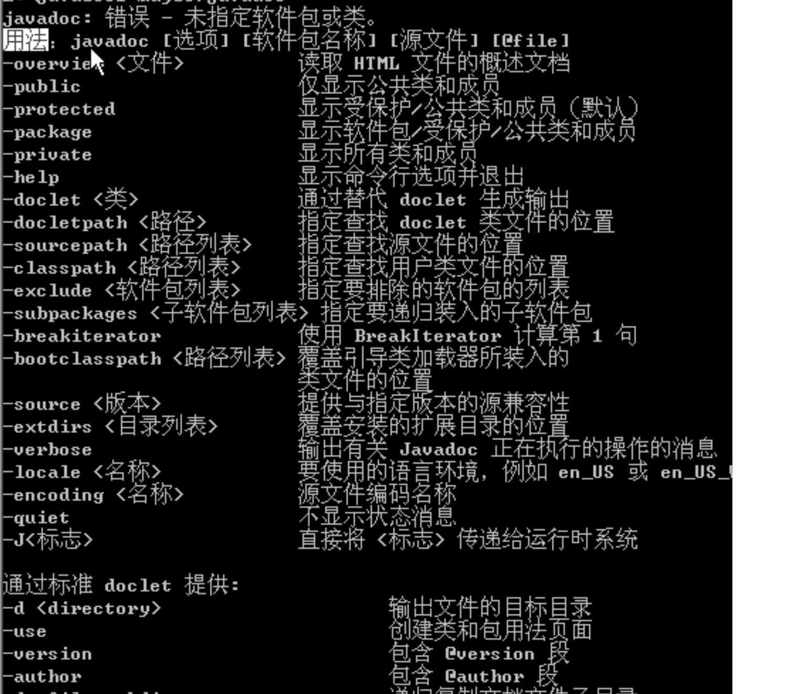

- # 方法提取范围
	- 文档注释能提取的public 和 protect 权限的方法，private 提取不 了
- # 注释提取范围，只能提取/** 开头 */结尾的文档注释
  collapsed:: true
	- ```java
	  类注释和方法注释标注的文档注释
	  /**
	  */
	  ```
	- 文档注释 (doc生成后只能显示出这种注释)
		- ```java
		  /**
		   */
		  ```
	- 多行注释
		- ```java
		  /*
		  */
		  ```
	- 单行注释
		- ```java
		  //
		  ```
- # 使用方式
	- 帮助文档:命令行输入javadoc 会显示帮助文档
		- 
	- ```java
	  // -d 输出到指定位置， 当前目录的help目录下
	  javadoc -d help -version -author 源文件
	  ```
	- 生成效果
		- 