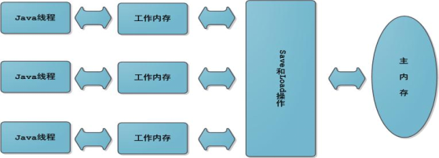

- 从抽象的角度来看，JMM定义了线程和主内存之间的抽象关系：
  collapsed:: true
	- 线程之间的共享变量存储在主内存（Main Memory）中，
	- 每个线程都有一个**私有**的本地内存（Local Memory），本地内存中存储了该线程以读/写共享变量的副本。
	- 本地内存是JMM的一个抽象概念，并不真实存在。它涵盖了缓存、写缓冲区、寄存器以及其他的硬件和编译器优化。
	- 
	- {:height 241, :width 602}
	- 
- # [[可见性]]
- # [[原子性]]