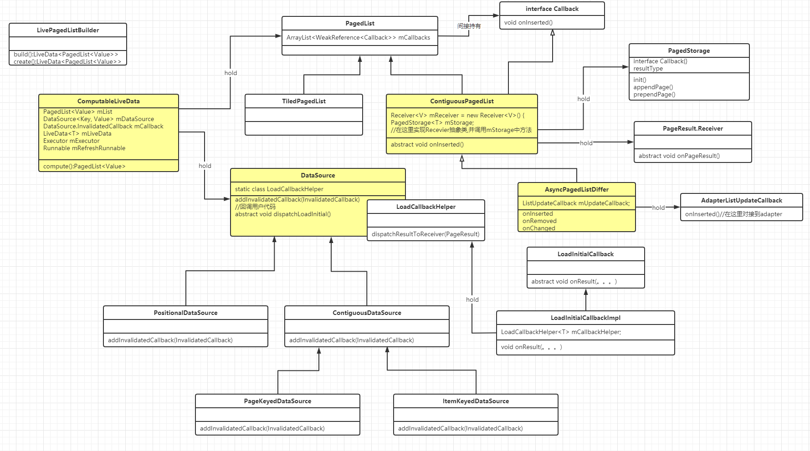

- [paging.xmind](../assets/paging_1691819522895_0.xmind)
- # 一、使用Paging的好处是什么:
	- ​好处一：分页库可以更轻松地在应用程序中的RecyclerView逐步和优雅地加载数据
	- 好处二：数据请求消耗的网络带宽更少，系统资源更少
	- ​好处三：即使在数据更新和刷新期间，应用程序仍会继续快速响应用户输入
	- 好处四：不过多浪费，显示多少就用多少，做一个素质高的少年
- # [[Paging的使用]]：
- # [[Paging的源码分析]]
- # UML
	- 