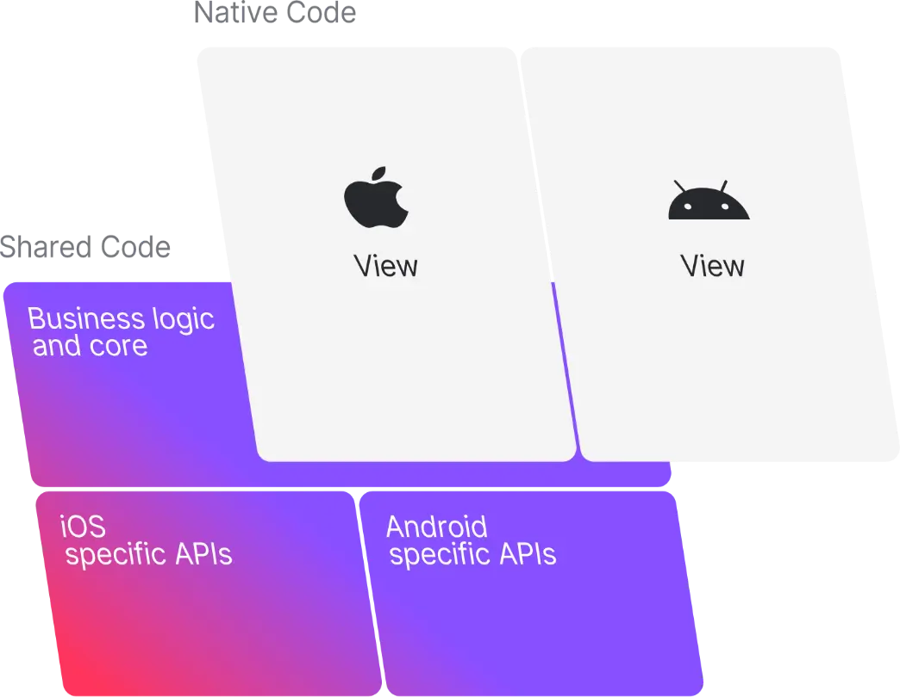

- # 前言
  collapsed:: true
	- 跨平台的开发技术一直是热门的技术方向，不论是为了追求应用逻辑和用户体验的一致性，还是为了提升研发效率以及降低成本，各大互联网公司都在投入跨平台开发方案的研发和使用。Android 和 iOS 是移动端的两大主流系统平台，但它们都有各自完善而独立的技术生态系统，针对这两个平台的跨平台技术方案层出不穷，比如 H5、RN、小程序和 Flutter，以及各公司运用这些技术进行二次开发包装成的跨平台框架。
	- 作为移动端应用开发者，我们在日常开发中对以下问题深有体会：
	- 基础功能模块逻辑相对复杂，多端研发成本较高
	  双端逻辑代码膨胀，无法保证完全一致，问题排查难
	  逻辑代码穿插在各个模块中，现有跨端复用方案迁移成本高
	  尤其在移动互联网应用进入存量时代，App 不再追求双端各自快速实现功能，而是确保双端功能稳定性和逻辑一致性。而随着不断迭代，很多逻辑写着写着双端就出现不一样的细节了，出了问题不好查，而且往往 BI 反馈的双端数据表现不一致，维护迭代后又产生新的差异，如果再出现人员变动，那一部分代码就会变成「祖传代码」。
	- 那么，如果将应用的逻辑层代码剥离成公共模块供双端复用，是否可以改善上面的问题呢？
- # 初识KMM，出生名门
  collapsed:: true
	- KMM 的全称是 Kotlin Multiplatform Mobile，它是大名鼎鼎的 JetBrains 开发的基于 Kotlin 的应用在 Android 和 iOS 的一种跨平台技术，它的特点是共享 iOS 和 Android 应用的逻辑而保持系统原生的用户体验，结合了跨平台和原生开发方式的优点。
	- KMM 是 Kotlin 语言实现的移动端跨平台开发模式，它派生于 Kotlin 生态早已经推出的跨平台解决方案 KMP（Kotlin Multiplatform），它的主要思想是使用不同的编译器编译同一份代码生成各端的不同产物来达到跨平台的目的。KMP 是在 Kotlin 1.2版本提出的，可以将 Kotlin 代码运行到特定平台的 JVM 和 JS 引擎上，分别叫 Kotlin/JVM 和 Kotlin/JS；另外还有将 Kotlin 编译为原生的二进制文件在没有虚拟机的情况下运行的技术 Kotlin/Native，在 Kotlin/Native 中 Kotlin 可以在 iOS 平台直接与 C 以及 Objective-C 代码互操作。KMM 就是利用了 Kotlin/JVM 和 Kotlin/Native 的能力实现的针对 Android 和 iOS 平台的 Kotlin 框架。
	- 从 Kotlin 发展的时间线可以知道，Kotlin 语言得到了 Android 官方的大力支持，2017年I/O上确定 Kotlin 是 Android 官方支持的一等开发语言。在去年10月 Android 官方宣布 Jetpack 开始支持 KMM，目前 Collections 和 DataStore 可以通过依赖 -dev01 版本在 KMM 上使用，同时 KMM 进入了 Beta 版本阶段，预计今年将发布稳定版。
	- 
- # 小试KMM，名不虚传
  collapsed:: true
	- 了解了 KMM 的大概来历和作用，下面就简单试试水，看看如何上手 KMM。
	- ### 开发环境准备
	  collapsed:: true
		- 更新 Android Studio 和 Xcode（用于 iOS 代码开发编译，本文暂略）到最新版本
		  JDK
		  从 Android Studio 下载 KMM 插件
		  更新 Kotlin Plugin 插件到最新版本
	- ### 创建KMM工程
	  collapsed:: true
		- 准备好必须的环境后就可以创建跨平台的App项目了，使用 Android Studio 创建 KMM 项目与我们创建普通的 Android 项目类似，可以创建 KMM 的 App 工程，也可以创建 Library 工程，创建的 App 工程中包含双端的壳工程和 shared 模块，Library 工程中就只包含 shared 模块
		  collapsed:: true
			- 
		- 配置完成应用程序的名称、包名、项目位置及最小SDK版本后，点击下一步进入工程中模块名称的配置，并选择iOS的发布类型，目前支持 CocoaPods Dependency Manager 和 Regular framework 两种，前者用于更复杂的项目，需要使用 CocoaPods 依赖管理器来管理依赖库，后者不需要三方工具，直接通过内部的 Gradle 任务和 Xcode 编译配置来集成 KMM 模块。
		  collapsed:: true
			- 
	- ## 代码工程结构
	  collapsed:: true
		- 创建好的 KMM App 工程中包含三个模块：
		  collapsed:: true
			- androidApp：是 Android 平台的应用程序模块，用于实现 Android App 的 UI 和平台相关的能力。
			- iosApp：是 iOS 应用程序模块，它依赖并使用 shared 模块作为 iOS 框架。
			- shared：是一个 Kotlin 模块，包含 Android 和 iOS 应用程序在平台之间共享的通用代码逻辑。
		- 
		- androidApp 和 shared 两个模块都是 Gradle 项目，在根目录下的 settings.gradle.kts 文件中有被 include，而 iosApp 是 Xcode 项目，需要单独编译，shared 工程需要被打包成 framework 提供给 iOS 使用。
		- 在 shared 模块内包含了三个源码集：androidMain、commonMain 和 iosMain，androidMain和 iosMain 分别是 Android 和 iOS 这两个平台的具体实现的源码集，通过 actual 关键字实现在 commonMain 中以 expected 关键字声明的 API。源码集是一个有逻辑关联的代码集合的 Gradle 概念，在 shared 模块根目录下的 build.gradle.kts 文件中可以为每个源码集配置依赖，Kotlin 标准库会被自动加到相应的 sourceSet 中，无需重复引入。
- # 深交KMM，内力深厚
  collapsed:: true
	- 从前面的了解我们对 KMM 的大致认识是：为 Android 和 iOS 应用程序的网路、数据存储、数据分析和其他通用逻辑维护一份共享的代码库，然后分别实现平台特有的功能，UI 部分也采用给自平台的原生代码实现。简而言之 KMM 实现跨平台的理念就是“Shared business, native UI”。
	- 
- # 接下来我们进一步探索 KMM 的 shared 模块是如何工作的。
  collapsed:: true
	- ### 共享代码库编译过程
	  collapsed:: true
		- 首选我们看一下 KMM 的编译过程。shared 模块下的 build.gradle.kts 文件中在 plugins 闭包下加载了 multiplatform 插件，并把 shared module 作为 library 输出。在 kotlin 闭包中配置了需要编译的平台。
		  collapsed:: true
			- ```
			  plugins {
			      kotlin("multiplatform")
			      id("com.android.library")
			  }
			  
			  kotlin {
			      android()
			      iosX64()
			      iosArm64()
			      iosSimulatorArm64()
			  }
			  ```
		- 分别进入 android() 和 iosXXX()，android() 是创建了 KotlinAndroidTarget 对象，iOSArm64() 创建了 KotlinNativeTarget 对象。
		  collapsed:: true
			- ```
			  fun android(
			          name: String = "android",
			          configure: KotlinAndroidTarget.() -> Unit = { }
			      ): KotlinAndroidTarget =
			          configureOrCreate(
			              name,
			              presets.getByName("android") as KotlinAndroidTargetPreset,
			              configure
			          )
			          
			  fun iosArm64(
			          name: String = "iosArm64",
			          configure: KotlinNativeTarget.() -> Unit = { }
			      ): KotlinNativeTarget =
			          configureOrCreate(
			              name,
			              presets.getByName("iosArm64") as KotlinNativeTargetPreset,
			              configure
			          )
			  
			  ```
		- kotlin-multiplatform 插件的入口类是 KotlinMultiplatformPluginWrapper，在其父类实现的 getPlugin 方法中返回了一个 KotlinMultiplatformPlugin 对象。
		  collapsed:: true
			- ```
			  implementation-class=org.jetbrains.kotlin.gradle.plugin.KotlinMultiplatformPluginWrapper
			  ```
		- KotlinMultiplatformPlugin 继承自 Plugin<Project>，它的 apply 方法核心实现部分如下：
		  collapsed:: true
			- ```
			  override fun apply(project: Project) {
			      //...
			      setupDefaultPresets(project)
			      customizeKotlinDependencies(project)
			      configureSourceSets(project)
			      //...
			  }
			  ```
		- 上面的 setupDefaultPresets 方法中主要是创建并添加各个平台的 TargetPreset，配置各个平台的编译详情，这里就与前面讲的 android() 和 iosXXX() 会分别创建 KotlinAndroidTarget 和 KotlinNativeTarget 关联起来了。接下来 Android 和 iOS 平台就会分别创建和配置 Target 了。
		- Android 平台的主要实现逻辑在 AndroidProjectHandler 类中，首先会创建编译工厂对象KotlinJvmAndroidCompilationFactory，然后预处理配置变量进行 KotlinJVMTask 注册，然后再创建 javaTask 和 kotlinTask，并调用编译工厂对象分别进行 Java 和 Kotlin 的代码编译，最终将生成 class 文件，kotlin编译有三种策略，分别是：
		- 守护进程编译：Kotlin编译的默认模式，只有这种模式才支持增量编译，可以在多个Gradle daemon进程间共享
		  进程内编译：Gradle daemon进程内编译
		  进程外编译：每次编译都是在不同的进程
		  总结 Android aar 的编译过程是由 KotlinMultiplatformPlugin 发起 kotlinTask，再由 kotlinTask开启 KotlinCompile 编译任务，并交给 GradleCompilerRunnerWithWorkers 执行。在执行过程中调到了 Kotlin 编译器内部 org.jetbrains.kotlin.daemon.CompileServiceImpl 的 compile()方法，并交由 CodegenFactory 实现，最终使用 ASM 框架去生成字节码。
		- iOS 平台的主要实现是在 KotlinNativeTargetConfigurator 类中，其中实现了该类继承的接口 KotlinTargetConfigurator 中的方法 configurePlatformSpecificModel。
		  collapsed:: true
			- ```
			  override fun configurePlatformSpecificModel(target: T) {
			      configureBinaries(target)
			      configureFrameworkExport(target)
			      configureCInterops(target)
			  
			      if (target.konanTarget.family.isAppleFamily) {
			          registerEmbedAndSignAppleFrameworkTasks(target)
			      }
			  
			      if (PropertiesProvider(target.project).ignoreIncorrectNativeDependencies != true) {
			          warnAboutIncorrectDependencies(target)
			      }
			  }
			  ```
		- 可以看到其中先调用了 configureBinaries，跟进该方法的实现可以知道，其中创建了 LinkTask，并执行编译 Task，最终生成和导出 framework 文件，在 iOS 应用中就可以引用这里生成的 framework 文件了。
	- ### 如何实现代码共享
		- 跨平台复用公共的逻辑代码是基于 KMM 共享代码的一些机制实现的，主要分为全平台共享和部分平台共享。
		- 如果有逻辑代码对所有平台是通用的，那么就不需要为每个平台写一份相同逻辑的代码，将这些具有相同逻辑的代码写到一个 common 原码集中，各平台都会默认依赖这个源码集。
		  collapsed:: true
			- 
		- 有一些代码可能只需要在部分平台共享，比如按芯片架构把 iosArm64 和 iosX64 看作两个平台，要在这两个平台上共享一些代码，而其他平台不需要共享。这种情况就需要用到代码集的层级结构，给需要共享代码的平台定义一个目标快捷方式。
		  collapsed:: true
			- 
		- 快捷方式依赖于 commonMain，各平台依赖于快捷方式，这样形成一种层级结构。目标快捷方式的源码集可以根据应用的需求进行自定义，这样的层级结构需要在 gradle 文件中手动设置：
		  collapsed:: true
			- ```
			  kotlin {
			      sourceSets{
			          val commonMain by sourceSets.getting
			          val iosX64Main by sourceSets.getting
			          val iosArm64Main by sourceSets.getting
			          val iosMain by sourceSets.creating {
			              dependsOn(commonMain)
			              iosX64Main.dependsOn(this)
			              iosArm64Main.dependsOn(this)
			          }
			      }
			  }
			  ```
		- 在共享代码中如果想要访问平台相关的 API，则需要使用 Kotlin 的 expect/actual 声明的机制。在共享的源码集中定义 expect 声明，然后在平台源码集中提供对应的 actual 声明，这个机制可以用于声明方法、类、接口、枚举、成员属性和注解。
		  collapsed:: true
			- 
		- KMP 的编译器会确保每个在共享源码集中定义的 expect 声明都会在所有依赖该共享源码集的平台源码集中有对应的 actual 声明的实现，IDE 也会提示开发者创建缺少的 actual 声明。下面以获取 Android 和 iOS 平台的 UUID 为例，在 common 模块中定义一个 expect 声明的 randomUUID 方法，然后在 Android 和 iOS 平台分别提供实现，在实现方法前需要加上 actual 关键字。
		  collapsed:: true
			- ```
			  // Common
			  expect fun randomUUID(): String
			  
			  // Android
			  import java.util.*
			  
			  actual fun randomUUID() = UUID.randomUUID().toString()
			  
			  // iOS
			  import platform.Foundation.NSUUID
			  
			  actual fun randomUUID(): String = NSUUID().UUIDString()
			  ```
		- 对于 expect/actual 声明有一些使用规则：
		  collapsed:: true
			- 必须标记关键字 expect 和 actual
			- 使用 expect 和 actual 声明的内容必须有相同的名字，并且所在的包名也要一致
			- expect 声明的方法里不能有任何的实现，默认是抽象的
			- 声明为 expect 的接口中的函数不能有函数体，但是对应的 actual 接口中的函数可以有函数体。允许 expect 声明的接口的子类不实现其中的某些函数，这需要将不被实现的函数标记为 open。
			- ```
			  // Common
			  expect interface Mascot {
			      open fun display(): String
			  }
			  
			  class MascotImpl : Mascot {
			      // 这里可以不实现`display()`函数
			  }
			  
			  // Platform-specific
			  actual interface Mascot {
			      actual fun display(): String {
			          // 由`actual`声明的函数需要有默认的实现
			          TODO()
			      }
			  }
			  ```
- # 群英比武，各显神通
	-