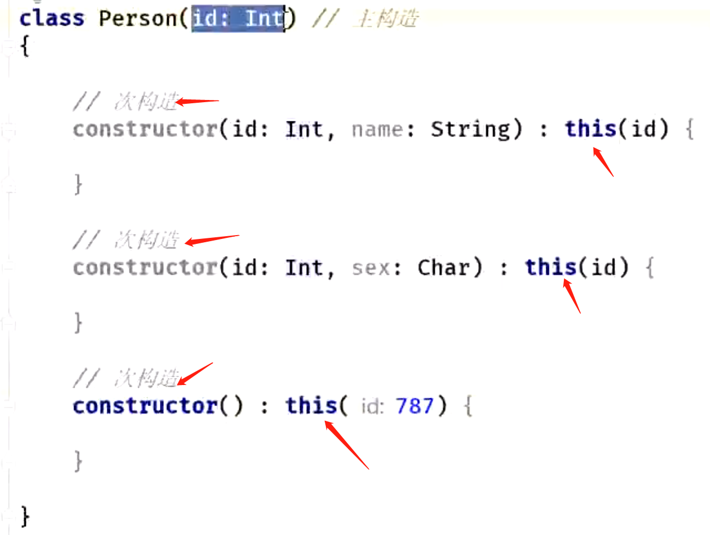
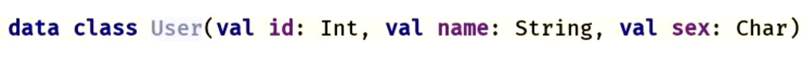

- > 1、类默认是final修饰的，需要加open/abstract才能被继承
     2、接口默认都是open的
- # 1、类的继承  和  实现接口：
	- ```kotlin
	  /**
	   *  kotlin  用 ： 代替 java里的 extend  类     继承类    类后需要有（）
	   *          用 ： 代替implements 实现接口      实现接口   接口后不需要有（）
	   */
	  public class MainActivity extends AppCompatActivity implements View.OnClickListener {
	   
	  }
	   
	   
	  class MainActivity : AppCompatActivity(), View.OnClickListener {
	  }
	  ```
- # 一、kotlin中的匿名内部类的生成
  collapsed:: true
	- ```java
	  // java  
	      Button btn_one;
	    
	      btn_one = findViewById(R.id.btn_one);
	      btn_one.setOnClickListener(new View.OnClickListener() {
	        @Override
	         public void onClick(View v) {
	   
	         }
	      });
	      
	  // kotlin 没有 new关键字  但是有object   object会自动生成一个单例对象
	          et_name.setOnClickListener(object : View.OnClickListener {
	              override fun onClick(v: View?) {
	              }
	          })
	  ```
- # 二、定义枚举类型
  collapsed:: true
	- ```java
	  // java   只使用 enum
	  public enum State{
	          
	  }
	  // kotlin   使用 enum class
	  enum class State{
	   
	  }
	  ```
- # 三、内部类 获取外部类对象修改外部类成员变量     例如网络数据回调中
  collapsed:: true
	- ```java
	  // java   成员变量    内部类更改外部类成功变量时 会用  外部类名.this.成员变量 获取
	   private int position;
	   
	   viewpager.registerOnPageChangeCallback(new ViewPager2.OnPageChangeCallback() {
	              @Override
	              public void onPageScrolled(int position, float positionOffset, int positionOffsetPixels) {
	                  super.onPageScrolled(position, positionOffset, positionOffsetPixels);
	              }
	   
	              @Override
	              public void onPageSelected(int position) {
	                  super.onPageSelected(position);
	                  SoundFragment.this.position = position;
	              }
	   
	              @Override
	              public void onPageScrollStateChanged(int state) {
	                  super.onPageScrollStateChanged(state);
	              }
	          });
	   
	  // kotlin  使用   this@外部类名.成员变量
	  this@SoundFragment.position  = position
	  ```
- # 四、静态内部类   安卓是可以使用static   kotlin  里没有static 关键字的
  collapsed:: true
	- ```java
	       *  kotlin 里 静态内部类是没有关键字的不写关键字 默认就是    而  java 里是使用 static的
	       *  kotlin 里 嵌套内部类 是使用关键字的inner              而  java是不需要写的       这两个地方是相反的
	       *  kotlin  inner 嵌套内部类是不允许有伴生对象的     默认的静态内部类可以有半生对象
	       *  internal 关键字   模块内可见 修饰符  在 当前的moudle  可见
	  ```
	- java  类里的静态内部类
	  collapsed:: true
		- ```java
		  class MyRecyclerAdapter extends RecyclerView.Adapter<MyRecyclerAdapter.NewViewHolder> {
		      private List<String> data = new ArrayList<>();
		   
		      void upAndNotify(List<String> data) {
		          this.data = data;
		          notifyDataSetChanged();
		      }
		   
		      @NonNull
		      @Override
		      public NewViewHolder onCreateViewHolder(@NonNull ViewGroup parent, int viewType) {
		          return NewViewHolder.onCreate(parent);
		      }
		   
		      @Override
		      public void onBindViewHolder(@NonNull NewViewHolder holder, int position) {
		          holder.onbind(data.get(position));
		      }
		   
		      @Override
		      public int getItemCount() {
		          return data.size();
		      }
		   
		      /**
		       *  这里包含 一个静态内部类  和一个静态函数
		       */
		      public static class NewViewHolder extends RecyclerView.ViewHolder {
		   
		          public NewViewHolder(@NonNull View itemView) {
		              super(itemView);
		          }
		   
		          /**
		           *  想要 类名.方法名调用
		           * @param parent
		           * @return
		           */
		          @NonNull
		          public static NewViewHolder onCreate(ViewGroup parent) {
		              return new NewViewHolder(LayoutInflater.from(parent.getContext())
		                      .inflate(R.layout.activity_main2, parent, false));
		          }
		   
		          public void onbind(String str) {
		   
		          }
		      }
		  }
		  ```
	- kotlin里的静态内部类  ：  直接写的类就是静态内部类    静态方法  使用伴生对象处理  达到类名. 方法名的调用
	  collapsed:: true
		- ```java
		  class MyRecuclerAdapterTwo : RecyclerView.Adapter<MyRecuclerAdapterTwo.NewViewHolder>() {
		   
		      private var data: List<String?> = ArrayList()
		   
		      fun upAndNotify(data: List<String>) {
		          this.data = data
		          notifyDataSetChanged()
		      }
		   
		      override fun onCreateViewHolder(parent: ViewGroup, viewType: Int): NewViewHolder {
		          return NewViewHolder.onCreate(parent)
		      }
		   
		      override fun onBindViewHolder(holder:NewViewHolder, position: Int) {
		          holder.onBind(data[position])
		      }
		   
		      override fun getItemCount(): Int {
		          return data.size
		      }
		      /**
		       *  kotlin 里 静态内部类是没有关键字的不写关键字 默认就是    而  java 里是使用 static的
		       *  kotlin 里 嵌套内部类 是使用关键字的inner              而  java是不需要写的       这两个地方是相反的
		       *  kotlin  inner 嵌套内部类是不允许有伴生对象的     默认的静态内部类可以有半生对象
		       *  internal 关键字   模块内可见 修饰符  在 当前的moudle  可见
		       *  class viewholder
		       */
		       class NewViewHolder internal constructor(itemView: View) : RecyclerView.ViewHolder(itemView) {
		          fun onBind(str: String?) {
		   
		          }
		   
		          /**
		           *  把静态方法 放进 伴生对象里   因为想类名.方法名调用
		           */
		          companion object {
		              fun onCreate(parent: ViewGroup): NewViewHolder {
		                  return NewViewHolder(LayoutInflater.from(parent.context)
		                          .inflate(R.layout.activity_main2, parent, false))
		              }
		          }
		      }
		  ```
- # 五、构造器
  collapsed:: true
	- ## 次构造器
	  collapsed:: true
		- ```java
		  class User {
		   
		      var username: String? = null
		      var password: String? = null
		      @JvmField
		      var code: String? = null
		   
		      /**
		       *  无参数构造
		       *  constructor关键字来代表构造函数
		       */
		      constructor()
		   
		      /**
		       *  有参构造
		       */
		      constructor(username: String?, password: String?, code: String?) {
		          this.username = username
		          this.code = code
		          this.password = password
		      }
		  }
		  ```
	- ## 主构造器+init代码块
	  collapsed:: true
		- 将设定的构造函数名   直接加在 类名后边  ，主构造器不能包含任何代码，   而构造函数里初始化成员变量的代码可以加在init代码块里
		- 1 如果该class 没有被可见性修饰符   或者注解修饰  这种声明主构造函数的方法可以省略constructor
		- 2 成员变量初始化可以直接访问  主构造函数中的参数
		- 3 init初始化代码块  和  成员变量初始化   会按照他们在文件中的上下顺序执行
		- ```java
		  /**
		   *  1 如果该class 没有被可见性修饰符   或者注解修饰  这种声明主构造函数的方法可以省略constructor
		   */
		   
		  class User constructor(username: String?, password: String?, code: String?) {
		   
		      var username: String? = null
		      var password: String? = null
		   
		      @JvmField
		      var code: String? = null
		   
		      /**
		       *  无参数构造
		       *  constructor关键字来代表构造函数
		       */
		      constructor()
		   
		      /**
		       *  2 init代码块会随着主构造函数
		       *    成员变量初始化可以直接访问  主构造函数中的参数
		       *  
		       */
		      init {
		          this.username = username
		          this.code = code
		          this.password = password
		      }
		  }
		  ```
	- ## 主构造器需要调用super()方法的 写法
	  collapsed:: true
		- ```java
		  // 普通构造
		   
		  class MyImageView : AppCompatImageView {
		      constructor(context: Context) : this(context, null) {
		      }
		   
		      constructor(context: Context, attr: AttributeSet?) : super(context, attr) {
		   
		      }
		  }
		   
		  // 改成主构造器
		  /**
		   *  主构造器
		   *  1 将constructor(context: Context, attr: AttributeSet?) 写在 类名后边
		   *  2 普通构造函数调用super方法传入参数  写在继承的父类 的右边
		   *
		   */
		  class MyImageView constructor(context: Context, attr: AttributeSet?) : AppCompatImageView(context, attr) {
		     
		      constructor(context: Context) : this(context, null) {
		      }
		  }
		  ```
	- ## 构造器里初始化成员变量-》加上  var/val
	  collapsed:: true
		- 成员变量初始化时是直接可以访问
		- 主构造器里的参数的，其他函数里 或者代码块里 是不可以直接访问主构造器里参数的    需要做如下操作变成成员变量
		- ## 在主构造参数前面加上  var/val  使构造参数 同时成为成员变量
			- ```java
			  class User(var username: String?, var password: String?, var code: String?) {
			   
			      /**
			       *  无参数构造
			       *  constructor关键字来代表构造函数
			       */
			      constructor()
			  }
			  ```
	- ## 注意点：
	  collapsed:: true
		- 如果类声明了主构造，和 次构造函数，次构造里必须调用主构造
			- 
- # 六、data class 数据类
	- 会自动生成 成员变量、set get、toString equals hashcode  copy(复制对象)。。。。等函数
	- ```java
	  /**
	   *  kotlin里的set get 是与成员变量关联一起的 写出来是
	   */
	  data class User(var username: String?, var password: String?, var code: String?) {
	   
	      /**
	       *  无参数构造
	       *  constructor关键字来代表构造函数
	       */
	      constructor()
	  }
	  ```
	- # 举例
		- 
		- 编译成class  反编译成java后
			- ```java
			  package com.example.myapplication;
			  
			  import kotlin.Metadata;
			  import kotlin.jvm.internal.Intrinsics;
			  import org.jetbrains.annotations.NotNull;
			  import org.jetbrains.annotations.Nullable;
			  
			  @Metadata(
			     mv = {1, 8, 0},
			     k = 1,
			     d1 = {"\u0000 \n\u0002\u0018\u0002\n\u0002\u0010\u0000\n\u0000\n\u0002\u0010\b\n\u0000\n\u0002\u0010\u000e\n\u0002\b\t\n\u0002\u0010\u000b\n\u0002\b\u0004\b\u0086\b\u0018\u00002\u00020\u0001B\u0015\u0012\u0006\u0010\u0002\u001a\u00020\u0003\u0012\u0006\u0010\u0004\u001a\u00020\u0005¢\u0006\u0002\u0010\u0006J\t\u0010\u000b\u001a\u00020\u0003HÆ\u0003J\t\u0010\f\u001a\u00020\u0005HÆ\u0003J\u001d\u0010\r\u001a\u00020\u00002\b\b\u0002\u0010\u0002\u001a\u00020\u00032\b\b\u0002\u0010\u0004\u001a\u00020\u0005HÆ\u0001J\u0013\u0010\u000e\u001a\u00020\u000f2\b\u0010\u0010\u001a\u0004\u0018\u00010\u0001HÖ\u0003J\t\u0010\u0011\u001a\u00020\u0003HÖ\u0001J\t\u0010\u0012\u001a\u00020\u0005HÖ\u0001R\u0011\u0010\u0002\u001a\u00020\u0003¢\u0006\b\n\u0000\u001a\u0004\b\u0007\u0010\bR\u0011\u0010\u0004\u001a\u00020\u0005¢\u0006\b\n\u0000\u001a\u0004\b\t\u0010\n¨\u0006\u0013"},
			     d2 = {"Lcom/example/myapplication/User;", "", "id", "", "name", "", "(ILjava/lang/String;)V", "getId", "()I", "getName", "()Ljava/lang/String;", "component1", "component2", "copy", "equals", "", "other", "hashCode", "toString", "My_Application.app.main"}
			  )
			  public final class User {
			     private final int id;
			     @NotNull
			     private final String name;
			  
			     public final int getId() {
			        return this.id;
			     }
			  
			     @NotNull
			     public final String getName() {
			        return this.name;
			     }
			  
			     public User(int id, @NotNull String name) {
			        Intrinsics.checkNotNullParameter(name, "name");
			        super();
			        this.id = id;
			        this.name = name;
			     }
			  
			     public final int component1() {
			        return this.id;
			     }
			  
			     @NotNull
			     public final String component2() {
			        return this.name;
			     }
			  
			     @NotNull
			     public final User copy(int id, @NotNull String name) {
			        Intrinsics.checkNotNullParameter(name, "name");
			        return new User(id, name);
			     }
			  
			     // $FF: synthetic method
			     public static User copy$default(User var0, int var1, String var2, int var3, Object var4) {
			        if ((var3 & 1) != 0) {
			           var1 = var0.id;
			        }
			  
			        if ((var3 & 2) != 0) {
			           var2 = var0.name;
			        }
			  
			        return var0.copy(var1, var2);
			     }
			  
			     @NotNull
			     public String toString() {
			        return "User(id=" + this.id + ", name=" + this.name + ")";
			     }
			  
			     public int hashCode() {
			        int var10000 = Integer.hashCode(this.id) * 31;
			        String var10001 = this.name;
			        return var10000 + (var10001 != null ? var10001.hashCode() : 0);
			     }
			  
			     public boolean equals(@Nullable Object var1) {
			        if (this != var1) {
			           if (var1 instanceof User) {
			              User var2 = (User)var1;
			              if (this.id == var2.id && Intrinsics.areEqual(this.name, var2.name)) {
			                 return true;
			              }
			           }
			  
			           return false;
			        } else {
			           return true;
			        }
			     }
			  }
			  
			  ```
- # 七、对象 set get方法
	- > var 修饰的成员变量默认生成setget方法
	      val 修饰的成员变量默认生成get方法
	      如果不想外界访问，可以私有化
	- java类 都继承自Object    kotlin都继承自Any
		- ```java
		  /**
		   *  kotlin里的set get 是与成员变量关联一起的 写出来是
		   */
		  class User {
		      @JvmField
		      var username: String? = null
		      var password: String? = null
		      var code: String? = null
		          /**
		           *  这个setget  可以省略的  会有默认的
		           */
		          set(value) {
		              //field  帮助访问成员属性的
		              field = value
		          }
		          get() {
		              return field
		          }
		   
		      /**
		       *  constructor关键字来代表构造函数
		       */
		      constructor()
		   
		      /**
		       *  有参构造
		       */
		      constructor(username: String?, password: String?, code: String?) {
		          this.username = username
		          this.code = code
		          this.password = password
		      }
		  }
		   
		   
		  // 在java里调用的时候  会默认带setget
		  User user = new User();
		  user.setUsername("sss");
		   
		  // 如果想  直接访问成员变量  @JvmField用该修饰 会形成一个公开的成员变量
		   
		  User user = new User();
		  user.username = "sss";
		  ```
	- java
		- ```java
		  public class TestJava {
		      String username;
		      String password;
		      String code;
		   
		      public String getCode() {
		          return code;
		      }
		   
		      public String getPassword() {
		          return password;
		      }
		   
		      public String getUsername() {
		          return username;
		      }
		   
		      public void setCode(String code) {
		          this.code = code;
		      }
		   
		      public void setPassword(String password) {
		          this.password = password;
		      }
		   
		      public void setUsername(String username) {
		          this.username = username;
		      }
		   
		      public TestJava() {
		   
		      }
		   
		      /**
		       * 有参构造
		       */
		      public TestJava(String username, String password, String code) {
		          this.username = username;
		          this.code = code;
		          this.password = password;
		      }
		  }
		  ```
- # 八、单例类
	- [[使用object声明kotlin 类]]