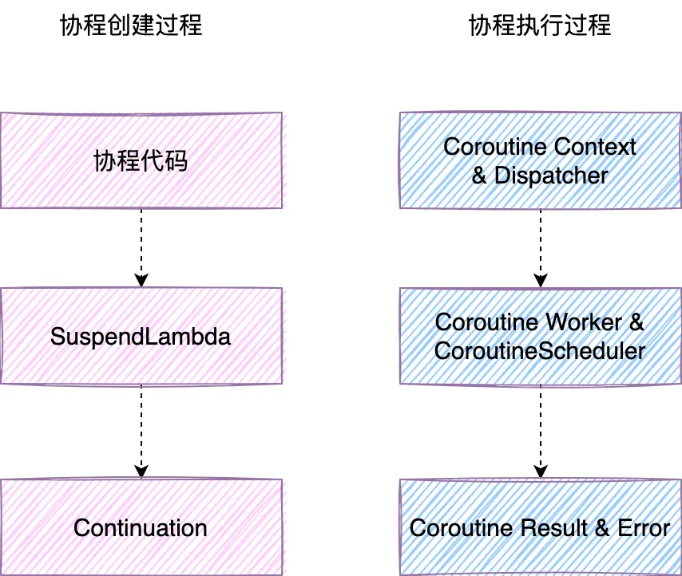

- # 简介
  collapsed:: true
	- 协程是一种并发设计模式，您可以在 Android 平台上使用它来简化异步执行的代码。协程是在版本 1.3 中添加到 Kotlin 的，它基于来自其他语言的既定概念。
	- ## [特点](https://kotlinlang.org/docs/coroutines-basics.html#structured-concurrency)
		- 协程是我们在 Android 上进行异步编程的推荐解决方案。值得关注的特点包括：
		- 轻量：您可以在单个线程上运行多个协程，因为协程支持挂起，不会使正在运行协程的线程阻塞。挂起比阻塞节省内存，且支持多个并行操作。
		  内存泄漏更少：使用结构化并发机制在一个作用域内执行多项操作。
		  内置取消支持：取消操作会自动在运行中的整个协程层次结构内传播。
		  Jetpack 集成：许多 Jetpack 库都包含提供全面协程支持的扩展。某些库还提供自己的协程作用域，可供您用于结构化并发。
- # 原理解析
	- 本文着重于协程原理的剖析，不再进行协程使用部分的介绍，如不了解请参考其他使用文档。本文使用的kotlin版本为1.6.1，不同kotlin版本生成的字节码稍有不同，内部原理没有太大区别。
	- ## 源码分析
	  collapsed:: true
		- 为了详细展示出运行的原理，下面一段中包含大量代码，可以先阅读文字解说再看大致源码。
		- 第一步我们从最简单的代码开始，逐步剖析其中的原理，下面是我准备的第一段代码：
		  collapsed:: true
			- ```
			  class MainActivity : AppCompatActivity() {
			      @OptIn(DelicateCoroutinesApi::class)
			      override fun onCreate(savedInstanceState: Bundle?) {
			          super.onCreate(savedInstanceState)
			          setContentView(R.layout.activity_main)
			          GlobalScope.launch {
			              println("Coroutine start")
			          }
			      }
			  }
			  ```
		- 直接在Activity的onCreate方法中启动一个协程，打印一行文本。反编译class文件后得到如下两个类：
		  collapsed:: true
			- ```java
			  public final class MainActivity extends AppCompatActivity {
			      /* access modifiers changed from: protected */
			      @Override // androidx.activity.ComponentActivity, androidx.core.app.ComponentActivity, androidx.fragment.app.FragmentActivity
			      public void onCreate(Bundle savedInstanceState) {
			          super.onCreate(savedInstanceState);
			          setContentView(R.layout.activity_main);
			          Job unused = BuildersKt__Builders_commonKt.launch$default(GlobalScope.INSTANCE, null, null, new MainActivity$onCreate$1(null), 3, null);
			      }
			  }
			  ```
		- 代码
		  collapsed:: true
			- ```java
			  final class MainActivity$onCreate$1 extends SuspendLambda implements Function2<CoroutineScope, Continuation<? super Unit>, Object> {
			      int label;
			  
			      MainActivity$onCreate$1(Continuation<? super MainActivity$onCreate$1> continuation) {
			          super(2, continuation);
			      }
			  
			      @Override // kotlin.coroutines.jvm.internal.BaseContinuationImpl
			      public final Continuation<Unit> create(Object obj, Continuation<?> continuation) {
			          return new MainActivity$onCreate$1(continuation);
			      }
			  
			      public final Object invoke(CoroutineScope coroutineScope, Continuation<? super Unit> continuation) {
			          return ((MainActivity$onCreate$1) create(coroutineScope, continuation)).invokeSuspend(Unit.INSTANCE);
			      }
			  
			      @Override // kotlin.coroutines.jvm.internal.BaseContinuationImpl
			      public final Object invokeSuspend(Object obj) {
			          IntrinsicsKt.getCOROUTINE_SUSPENDED();
			          switch (this.label) {
			              case 0:
			                  ResultKt.throwOnFailure(obj);
			                  System.out.println((Object) "Coroutine start");
			                  return Unit.INSTANCE;
			              default:
			                  throw new IllegalStateException("call to 'resume' before 'invoke' with coroutine");
			          }
			      }
			  }
			  ```
		- 从上面反编译类可以看出，协程代码块会被编译成继承了SuspendLambda的代码类，并实现了Function2接口，Function2是高阶函数生成的类，那么这个类的invoke方法就是入口方法。看到这里我们可以暂时把这个类放一放，看看上面的MainActivity的反编译代码。
		- 协程的启动被编译成了这行代码
		  collapsed:: true
			- ```
			      Job unused = BuildersKt__Builders_commonKt.launch$default(GlobalScope.INSTANCE, null, null, new MainActivity$onCreate$1(null), 3, null);`
			  ```
		- 看一下BuildersKt__Builders_commonKt.launch$default方法
		  collapsed:: true
			- ```
			    public static /* synthetic */ Job launch$default(CoroutineScope coroutineScope, CoroutineContext coroutineContext, CoroutineStart coroutineStart, Function2 function2, int i, Object obj) {
			          if ((i & 1) != 0) {
			              coroutineContext = EmptyCoroutineContext.INSTANCE;
			          }
			          if ((i & 2) != 0) {
			              coroutineStart = CoroutineStart.DEFAULT;
			          }
			          return BuildersKt.launch(coroutineScope, coroutineContext, coroutineStart, function2);
			      }
			  ```
		- 先不关注细枝末节，继续看BuildersKt.launch方法
		  collapsed:: true
			- ```
			      public static final Job launch(CoroutineScope $this$launch, CoroutineContext context, CoroutineStart start, Function2<? super CoroutineScope, ? super Continuation<? super Unit>, ? extends Object> function2) {
			          return BuildersKt__Builders_commonKt.launch($this$launch, context, start, function2);
			      }
			  ```
		- 再回到BuildersKt__Builders_commonKt.launch方法
		  collapsed:: true
			- ```
			      public static final Job launch(CoroutineScope $this$launch, CoroutineContext context, CoroutineStart start, Function2<? super CoroutineScope, ? super Continuation<? super Unit>, ? extends Object> function2) {
			          LazyStandaloneCoroutine coroutine;
			          CoroutineContext newContext = CoroutineContextKt.newCoroutineContext($this$launch, context);
			          if (start.isLazy()) {
			              coroutine = new LazyStandaloneCoroutine(newContext, function2);
			          } else {
			              coroutine = new StandaloneCoroutine(newContext, true);
			          }
			          coroutine.start(start, coroutine, function2);
			          return coroutine;
			      }
			  ```
		- 继续追踪coroutine.start方法，这里有一个lazy的判断，简单看一下可知LazyStandaloneCoroutine是继承自StandaloneCoroutine，他们的start的实现都在父类AbstractCoroutine中，具体实现如下：
		  collapsed:: true
			- ```
			    public final <R> void start(CoroutineStart start, R r, Function2<? super R, ? super Continuation<? super T>, ? extends Object> function2) {
			          start.invoke(function2, r, this);
			      }
			  ```
		- 继续往下追踪，CoroutineStart.invoke(function2, r, this)方法由于反编译后的代码由于有枚举类阅读起来比较吃力，我们可以直接看kotlin源码：
		- 在分析kotlin协程源码时要结合反编译和kotlin源码，由于kotlin编译器会在编译时生成较多代码因此优先读反编译代码，当发现反编译代码阅读比较吃力时再切换到kotlin源码方式。
		  collapsed:: true
			- ```
			      public operator fun <R, T> invoke(block: suspend R.() -> T, receiver: R, completion: Continuation<T>): Unit =
			          when (this) {
			              DEFAULT -> block.startCoroutineCancellable(receiver, completion)
			              ATOMIC -> block.startCoroutine(receiver, completion)
			              UNDISPATCHED -> block.startCoroutineUndispatched(receiver, completion)
			              LAZY -> Unit // will start lazily
			          }
			  
			  ```
		- 看到这里我们就不能继续往下读了，因为我们不知道CoroutineStart这个类是什么枚举类，那就回到CoroutineStart这个类创建的地方。回到MainActivity类，发现BuildersKt__Builders_commonKt.launch$default方法中传的CoroutineStart参数是null，再往下走BuildersKt__Builders_commonKt.launch方法中有一段代码如下：
		  collapsed:: true
			- ```
			  if ((i & 2) != 0) {
			     coroutineStart = CoroutineStart.DEFAULT;
			  }
			  ```
		- 通过上文我们可知这个i=3，因此coroutineStart就是CoroutineStart.DEFAULT。那我们就继续往下看：
		  collapsed:: true
			- ```
			  internal fun <R, T> (suspend (R) -> T).startCoroutineCancellable(
			      receiver: R, completion: Continuation<T>,
			      onCancellation: ((cause: Throwable) -> Unit)? = null
			  ) =
			      runSafely(completion) {
			          createCoroutineUnintercepted(receiver, completion).intercepted().resumeCancellableWith(Result.success(Unit), onCancellation)
			      }
			  先
			  ```
		- 先看一下runSafely方法是干什么的：
		  collapsed:: true
			- ```
			  private inline fun runSafely(completion: Continuation<*>, block: () -> Unit) {
			      try {
			          block()
			      } catch (e: Throwable) {
			          dispatcherFailure(completion, e)
			      }
			  }
			  ```
		- 这里学到了新的写法，使用kotlin的闭包可以优雅的处理异常，那我们继续看createCoroutineUnintercepted方法，这个方法其实通过ide点进去看到的是IntrinsicsKt.class类文件，无法直接查看到源码，这里有一个小知识，这个源码其实在IntrinsicsJvm.kt文件里，kotlin通过注解@file:kotlin.jvm.JvmName("IntrinsicsKt")，改变了其生成的class文件名。言归正传，继续看代码：
		  collapsed:: true
			- ```
			  @SinceKotlin("1.3")
			  public actual fun <R, T> (suspend R.() -> T).createCoroutineUnintercepted(
			      receiver: R,
			      completion: Continuation<T>
			  ): Continuation<Unit> {
			      val probeCompletion = probeCoroutineCreated(completion)
			      return if (this is BaseContinuationImpl)
			          create(receiver, probeCompletion)
			      else {
			          createCoroutineFromSuspendFunction(probeCompletion) {
			              (this as Function2<R, Continuation<T>, Any?>).invoke(receiver, it)
			          }
			      }
			  }
			  ```
		- probeCoroutineCreated方法直接将completion返回了，继续往下走，从上文可知我们的协程体继承了SuspendLambda，而SuspendLambda又继承了ContinuationImpl，ContinuationImpl继承了BaseContinuationImpl，因此第一个判断条件成立，进入create方法，就是我们的协程体的create：
		  collapsed:: true
			- ```
			   public final Continuation<Unit> create(Object obj, Continuation<?> continuation) {
			          return new MainActivity$onCreate$1(continuation);
			      }
			  ```
		- 这里又创建了一个协程体对象，并且把之前的协程体对象进行了包装，这里可能会很迷茫，明明一开始已经创建了一个协程体对象了，为什么这里又创建了一个呢？我们继续往下看，创建完返回后会进入intercepted方法：
		  collapsed:: true
			- ```
			  public actual fun <T> Continuation<T>.intercepted(): Continuation<T> =
			      (this as? ContinuationImpl)?.intercepted() ?: this
			  ```
		- 这里又调用了协程体的intercepted方法：
		  collapsed:: true
			- ```
			  internal abstract class ContinuationImpl(
			      completion: Continuation<Any?>?,
			      private val _context: CoroutineContext?
			  ) : BaseContinuationImpl(completion) {
			      constructor(completion: Continuation<Any?>?) : this(completion, completion?.context) public override val context: CoroutineContext
			          get() = _context!!
			  
			      @Transient
			      private var intercepted: Continuation<Any?>? = null
			  
			      public fun intercepted(): Continuation<Any?> =
			          intercepted
			              ?: (context[ContinuationInterceptor]?.interceptContinuation(this) ?: this)
			                  .also { intercepted = it }
			  }
			  
			  ```
		- 由于我们刚刚运行到这里，intercepted为null，context是CoroutineContext协程上下文。
		- 进入到CoroutineDispatcher的interceptContinuation方法
		  collapsed:: true
			- ```
			  public final override fun <T> interceptContinuation(continuation: Continuation<T>): Continuation<T> =
			          DispatchedContinuation(this, continuation)
			  ```
		- 这里构造了一个DispatchedContinuation对象并返回。回到上一步，调用完intercepted方法后，调用了DispatchedContinuation的resumeCancellableWith
		  collapsed:: true
			- ```
			  @InternalCoroutinesApi
			  public fun <T> Continuation<T>.resumeCancellableWith(
			      result: Result<T>,
			      onCancellation: ((cause: Throwable) -> Unit)? = null
			  ): Unit = when (this) {
			      is DispatchedContinuation -> resumeCancellableWith(result, onCancellation)
			      else -> resumeWith(result)
			  }
			  ```
		- 这里又调用了DispatchedContinuation的resumeCancellableWith方法，我们看看执行了什么？
		  collapsed:: true
			- ```
			     @Suppress("NOTHING_TO_INLINE")
			      inline fun resumeCancellableWith(
			          result: Result<T>,
			          noinline onCancellation: ((cause: Throwable) -> Unit)?
			      ) {
			          val state = result.toState(onCancellation)
			          if (dispatcher.isDispatchNeeded(context)) {
			              _state = state
			              resumeMode = MODE_CANCELLABLE
			              dispatcher.dispatch(context, this)
			          } else {
			              executeUnconfined(state, MODE_CANCELLABLE) {
			                  if (!resumeCancelled(state)) {
			                      resumeUndispatchedWith(result)
			                  }
			              }
			          }
			      }
			  ```
		- 根据逻辑这里会调用dispatcher.dispatch方法，实现如下：
		  collapsed:: true
			- ```
			  override fun dispatch(context: CoroutineContext, block: Runnable): Unit = coroutineScheduler.dispatch(block)
			  ```
		- 这里首次引入了CoroutineScheduler，这个概念后面再讲，我们继续往下看：
		  collapsed:: true
			- ```
			   fun dispatch(block: Runnable, taskContext: TaskContext = NonBlockingContext, tailDispatch: Boolean = false) {
			          trackTask() // this is needed for virtual time support
			          val task = createTask(block, taskContext)
			          // try to submit the task to the local queue and act depending on the result
			          val currentWorker = currentWorker()
			          val notAdded = currentWorker.submitToLocalQueue(task, tailDispatch)
			          if (notAdded != null) {
			              if (!addToGlobalQueue(notAdded)) {
			                  // Global queue is closed in the last step of close/shutdown -- no more tasks should be accepted
			                  throw RejectedExecutionException("$schedulerName was terminated")
			              }
			          }
			          val skipUnpark = tailDispatch && currentWorker != null
			          // Checking 'task' instead of 'notAdded' is completely okay
			          if (task.mode == TASK_NON_BLOCKING) {
			              if (skipUnpark) return
			              signalCpuWork()
			          } else {
			              // Increment blocking tasks anyway
			              signalBlockingWork(skipUnpark = skipUnpark)
			          }
			      }
			  ```
		- 这里出现了一个方法currentWorker，直觉告诉我这跟线程有关系，我们看一下currentWorker的实现：
		  collapsed:: true
			- ```
			   private fun currentWorker(): Worker? = (Thread.currentThread() as? Worker)?.takeIf { it.scheduler == this }
			  ```
		- 如果当前线程为Worker就返回当前Worker，否则返回null，通过这段代码我们可以理解，kotlin协程里的执行线程是被包装成了Worker，我们看一下Worker的定义就知道了：
		  collapsed:: true
			- ```
			  internal inner class Worker private constructor() : Thread() {}
			  ```
		- 好了，继续我们刚才的运行过程，首次执行currentWorker为null，那我们再看看submitToLocalQueue的实现：
		  collapsed:: true
			- ```
			   private fun Worker?.submitToLocalQueue(task: Task, tailDispatch: Boolean): Task? {
			          if (this == null) return task
			          /*
			           * This worker could have been already terminated from this thread by close/shutdown and it should not
			           * accept any more tasks into its local queue.
			           */
			          if (state === WorkerState.TERMINATED) return task
			          // Do not add CPU tasks in local queue if we are not able to execute it
			          if (task.mode == TASK_NON_BLOCKING && state === WorkerState.BLOCKING) {
			              return task
			          }
			          mayHaveLocalTasks = true
			          return localQueue.add(task, fair = tailDispatch)
			      }
			  ```
		- 当Worker为null的时候返回了task，继续执行，会进入到addToGlobalQueue方法，
		  collapsed:: true
			- ```
			    @JvmField
			      val globalCpuQueue = GlobalQueue()
			      @JvmField
			      val globalBlockingQueue = GlobalQueue()
			  
			      private fun addToGlobalQueue(task: Task): Boolean {
			          return if (task.isBlocking) {
			              globalBlockingQueue.addLast(task)
			          } else {
			              globalCpuQueue.addLast(task)
			          }
			      }
			  ```
		- 由于上文中dispatch方法中的taskContext为默认值NonBlockingContext，创建的task.isBlocking为false，会将task加入到globalCpuQueue队列中。继续执行就会进入到signalCpuWork方法中
		  collapsed:: true
			- ```
			  fun signalCpuWork() {
			          // 从stack中pop出一个挂起线程，并对其进行唤醒。
			          if (tryUnpark()) return
			          if (tryCreateWorker()) return
			          tryUnpark()
			      }
			  ```
		- 由于首次执行协程，没有挂起的线程，tryUnpark方法可以忽略，继续看tryCreateWorker方法
		  collapsed:: true
			- ```
			  private fun tryCreateWorker(state: Long = controlState.value): Boolean {
			          val created = createdWorkers(state)
			          val blocking = blockingTasks(state)
			          val cpuWorkers = (created - blocking).coerceAtLeast(0)
			          /*
			           * We check how many threads are there to handle non-blocking work,
			           * and create one more if we have not enough of them.
			           */
			          if (cpuWorkers < corePoolSize) {
			              val newCpuWorkers = createNewWorker()
			              // If we've created the first cpu worker and corePoolSize > 1 then create
			              // one more (second) cpu worker, so that stealing between them is operational
			              if (newCpuWorkers == 1 && corePoolSize > 1) createNewWorker()
			              if (newCpuWorkers > 0) return true
			          }
			          return false
			      }
			  ```
		- 首次运行cpuWorkers为0，继续看createNewWorker方法：
		  collapsed:: true
			- ```
			  /*
			       * Returns the number of CPU workers after this function (including new worker) or
			       * 0 if no worker was created.
			       */
			      private fun createNewWorker(): Int {
			          synchronized(workers) {
			              //...省略部分代码
			              //创建一个Worker并执行
			              val worker = Worker(newIndex)
			              workers.setSynchronized(newIndex, worker)
			              require(newIndex == incrementCreatedWorkers())
			              worker.start()
			              return cpuWorkers + 1
			          }
			      }
			  ```
		- 这里主要是创建了Worker并且调用了worker.start方法。到这里我们应该能看明白CoroutineScheduler其实是线程池，而Worker是一个线程，协程就是运行在Worker线程中。后面的代码暂时不再详细介绍了，有兴趣的读者可以自行阅读kotlinx.coroutines.scheduling.CoroutineScheduler.Worker。下面我们打印一下线程名称，来确认一下逻辑判断，将协程体代码修改为如下：
		  collapsed:: true
			- ```
			  GlobalScope.launch {
			              println("Coroutine start : ${Thread.currentThread().name}")
			          }
			  ```
		- 打印结果如下：
		  collapsed:: true
			- ```
			  Coroutine start : DefaultDispatcher-worker-1
			  ```
	- ## 原理分析
	  collapsed:: true
		- 协程的创建和执行过程原理图大致如下：
		- 
		- 协程创建：kotlin编译器将协程体编译为SuspendLambda对象，并且创建为Coroutine对象，在运行中一共会创建两个SuspendLambda，主要是为了实现挂起功能，由于篇幅限制后面再讲。
		- 协程执行：协程代码在执行时需要一个协程上下文和分发器，协程上下文包括协程范围和协程作业，并负责管理协程的生命周期和作业的关系。分发器则是用于将协程分发到线程池中运行。
	- ## 协程相关概念
	  collapsed:: true
		- ### SuspendLambda
		  collapsed:: true
			- 上面我们可以看到，我们的协程代码被编译成了继承了SuspendLambda的类，协程体的继承链是这样的：SuspendLambda->ContinuationImpl->BaseContinuationImpl->Continuation，我们从继承链的最顶部Continuation类开始，依次分析各个类的作用：
				- ```
				  public interface Continuation<in T> {
				      /**
				       * 协程上下文
				       */
				      public val context: CoroutineContext
				  
				      /**
				       * 恢复相应协程的执行，将成功或失败[result]作为最后一个挂起点的返回值。
				       */
				      public fun resumeWith(result: Result<T>)
				  }
				  ```
			- Continuation 接口内部的实现很简单，一个协程上下文context，一个方法声明resumeWith()，用于协程的启动或者恢复执行。
		- ### BaseContinuationImpl：
		  collapsed:: true
			- ```
			  internal abstract class BaseContinuationImpl(
			      // This is `public val` so that it is private on JVM and cannot be modified by untrusted code, yet
			      // it has a public getter (since even untrusted code is allowed to inspect its call stack).
			      public val completion: Continuation<Any?>?
			  ) : Continuation<Any?>, CoroutineStackFrame, Serializable {
			      // This implementation is final. This fact is used to unroll resumeWith recursion.
			      public final override fun resumeWith(result: Result<Any?>) {
			          //省略部分代码
			                          val outcome = invokeSuspend(param)
			          //省略部分代码
			      }
			  
			      protected abstract fun invokeSuspend(result: Result<Any?>): Any?
			      //省略部分代码
			  }
			  ```
			- BaseContinuationImpl中定义了一个抽象方法invokeSuspend()，并重写了Continuation的resumeWith()，resumeWith()中调用invokeSuspend()，上文我们看到协程体的代码都被编译到invokeSuspend()方法中，由此可见协程体的执行其实就是resumeWith()被调用。BaseContinuationImpl中的invokeSuspend()只是一个抽象方法，它的具体实现是在协程体类中。
		- ### ContinuationImpl
		  collapsed:: true
			- code
			  collapsed:: true
				- ```
				  internal abstract class ContinuationImpl(
				      completion: Continuation<Any?>?,
				      private val _context: CoroutineContext?
				  ) : BaseContinuationImpl(completion) {
				      constructor(completion: Continuation<Any?>?) : this(completion, completion?.context)
				      // 省略部分代码
				      public fun intercepted(): Continuation<Any?> =
				          intercepted
				              ?: (context[ContinuationInterceptor]?.interceptContinuation(this) ?: this)
				                  .also { intercepted = it }
				  
				      // 省略部分代码
				  }
				  ```
			- ContinuationImpl继承BaseContinuationImpl，它的作用是使用拦截器生成一个DispatchedContinuation对象，这也是一个Continuation，这个对象内部封装线程调度器，以及代理了协程体对象。
		- ### CoroutineScope
		  collapsed:: true
			- CoroutineScope是协程作用域，我们的例子代码使用的GlobalScope就是实现了CoroutineScope。
			  collapsed:: true
				- ```
				  public interface CoroutineScope {
				      /**
				       * The context of this scope.
				       * Context is encapsulated by the scope and used for implementation of coroutine builders that are extensions on the scope.
				       * Accessing this property in general code is not recommended for any purposes except accessing the [Job] instance for advanced usages.
				       *
				       * By convention, should contain an instance of a [job][Job] to enforce structured concurrency.
				       */
				      public val coroutineContext: CoroutineContext
				  }
				  
				  public object GlobalScope : CoroutineScope {
				      /**
				       * Returns [EmptyCoroutineContext].
				       */
				      override val coroutineContext: CoroutineContext
				          get() = EmptyCoroutineContext
				  }
				  ```
			- GlobalScope实现了CoroutineScope接口，而CoroutineScope只有一个属性CoroutineContext协程上下文，GlobalScope重写了这个上下文返回了一个空的协程上下文。GlobalScope由object修饰，是一个单例对象，所以它的生命周期跟随整个应用。
			- CoroutineScope可以理解为作用范围，通过CoroutineScope的扩展函数去创建一个协程，当这个作用范围被取消的时候，它内部的协程也会被取消，比如viewModelScope、lifecycleScope具有这样的功能。
		- ### CoroutineContext
		  collapsed:: true
			- ```
			  public interface CoroutineContext {
			      /**
			       * Returns the element with the given [key] from this context or `null`.
			       */
			      public operator fun <E : Element> get(key: Key<E>): E?
			  
			      /**
			       * Accumulates entries of this context starting with [initial] value and applying [operation]
			       * from left to right to current accumulator value and each element of this context.
			       */
			      public fun <R> fold(initial: R, operation: (R, Element) -> R): R
			  
			      /**
			       * Returns a context containing elements from this context and elements from  other [context].
			       * The elements from this context with the same key as in the other one are dropped.
			       */
			      public operator fun plus(context: CoroutineContext): CoroutineContext
			          //... 省略部分代码
			  
			      /**
			       * Returns a context containing elements from this context, but without an element with
			       * the specified [key].
			       */
			      public fun minusKey(key: Key<*>): CoroutineContext
			  
			      /**
			       * Key for the elements of [CoroutineContext]. [E] is a type of element with this key.
			       */
			      public interface Key<E : Element>
			  
			      /**
			       * An element of the [CoroutineContext]. An element of the coroutine context is a singleton context by itself.
			       */
			      public interface Element : CoroutineContext {
			          //... 省略部分代码
			      }
			  }
			  ```
			- CoroutineContext是一个接口，声明的方法展示了它的能力，是一个以Key为索引的数据集合，它的Key是一个interface，每一个元素的类型是Element，而Element又实现CoroutineContext，所以它既可以是一个集合的元素，也可以是一个集合。
		- ### CoroutineStart
		  collapsed:: true
			- CoroutineStart 是协程的启动模式，有以下4种模式：
			- DEFAULT 立即调度，可以在执行前被取消
			  LAZY 需要时才启动，需要start、join等函数触发才可进行调度
			  ATOMIC 立即调度，协程肯定会执行，执行前不可以被取消
			  UNDISPATCHED 立即在当前线程执行，直到遇到第一个挂起点（可能切线程
		- ### Dispatchers
		  collapsed:: true
			- Dispatchers是协程中提供的线程调度器，用来切换线程，指定协程所运行的线程。
				- ```
				  public actual object Dispatchers {
				      //默认调度器，适合CPU密集型任务调度器 比如逻辑计算；
				      @JvmStatic
				      public actual val Default: CoroutineDispatcher = DefaultScheduler
				  
				      //UI调度器
				      @JvmStatic
				      public actual val Main: MainCoroutineDispatcher get() = MainDispatcherLoader.dispatcher
				  
				      //无限制调度器，对协程执行的线程不做限制，协程恢复时可以在任意线程；
				      @JvmStatic
				      public actual val Unconfined: CoroutineDispatcher = kotlinx.coroutines.Unconfined
				  
				      //IO调度器，适合IO密集型任务调度器 比如读写文件，网络请求等。
				      @JvmStatic
				      public val IO: CoroutineDispatcher = DefaultIoScheduler
				  
				      
				      @DelicateCoroutinesApi
				      public fun shutdown() {
				          DefaultExecutor.shutdown()
				          // Also shuts down Dispatchers.IO
				          DefaultScheduler.shutdown()
				      }
				  }
				  ```
		- 各个线程调度器根据自己的特点有不同的实现，不再一一分析。
		- ### CoroutineScheduler
			- 分析源码的时候我们也讲了CoroutineScheduler就是kotlin实现的一个线程池，提供了协程运行线程，而具体的线程对象则由Worker类实现。由于代码比较多大部分是对策略的封装，有兴趣可以查看源码，此处不再细讲。
	-
	- # 总结
		- 问题
		  反编译的时候发现调用launch创建了一个继承SuspendLambda的协程体对象，后面又调用了create方法创建了一个协程体对象？
		- 其实这里使用了装饰模式，协程其实一共有3层包装，每一层包装都自己的职责：
	- 第一层就是launch和async返回的Job、Deferred，里面封装了协程状态，提供了取消协程接口，而它们的实例都是继承自AbstractCoroutine，AbstractCoroutine就是协程的第一层包装
	- 第二层包装是编译器生成的SuspendLambda的子类，封装了协程执行的代码和执行逻辑，SuspendLambda又继承自BaseContinuationImpl，其completion属性就是协程的第一层包装
	- 第三层包装是协程的线程调度器DispatchedContinuation，封装了线程调度逻辑，并持有协程的第二层包装对象。
	- 回顾
	  协程体类：封装协程体的操作逻辑。
	  CoroutineScope：协程作用域，作用域取消则内部协程相应取消。
	  CoroutineContext：协程上下文，是一个存储了协程运行时信息的集合。
	  CoroutineStart：协程启动模式，4种：DEFAULT、LAZY、ATOMIC、UNDISPATCHED。
	  Dispatchers ：线程调度器，4种：Default、Main、Unconfined、IO。
	  CoroutineScheduler：执行协程体代码的线程池。
	  Worker：Worker的实现是继承了Thread，对java线程的封装。
-