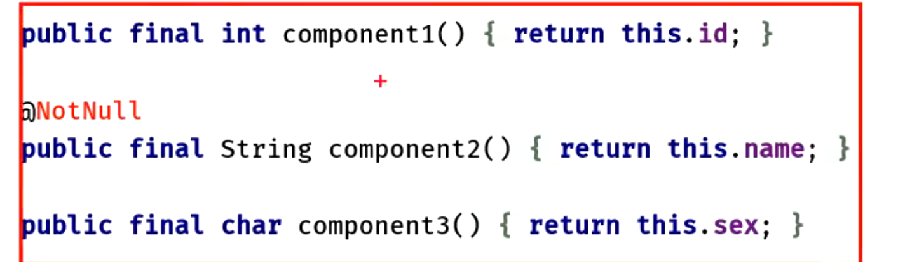

- ## 作用：将data修饰的数据类的参数结构出来
- ## 使用：
  collapsed:: true
	- ```java
	  // 模拟请求网络   定义返回类型  数据类
	  data class Response(var code: Int, var message: String, var body: String)
	   
	  /**
	   *  执行网络请求函数  返回Response
	   */
	  fun excuteNet(): Response {
	      return Response(200, "成功", "好")
	  }
	   
	  fun main() {
	      // 在java里 取返回对象里的数据   先获取到返回对象 再挨个取
	      var response: Response = excuteNet()
	      println(response.code.toString() + response.message + response.body)
	      // 在 kotlin  解构   excuteNet().val  回车 选择 Create destructuring declaration(创建解构声明)
	      val (code, message, body) = excuteNet()
	      // 可直接使用  返回的解构声明是与返回数据类  构造参数一一对应的
	      println(code.toString() + message + body)
	  }
	  ```
- ## 原理：data自动生成 componentx等方法用于结构的。可以看反编译的代码
  collapsed:: true
	- 