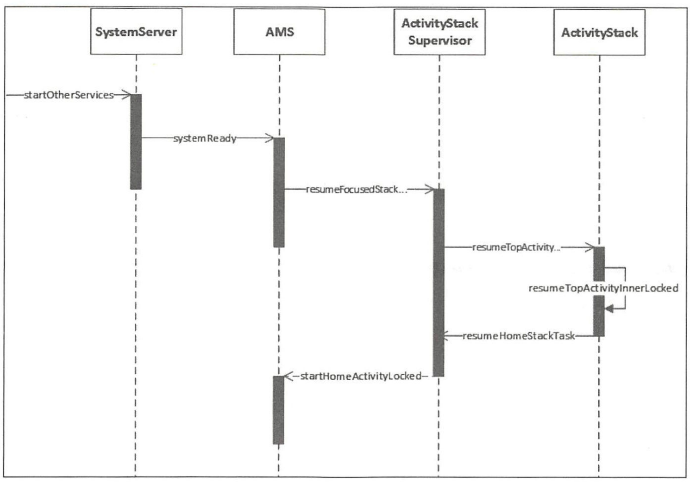

- # 一、概述
	- 系统启动的最后一步是启动一个应用程序用来显示系统中已经安装的应用程序，这个应用程序就叫作Launcher。 Launcher 在启动过程中会请求 PackageManagerService 返回系统中已经安装的应用程序的信息，并将这些信息封装成一个快捷图标列表显示在系统屏幕上，这样用户可以通过点击这些快捷图标来启动相应的应用程序。
	- 通俗来讲 Launcher 就是 Android 系统的桌面，它的作用主要有以下两点：
	  (1 ）作为 Android 系统的启动器，用于启动app应用程序
	  (2 ）作为 Android 系统的桌面，用于显示和管理应用程序的快捷图标或者其他桌面组件。
- # 二、启动过程
	- SystemServer 进程在启动的过程中会启动 PackageManagerService, PackageManagerService 启动后会将系统中的应用程序安装完成。在此前已经启动的 AMS 会将 Launcher 启动起来。
	- 
	- 启动 Launcher的入口为AMS的systemReady方法