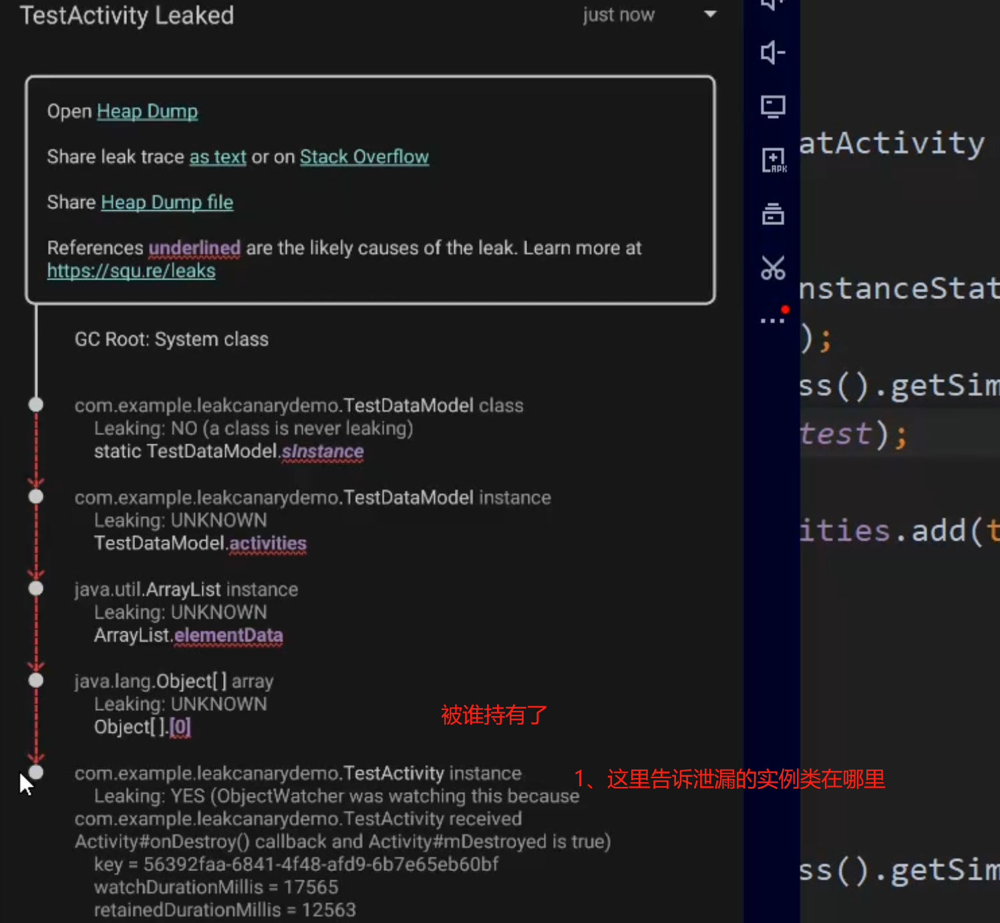

# 1、实际使用分析步骤
collapsed:: true
	- 
- # 2、LeakCanary默认检测的只有activity和fragment
	- 如果需要监控 service 和 其他对象  需要自己调用 RefWatcher    进行监控
		- ```java
		  AppWatcher.INSTANCE.getObjectWatcher().watch(view,"描述为啥要被销毁");
		  ```
	- 直接通过单例  获取  然后 观测指定对象
- # 3、[[LeakCanary原理]]
- # 面试
	- # [[leakCanary-面试]]
- # 参考
	- ## [针对LeakCanary 引用方面的面试题总结]([针对LeakCanary 引用方面的面试题总结]())
	- # [github地址](https://github.com/square/leakcanary)