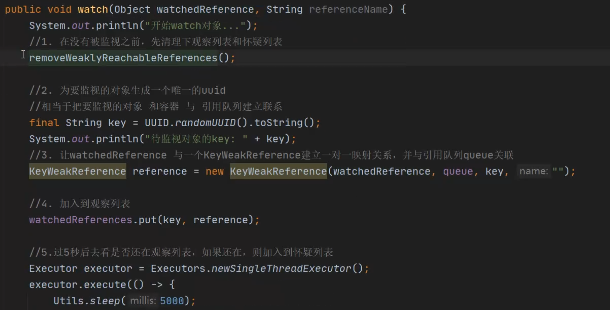
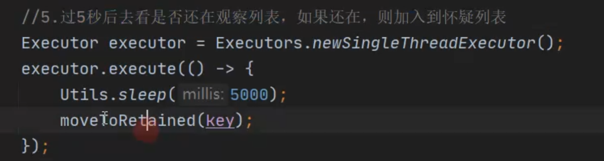

# 1、什么时候开始检测的
collapsed:: true
	- ## Activity检测时机
		- Activity 是通过application.[[#red]]==**registerActivityLifecycleCallbacks**==  传入回调接口 , 在[[#red]]==**onActivityDestoryed**==回调方法中   调用  objectWatcher.watch（activity）开始检测
			- ```java
			  // 那么在应用中  Activity 调用声明周期的时候  这个接口里的对应方法都会被调用 
			  application.registerActivityLifecycleCallbacks(activityRefWatcher.lifecycleCallbacks);
			  ```
	- ## Fragment
		- fragment 通过application.registerActivityLifecycleCallbacks  注册activity的声明周期回调，在onActivityCreated 回调里 拿到activity  ，通过activity 获取fragmentManager  注册fragment的声明周期回调([[#red]]==**registerFragmentLifecycleCallbacks**==)，
		- 在 onFragmentViewDestroyed  回调中  开始对  fragment.view的view 进行监测：
		- 在  [[#red]]==**onFragmentDestroyed   中  对fragment  进行监测**==
	- 
- # 2、2.x Watch 流程 及原理
	- ## [[注意这三个弱一点的引用相同功能-gc前将弱引用本身加载队列里]]：
	- # 大体原理
	  collapsed:: true
		- 原理：就是通过弱引⽤的⽅式来判断队列中是否有弱引⽤来判断对象是否被垃圾回收了。
		- 弱引用队列：创建弱引用的时候可以使用双参数构造，第一个具体的引用   第二个参数是弱引用队列
		- 在gc开始的时候，如果垃圾处理器发现，这个对象的引用 只被弱引用引用到，没有被其他强引用所引用到，那么在垃圾回收前，把弱引用本身添加到 这个队列中，注意是弱引用这个对象WeakReference  而不是他引用的那个this 。 所以可以通过队列中是否有对应的弱引⽤来判断    被弱引用所引用的那个对象是否将被垃圾回收了
	- # Watch一个object具体流程
		- 顺口溜：清理-新建-添加-移动-倒信息-交分析
		- 代码：会传入待检测的object
		  collapsed:: true
			- 
		- > 它会创建一个KeyWeakReference.
		  将uuid生成的唯一key与 弱引用以及 弱引用持有的对象 三者关联起来
		  [[#red]]==**其中这个key也是作为观察列表map的键**==
		- ## 1、清理观察列表和怀疑列表引用
		  collapsed:: true
			- 首先 ==**遍历**== 创建弱引用的时候 传入的[[#red]]==**弱引用队列queue**== ，检查队列中弱引用有没有 [[#red]]==**和 观察列表map相同的key**==【uuid随机生成的字符串key】
			- 如果[[#red]]==**有的话就移除**== 因为弱引用队列里有的弱引用都是其持有的对象已经被回收的，不需要跟踪分析了 就移除
				- 代码在removeWeaklyReachableObjects()
			- ==**如果map.remove 返回null 说明该弱引用已经从观察列表里，移到怀疑列表里。再从怀疑列表移除**==
		- ## 2、为检测对象生成唯一的UUid作为key,并创建KeyedWeakReference，将key和被检测对象、弱引用队列进行关联
		  collapsed:: true
			- 然后将key和被检测对象、弱引用队列进行关联。创建KeyedWeakReference
			- ```java
			      val key = UUID.randomUUID()
			          .toString()
			      val watchUptimeMillis = clock.uptimeMillis()
			      val reference =
			        KeyedWeakReference(watchedObject, key, description, watchUptimeMillis, queue)
			      SharkLog.d {
			        "Watching " +
			            (if (watchedObject is Class<*>) watchedObject.toString() else "instance of ${watchedObject.javaClass.name}") +
			            (if (description.isNotEmpty()) " ($description)" else "") +
			            " with key $key"
			      }
			   
			      watchedObjects[key] = reference
			  ```
		- ## 3、将新建的弱引用加入到观察列表map中。
		  collapsed:: true
			- 此时相当于观察列表一份，gc后和弱引用队列 对比
		- ## 4、开启线程池，过5s查看是否还在观察列表中，如果在就移到怀疑列表map中
		  collapsed:: true
			- 
		- ## 5、怀疑列表map大于5个，会判断是否导出堆信息
		  collapsed:: true
			- 1  如果map里遗留的 本应该被回收的引用个数大于0   会调用下 gc
			- 2  检测泄漏的数量 没有超过 5个 并且 [[#red]]==**应用在前台，这时候不会dump内存**==  直接return  【相对于1.x优化点】
			- 3 如果是[[#red]]==**debug调试状态也会return的**==
			- 4 现在的时间  与  [[#red]]==**上次HeapDump的时间  差 小于60秒的话 也会直接返回**==
			- 5 条件判断完 满足 HeapDump条件 就会去 HeapDump
		- ## 6、执行 HeapDump   导出堆信息，到文件
		  collapsed:: true
			- ```java
			    private fun dumpHeap(
			      。。。
			      val heapDumpFile = heapDumper.dumpHeap()
			      。。
			      // 交给分析进程里的分析服务进行堆信息的分析
			      HeapAnalyzerService.runAnalysis(application, heapDumpFile)
			    }
			  ```
			- 1  使用的是  AndroidHeapDumper.dumpHeap  方法 导出堆信息的
			- 2 里边导出堆信息的代码： Debug.dumpHprofData(heapDumpFile.absolutePath)   传入文件的绝对路径  就导出到文件了
		- ## 7、将导出的文件   交给分析进程处理，借助shark三方库进行堆信息分析
		  collapsed:: true
			- ```java
			  // 交给分析进程里的分析服务进行堆信息的分析
			      HeapAnalyzerService.runAnalysis(application, heapDumpFile)
			  ```
			- 老版本使用一个叫haha的库进行分析的，，新版本使用   [[#red]]==**shark 第三⽅库进⾏堆⽂件分析**==，内存占⽤⼤幅度减少， 分析速度⼤幅度提⾼