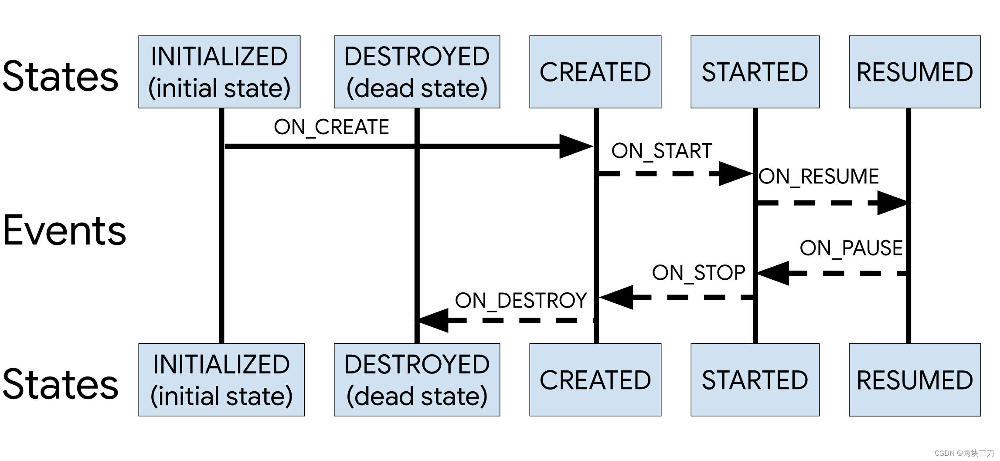

- ```java
      public void handleLifecycleEvent(@NonNull Lifecycle.Event event) {
          // 首先判断是否在主线程
          enforceMainThreadIfNeeded("handleLifecycleEvent");
          // event.getTargetState()获取此事件的状态，然后传递给moveToState方法，改变状态。
          moveToState(event.getTargetState());
      }
  
  ```
- ## getTargetState：获取目标状态
  collapsed:: true
	- 这里的状态变化可以参考开头的关系时序图。
	- 
	- ```java
	          @NonNull
	          public State getTargetState() {
	              switch (this) {
	                  case ON_CREATE:
	                  case ON_STOP:
	                      return State.CREATED;
	                  case ON_START:
	                  case ON_PAUSE:
	                      return State.STARTED;
	                  case ON_RESUME:
	                      return State.RESUMED;
	                  case ON_DESTROY:
	                      return State.DESTROYED;
	                  case ON_ANY:
	                      break;
	              }
	              throw new IllegalArgumentException(this + " has no target state");
	          }
	  ```
- ## moveToState：改变状态：先判断与当前状态是否一致，不一致则调用sync方法改变状态
  collapsed:: true
	- ```java
	      private void moveToState(State next) {
	          // 状态一致 直接return
	          if (mState == next) {
	              return;
	          }
	          if (mState == INITIALIZED && next == DESTROYED) {
	              throw new IllegalStateException("no event down from " + mState);
	          }
	          mState = next;
	          if (mHandlingEvent || mAddingObserverCounter != 0) {
	              mNewEventOccurred = true;
	              // we will figure out what to do on upper level.
	              return;
	          }
	          mHandlingEvent = true;
	          // 不一致改变状态
	          sync();
	          mHandlingEvent = false;
	          if (mState == DESTROYED) {
	              mObserverMap = new FastSafeIterableMap<>();
	          }
	      }
	  ```
- ## sync：sync 方法中会根据当前状态判断是向前还是向后。
  collapsed:: true
	- ```java
	      private void sync() {
	          LifecycleOwner lifecycleOwner = mLifecycleOwner.get();
	          if (lifecycleOwner == null) {
	              throw new IllegalStateException("LifecycleOwner of this LifecycleRegistry is already"
	                      + "garbage collected. It is too late to change lifecycle state.");
	          }
	          while (!isSynced()) {
	              mNewEventOccurred = false;
	              // no need to check eldest for nullability, because isSynced does it for us.
	              if (mState.compareTo(mObserverMap.eldest().getValue().mState) < 0) {
	                 // 向后 按照箭头方向
	                 backwardPass(lifecycleOwner);
	              }
	              Map.Entry<LifecycleObserver, ObserverWithState> newest = mObserverMap.newest();
	              if (!mNewEventOccurred && newest != null
	                      && mState.compareTo(newest.getValue().mState) > 0) {
	                 // 向前 
	                 forwardPass(lifecycleOwner);
	              }
	          }
	          mNewEventOccurred = false;
	      }
	  ```
- # [[#red]]==【疑问】怎样是向前？怎样是向后呢？==
	- 我们可以对照开头的Lifecycle时序图，状态由INITIALIZED——>到RESUMED 是向前，反之就是向后。
- ## backwardPass：向前和向后的代码实现差不多，这里就以向后为例
	- ```java
	      private void backwardPass(LifecycleOwner lifecycleOwner) {
	          Iterator<Map.Entry<LifecycleObserver, ObserverWithState>> descendingIterator =
	                  mObserverMap.descendingIterator();
	          while (descendingIterator.hasNext() && !mNewEventOccurred) {
	              Map.Entry<LifecycleObserver, ObserverWithState> entry = descendingIterator.next();
	              ObserverWithState observer = entry.getValue();
	              while ((observer.mState.compareTo(mState) > 0 && !mNewEventOccurred
	                      && mObserverMap.contains(entry.getKey()))) {
	                  // 1 获取下一个事件
	                  Event event = Event.downFrom(observer.mState);
	                  if (event == null) {
	                      throw new IllegalStateException("no event down from " + observer.mState);
	                  }
	                  pushParentState(event.getTargetState());
	                  // 分发给 状态观察者
	                  observer.dispatchEvent(lifecycleOwner, event);
	                  popParentState();
	              }
	          }
	      }
	  ```
	- 1、获取了当前状态的下个event事件。
	- 2、事件会传给所有的ObserverWithState（状态观察者）对象的dispatchEvent方法来分发。
	  [[ObserverWithState]]是LifecycleRegistry的内部类。