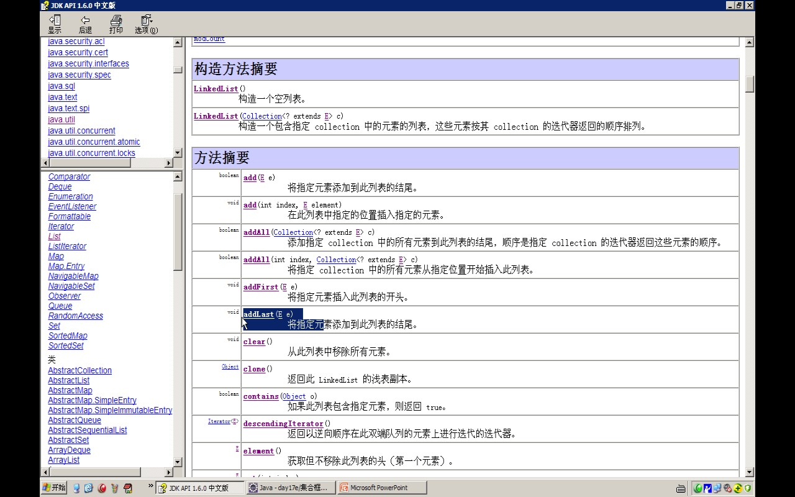

- # 数据结构：
	- 双向循环[[链表linked-list]]，链表结构重点头尾，内存不连续
- # 特点：
  collapsed:: true
	- 线程是不同步的
	- 对==数据增删速度快    适合频繁增删==
- # 常用方法
  collapsed:: true
	- 
	- - 增：add,addFirst,addLast offer, push。
	- - 删：poll, pop, remoe。
	- - 改：set。
	- - 查：get, peek。
	- - 当然还有很多变种的，结尾加 First, Last 即可。
- # [[使用LinkedList模拟堆栈和队列]]