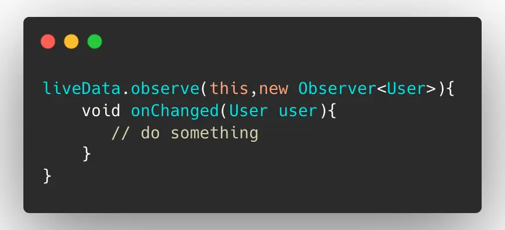

- 1、 LiveData 去观察数据，会用到 observe 方法，观察者可以在收到 onChanged 事件时更新界面
	- {:height 335, :width 716}
- 2、在 observe，通过Lifecycle 而与宿主生命周期的绑定，感知宿主生命周期变换，当宿主onDestory时，会反注册数据观察者，避免内存泄漏
	- 
- 3、在setValue时，判断数据观察者为活跃状态（对应生命周期为onStart和onResume），才会向其分发数据
- 4、