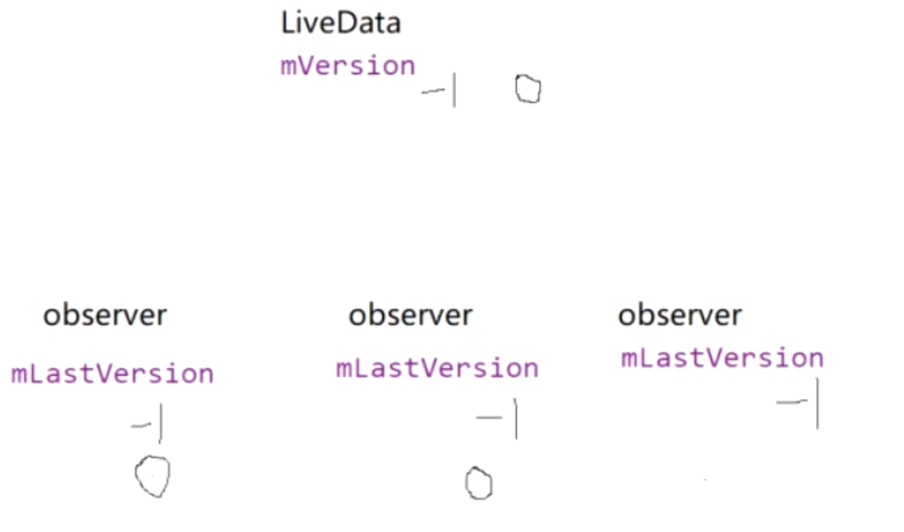

# 1、observer方法->
	- 简单使用
	  collapsed:: true
		- ```java
		  LiveDataBus.getInstance().with("data", String.class)
		                      .observe(this, new Observer<String>() {
		                          @Override
		                          public void onChanged(String s) {
		                              if(s!=null)
		                              Toast.makeText(TestLiveDataBusActivity.this, s, Toast.LENGTH_SHORT).show();
		                          }
		                      });
		  ```
	- 源码
	  collapsed:: true
		- 参数1，Activity等实现LifecycleOwner的对象，可观察其生命周期变换
		- 参数2，自定义observer，数据观察者
		- ```java
		   @MainThread
		      public void observe(@NonNull LifecycleOwner owner, @NonNull Observer<? super T> observer) {
		          assertMainThread("observe");
		          // 1、DESTROYED状态直接返回
		          if (owner.getLifecycle().getCurrentState() == DESTROYED) {
		              // ignore
		              return;
		          }
		          // 2、将activity和自定义数据观察者 放入包装类中，LifecycleBoundObserver继承了
		          LifecycleBoundObserver wrapper = new LifecycleBoundObserver(owner, observer);
		          // 3、mObservers为存放 数据观察者的集合
		          ObserverWrapper existing = mObservers.putIfAbsent(observer, wrapper);
		          if (existing != null && !existing.isAttachedTo(owner)) {
		              throw new IllegalArgumentException("Cannot add the same observer"
		                      + " with different lifecycles");
		          }
		          if (existing != null) {
		              return;
		          }
		          // activity 获取 lifecycle 注册生命周期的观察者
		          owner.getLifecycle().addObserver(wrapper);
		      }
		  ```
	- 1、将activity和自定义数据观察者 放入包装类LifecycleBoundObserver中，LifecycleBoundObserver继承了，lifecycle的被观察者LifecycleEventObserver
	- 2、activity 获取 lifecycle 注册生命周期的观察者LifecycleBoundObserver
	- 这个包装类就可以接受activity的生命周期回调了
	- ## 总结
		- activity 获取 lifecycle 注册生命周期的观察者LifecycleBoundObserver
- # 2、setValue，发送数据
	- 使用
	  collapsed:: true
		- ```java
		              new Thread(){
		                  @Override
		                  public void run() {
		                      for (int i = 0; i < 10; i++) {
		                          //发送消息
		                          LiveDataBus.getInstance().with("data", String.class).postValue("jett");
		                          try {
		                              Thread.sleep(5000);
		                          } catch (InterruptedException e) {
		                              e.printStackTrace();
		                          }
		  
		  
		                      }
		                  }
		              }.start();
		  ```
	- 源码setValue
		- ```java
		      @MainThread
		      protected void setValue(T value) {
		          assertMainThread("setValue");
		          // 执行记录 ++ 
		          mVersion++;
		          // 数据赋值
		          mData = value;
		          // 分发
		          dispatchingValue(null);
		      }
		  ```
	- dispatchingValue分发数据,setvalue 参数 null
	  collapsed:: true
		- ```java
		  void dispatchingValue(@Nullable ObserverWrapper initiator) {
		          if (mDispatchingValue) {
		              mDispatchInvalidated = true;
		              return;
		          }
		          mDispatchingValue = true;
		          do {
		              mDispatchInvalidated = false;
		              if (initiator != null) {
		                  considerNotify(initiator);
		                  initiator = null;
		              } else {
		                  // 遍历所有的数据观察者
		                  for (Iterator<Map.Entry<Observer<? super T>, ObserverWrapper>> iterator =
		                          mObservers.iteratorWithAdditions(); iterator.hasNext(); ) {
		                      // 传入 数据观察者
		                      considerNotify(iterator.next().getValue());
		                      if (mDispatchInvalidated) {
		                          break;
		                      }
		                  }
		              }
		          } while (mDispatchInvalidated);
		          mDispatchingValue = false;
		      }
		  
		  ```
	- considerNotify
	  collapsed:: true
		- ```java
		   private void considerNotify(ObserverWrapper observer) {
		          // 1非显示的情况不会发消息
		          if (!observer.mActive) {
		              return;
		          }
		          // Check latest state b4 dispatch. Maybe it changed state but we didn't get the event yet.
		          //
		          // we still first check observer.active to keep it as the entrance for events. So even if
		          // the observer moved to an active state, if we've not received that event, we better not
		          // notify for a more predictable notification order.
		     // 2、还是判断如果在子线程发消息，生命周期未来得及更改，是不是onStart onResume 情况
		     // 不是的话就把observer的mActive状态设置false    return
		          if (!observer.shouldBeActive()) {
		              observer.activeStateChanged(false);
		              return;
		          }
		          // 3、
		          if (observer.mLastVersion >= mVersion) {
		              return;
		          }
		          observer.mLastVersion = mVersion;
		          // 4、
		          observer.mObserver.onChanged((T) mData);
		      }
		  ```
		- 1、mActive是否是显示的情况。在Lifecycle中，生命周期为onStart onResume时，会设置为true
		- 2、还是判断如果在子线程发消息，生命周期未来得及更改，是不是onStart onResume 情况
		     不是的话就把observer的mActive状态设置false    return
		- > 上边这2轮判断后，可以知道Activity是显示出来的
		- 3、livedata 有个mVersion，标识数据版本。 ObserverWrapper 都有个 mLastVersion。
		  collapsed:: true
			- observer收到的数据次数小于 等于 livedata 的mVersion，才会赋值version标识， 发送数据。
			- 
		- 4、observer.mObserver.onChanged((T) mData);将数据回调给数据观察者
	- ## [[livedatabus的粘性问题]]
-