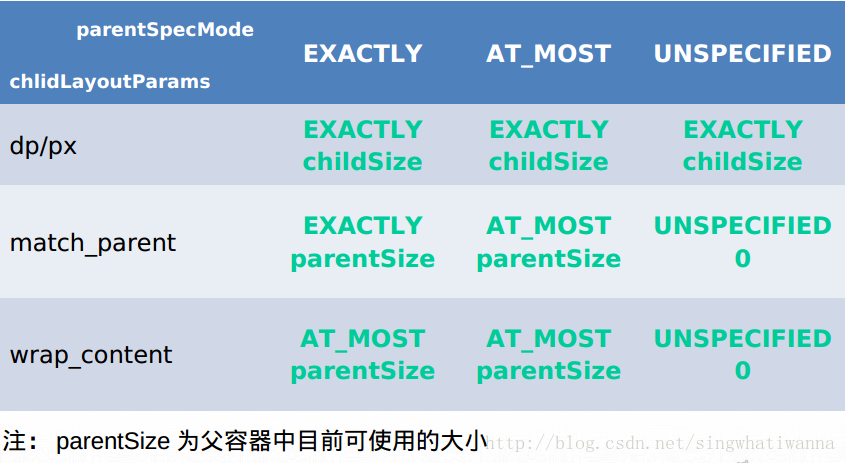

## 1、什么是MeasureSpec#card
	- 1、MeasureSpec是View中的内部类，标识测量规格，封装了父容器对 view 的布局上的限制
	- 2、用高两位表示Specmode，低30位表示SpecSize(SpecSize是指在某种SpecMode下的参考尺寸)，MODE_SHIFT = 30的作用是移位
	- 3、其中SpecMode 有如下三种：
		- UNSPECIFIED：不对View大小做限制，主要用于系统内部多次Measure的情况
		- EXACTLY：确切的大小，如：100dp
		- AT_MOST：大小不可超过某数值，如：matchParent, 最大不能超过你爸爸
- ## 2、测量流程中，根据父view的 模式，计算子view的模式算法getChildMeasureSpec？#card
	- ### 1、首先
		- 对于应用层 View ，其 MeasureSpec 由父容器的 MeasureSpec 和自身的 LayoutParams 来共同决定，具体计算逻辑封装在getChildMeasureSpec()里
	- ### 2、getChildMeasureSpec（）算法逻辑如下
		- {:height 435, :width 780}
		- 对于不同的父容器和view本身不同的LayoutParams，view就可以有多种MeasureSpec。
		- ### 1. 当view采用固定宽高的时候(100dp)
			- 不管父容器的MeasureSpec是什么，view的MeasureSpec都是精确模式并且其大小遵循Layoutparams中的大小；
		- ### 2. 当view的宽高是match_parent时
			- 2-1、父容器是精准模式，view也是精准模式并且其大小是父容器的剩余空间
			- 2-2、父容器是最大模式，那么view也是最大模式并且其大小不会超过父容器的剩余空间
			- 2-3、父容器是不指定大小，子view也是不指定大小模式，size=0
		- ### 3. 当view的宽高是wrap_content时，
			- 3-1、父容器的模式是精准还是最大化，view的模式总是最大化并且大小不能超过父容器的剩余空间。
			- 3-2、父容器是不指定大小，子view也是不指定大小模式，size=0