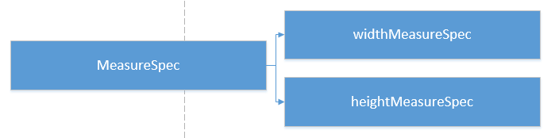
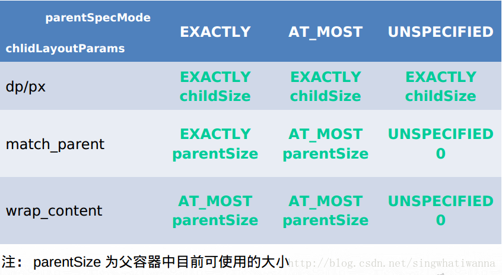

- # 定义
  collapsed:: true
	- 
	- 测量规格,封装了父容器对 view 的布局上的限制，内部提供了宽高的信息（ SpecMode 、 SpecSize ），SpecSize是指在某种SpecMode下的参考尺寸，其中SpecMode 有如下三种：
	- >UNSPECIFIED 父控件不对你有任何限制，你想要多大给你多大，想上天就上天。这种情况一般用于系统内部，表示一种测量状态。（这个模式主要用于系统内部多次Measure的情形，并不是真的说你想要多大最后就真有多大）
	- >EXACTLY 父控件已经知道你所需的精确大小，你的最终大小应该就是这么大。
	- >AT_MOST 你的大小不能大于父控件给你指定的size，但具体是多少，得看你自己的实现
- # MeasureSpecs 的意义
  collapsed:: true
	- 通过将 SpecMode 和 SpecSize 打包成一个 int 值可以避免过多的对象内存分配，为了方便操作，其提供了打包 / 解包方法
- # MeasureSpec值的确定
  collapsed:: true
	- MeasureSpec值到底是如何计算得来的呢?
	- 
	- 子View的MeasureSpec值是根据子View的布局参数（LayoutParams）和父容器的MeasureSpec值计算得来的，具体计算逻辑封装在getChildMeasureSpec()里
	- ```java
	   /**
	       *
	       * 目标是将父控件的测量规格和child view的布局参数LayoutParams相结合，得到一个
	       * 最可能符合条件的child view的测量规格。
	       * @param spec 父控件的测量规格
	       * @param padding 父控件里已经占用的大小
	       * @param childDimension child view布局LayoutParams里的尺寸
	       * @return child view 的测量规格
	       */
	      public static int getChildMeasureSpec(int spec, int padding, int childDimension) {
	          int specMode = MeasureSpec.getMode(spec); //父控件的测量模式
	          int specSize = MeasureSpec.getSize(spec); //父控件的测量大小
	          int size = Math.max(0, specSize - padding);
	          int resultSize = 0;
	          int resultMode = 0;
	          switch (specMode) {
	              // 当父控件的测量模式 是 精确模式，也就是有精确的尺寸了
	              case MeasureSpec.EXACTLY:
	  //如果child的布局参数有固定值，比如"layout_width" = "100dp"
	  //那么显然child的测量规格也可以确定下来了，测量大小就是100dp，测量模式也是EXACTLY
	                  if (childDimension >= 0) {
	                      resultSize = childDimension;
	                      resultMode = MeasureSpec.EXACTLY;
	                  }
	  //如果child的布局参数是"match_parent"，也就是想要占满父控件
	  //而此时父控件是精确模式，也就是能确定自己的尺寸了，那child也能确定自己大小了
	                  else if (childDimension == LayoutParams.MATCH_PARENT) {
	                      resultSize = size;
	                      resultMode = MeasureSpec.EXACTLY;
	                  }
	  //如果child的布局参数是"wrap_content"，也就是想要根据自己的逻辑决定自己大小，
	  //比如TextView根据设置的字符串大小来决定自己的大小
	  //那就自己决定呗，不过你的大小肯定不能大于父控件的大小嘛
	  //所以测量模式就是AT_MOST，测量大小就是父控件的size
	                  else if (childDimension == LayoutParams.WRAP_CONTENT) {
	                      resultSize = size;
	                      resultMode = MeasureSpec.AT_MOST;
	                  }
	                  break;
	  // 当父控件的测量模式 是 最大模式，也就是说父控件自己还不知道自己的尺寸，但是大小不能超过size
	              case MeasureSpec.AT_MOST:
	  //同样的，既然child能确定自己大小，尽管父控件自己还不知道自己大小，也优先满足孩子的需求？？
	                  if (childDimension >= 0) {
	                      resultSize = childDimension;
	                      resultMode = MeasureSpec.EXACTLY;
	                  }
	  //child想要和父控件一样大，但父控件自己也不确定自己大小，所以child也无法确定自己大小
	  //但同样的，child的尺寸上限也是父控件的尺寸上限size
	                  else if (childDimension == LayoutParams.MATCH_PARENT) {
	                      resultSize = size;
	                      resultMode = MeasureSpec.AT_MOST;
	                  }
	  //child想要根据自己逻辑决定大小，那就自己决定呗
	                  else if (childDimension == LayoutParams.WRAP_CONTENT) {
	                      resultSize = size;
	                      resultMode = MeasureSpec.AT_MOST;
	                  }
	                  break;
	  // Parent asked to see how big we want to be
	              case MeasureSpec.UNSPECIFIED:
	                  if (childDimension >= 0) {
	                      // Child wants a specific size... let him have it
	                      resultSize = childDimension;
	                      resultMode = MeasureSpec.EXACTLY;
	                  } else if (childDimension == LayoutParams.MATCH_PARENT) {
	  // Child wants to be our size... find out how big it should
	                  // be
	                      resultSize = 0;
	                      resultMode = MeasureSpec.UNSPECIFIED;
	                  } else if (childDimension == LayoutParams.WRAP_CONTENT) {
	                      // Child wants to determine its own size.... find out how
	                      // big it should be
	                      resultSize = 0;
	                      resultMode = MeasureSpec.UNSPECIFIED;
	                  }
	                  break;
	  
	          }
	          return MeasureSpec.makeMeasureSpec(resultSize, resultMode);
	      }
	  ```
- {:height 435, :width 780}
- 针对上表，这里再做一下具体的说明
  collapsed:: true
	- 对于应用层 View ，其 MeasureSpec 由父容器的 MeasureSpec 和自身的 LayoutParams 来共同决定
	- 对于不同的父容器和view本身不同的LayoutParams，view就可以有多种MeasureSpec。
		- 1. 当view采用固定宽高的时候，不管父容器的MeasureSpec是什么，view的MeasureSpec都是精确模式并且其大小遵循Layoutparams中的大小；
		- 2. 当view的宽高是match_parent时，这个时候如果父容器的模式是精准模式，那么view也是精准模式并且其大小是父容器的剩余空间，如果父容器是最大模式，那么view也是最大模式并且其大小不会超过父容器的剩余空间；
		- 3. 当view的宽高是wrap_content时，不管父容器的模式是精准还是最大化，view的模式总是最大化并且大小不能超过父容器的剩余空间。
		- 4. Unspecified模式，这个模式主要用于系统内部多次measure的情况下，一般来说，我们不需要关注此模式(这里注意自定义View放到ScrollView的情况 需要处理)。
- # [[MeasureSpec-面试题]]
- id:: 64cb3813-be97-491f-a3e5-d283e17cd3d2