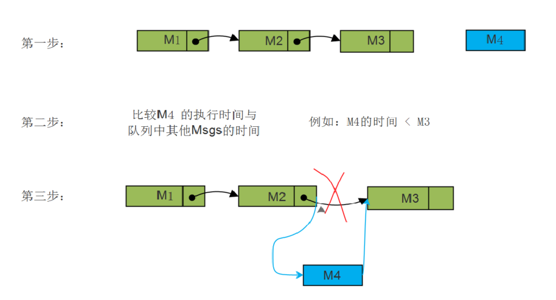
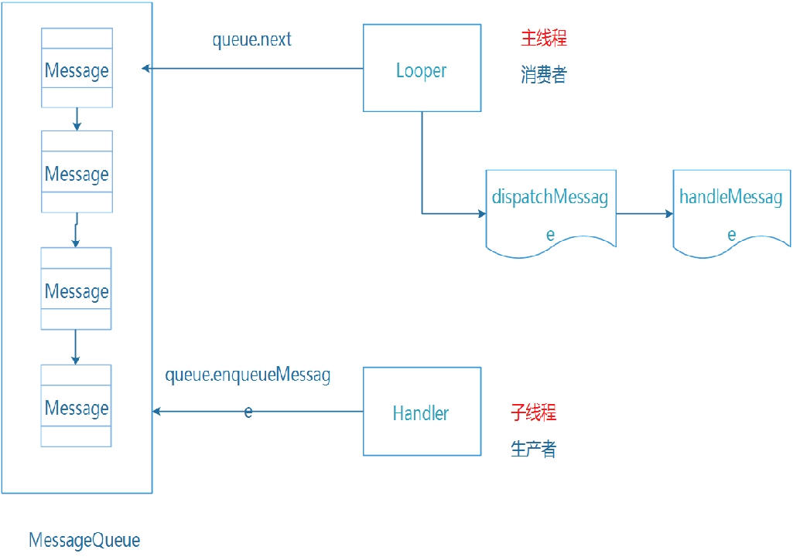
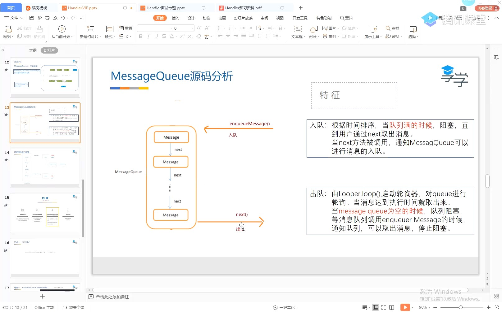

- # 概念【利用了插入排序】
  collapsed:: true
	- 按照msg中携带的时间顺序存储的优先级队列【先进先出】
	- 
- # 数据结构
	- 单链表
- # 构造方法
	- ```java
	  MessageQueue(boolean quitAllowed) {
	  //mQuitAllowed决定队列是否可以销毁 主线程的队列不可以被销毁需要传入false, 
	    //在MessageQueue的quit()方法
	  	mQuitAllowed = quitAllowed;
	  	mPtr = nativeInit();
	  }
	  ```
- # 存消息
	- MessageQueue.enqueueMessage()向消息队列添加消息，会对比时间
- # 取消息
	- [[MessageQueue.next()]]从消息队列中获取消息【取队列最前边的消息】
	- 使用for循环
- # [[ MessageQueue终止循环quit]]
	-
- # 设计模式：生产者消费者（消息睡眠和唤醒）
  collapsed:: true
	- ## 模式
	  collapsed:: true
		- 
	- ## 特点
		- 
		- ### 入队：
			- 理论上生产者消费者，消息队列满的时候，==进入阻塞==，当用户next()取消息时，通知可以存了入队
			- **==实际handler没有设置队列满的大小，只不过一直加入消息，内存会耗尽==**
		- ### 出队：==队列为空也阻塞==，当存消息时，通知可以取 了
			- ### 实际等待1：msg不到执行时间,进入等待（时间到自动唤醒）
			  collapsed:: true
				- 实际上：当[[MessageQueue.next()]]时，当取出的消息，还没到执行时间，会调用
				  nativePollOnce(ptr, nextPollTimeoutMillis);睡眠
				- 第一个参数ptr 取值含义
				  collapsed:: true
					- -1表示无限等待，直到有事件发生为止
					- 0无需等待，立即返回
			- ### 等待2：消息队列为空的时候，无限等待，（）
				- 消息队列为空的时候，nativePollOnce(ptr, nextPollTimeoutMillis)  ptr为-1会一直等待
				- ### 什么时候唤醒
					- 添加消息的时候，MessageQueue.enqueueMessage，里会调用
					  nativeWake唤醒，
- # [[MessageQueue，属于哪个线程？问队列创建流程]]