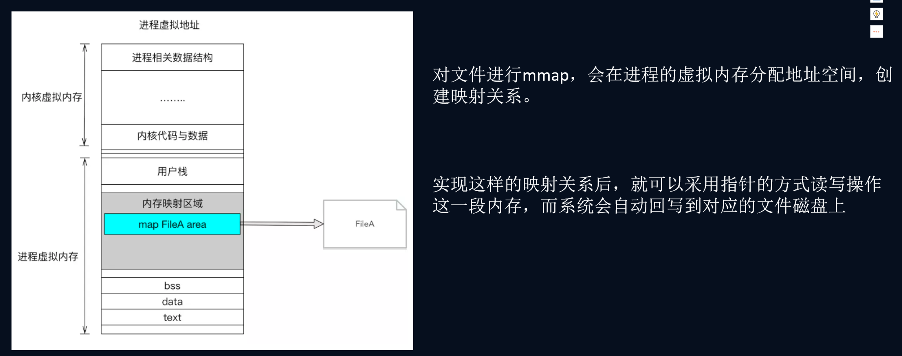
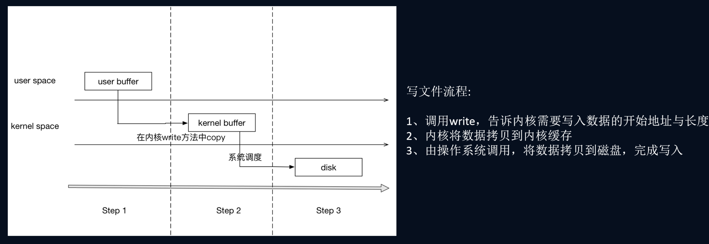

# 三、Mmap工作原理
	- 将==虚拟内存和指定的物理内存联系起来==。
	- 场景：
		- Binder里用的是 将==接受进程虚拟内存== 指向 ==内核空间中的同一块物理内存==，达到内存共享
		- 操作用户空间拷贝，就是直接往内核内存拷贝，接受进程也有了。达到一次拷贝
- # 一、概念
	- Linux通过将一个==虚拟内存区域与一个磁盘上的对象关联起来==（[[#red]]==以前虚拟内存映射哪块物理内存系统完成的，我们不需要关注，但是现在通过mmap人为的指定映射哪个物理内存==），以初始化这个虚拟内存区域的内容，这个过程称为内存映射(memory mapping)。
	- 虚拟内存寻址，找到物理内存才能拿东西
	- 
- # 二、==用户空间操作的是虚拟内存，不能直接操作文件==
  collapsed:: true
	- 所有的系统资源管理都是在内核空间中完成的。比如读写磁盘文件，分配回收内存，从网络接口读写数据等等。用户空间通过系统调用让内核空间完成这些功能。
	- 
	- ## 所以实际想把数据拷贝到文件里流程
		- 用户空间 拷贝到 内核空间
		- 内核空间  拷贝到 磁盘
		- 进行2次拷贝
-