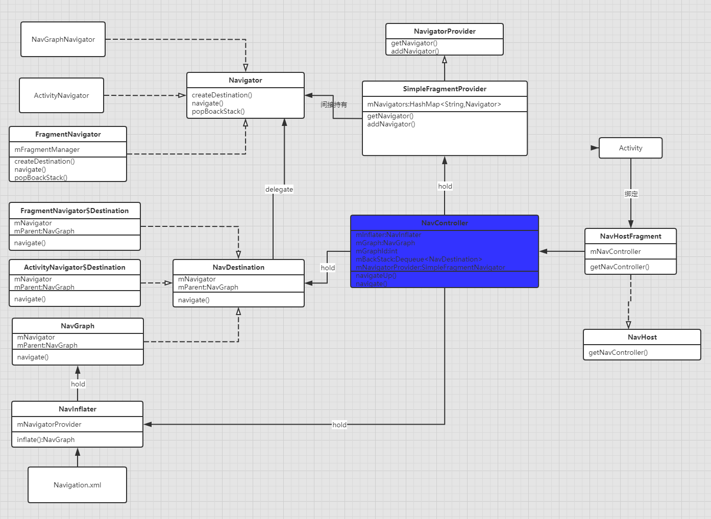
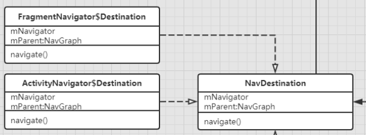
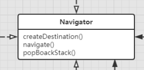
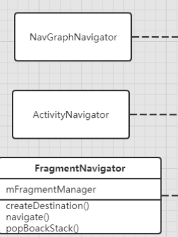
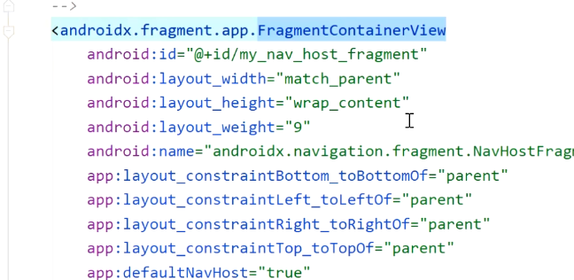
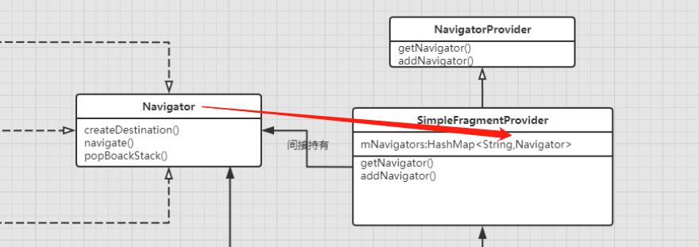

# 类图
	- 
- # 名词介绍
	- ## [[Navigation graph (导航图)]]
	- ## [[ NavHost：默认实现NavHostFragment]]
	- ## [[NavController]]-导航的核心控制
- # 一、实现思路
	- 1、首先Activity，绑定NavHostFragment空容器，是实际显示内容的第一页，不过没数据，用户看不到
	- 2、如果我们开始导航，第一页显示的就是我们设置的startDestination那一页
		- 
		- ```xml
		  <navigation xmlns:android="http://schemas.android.com/apk/res/android"
		      xmlns:app="http://schemas.android.com/apk/res-auto"
		      xmlns:tools="http://schemas.android.com/tools"
		      android:id="@+id/nav_graph_main.xml"
		      app:startDestination="@id/page1Fragment">
		  ```
	- 3、用的时候会取到一个NavController，导航控制者对象--->导航核心控制
	- 4、所以第一次用的时候，需要inflate 解析我们写的导航图xml，将信息存入NavGraph类中
		- 
	- 5、在使用跳转的时候，下一页要跳转谁，NavController 会生成一个NavDestination。导航目的地
		- 
	- 6、触发导航使用的NavDestination的navigate()方法。会调用到Navigator的navigate导航实现的。
		- 
		- 所以NavDestination只是存放，我下一个要跳转的页面。具体怎么跳，还是通过Navigator来实现的
	- 7、Navigator有几个实现类，Activity的跳转就通过ActivityNavigator（activity.startActivity api去跳转）,Fragment跳转就通过FragmentNavigator（内部还是使用FragmentManager）
		- 
	- > 回退的时候，怎么知道上一个是谁？
	     在Navigator 里有个回退栈的实现，保存了
	- ## 小结，Activity就需要一个导航控制器，拿到导航控制器，就知道下一页跳谁（NavDestination）
- # 二、代码流程
	- 官网推荐使用，NavHostFragment绑定Activity的方式
	  collapsed:: true
		- ```kotlin
		          val finalHost = NavHostFragment.create(R.navigation.nav_graph_main)
		          supportFragmentManager.beginTransaction()
		                  .replace(R.id.ll_fragment_navigation, finalHost)
		                  .setPrimaryNavigationFragment(finalHost)
		                  .commit(); 
		  ```
	- ## 1、先从NavHostFragment 的 Create开始,传入导航图xml
	  collapsed:: true
		- ```java
		      @NonNull
		      public static NavHostFragment create(@NavigationRes int graphResId) {
		          return create(graphResId, null);
		      }
		  
		  	 @NonNull
		      public static NavHostFragment create(@NavigationRes int graphResId,
		              @Nullable Bundle startDestinationArgs) {
		          // 将导航图存入 Bundle中
		          Bundle b = null;
		          if (graphResId != 0) {
		              b = new Bundle();
		              b.putInt(KEY_GRAPH_ID, graphResId);
		          }
		          if (startDestinationArgs != null) {
		              if (b == null) {
		                  b = new Bundle();
		              }
		              b.putBundle(KEY_START_DESTINATION_ARGS, startDestinationArgs);
		          }
		  
		          final NavHostFragment result = new NavHostFragment();
		          if (b != null) {
		              result.setArguments(b);
		          }
		          return result;
		      }
		  ```
		- 1、将导航图存入 Bundle中
		- 2、new NavHostFragment 初始化实例，并传入bundle
	- ## 2、NavHostFragment 初始化后需要解析它xml里的属性，看onInflate
	  collapsed:: true
		- app:defaultNavHost="true"
		- app:navGraph="@navigation/nav_graph_main"
		- 代码
			- ```java
			      @CallSuper
			      @Override
			      public void onInflate(@NonNull Context context, @NonNull AttributeSet attrs,
			              @Nullable Bundle savedInstanceState) {
			          super.onInflate(context, attrs, savedInstanceState);
			  
			          final TypedArray navHost = context.obtainStyledAttributes(attrs,
			                  androidx.navigation.R.styleable.NavHost);
			          final int graphId = navHost.getResourceId(
			                  androidx.navigation.R.styleable.NavHost_navGraph, 0);
			          if (graphId != 0) {
			              mGraphId = graphId;
			          }
			          navHost.recycle();
			  
			          final TypedArray a = context.obtainStyledAttributes(attrs, R.styleable.NavHostFragment);
			          final boolean defaultHost = a.getBoolean(R.styleable.NavHostFragment_defaultNavHost, false);
			          if (defaultHost) {
			              mDefaultNavHost = true;
			          }
			          a.recycle();
			      }
			  
			  ```
		- 就是解析上边那2个属性，获取到对应的值
	- ## 3、create方法创建实例会回调onCreate
	  collapsed:: true
		- 代码
			- ```java
			   public void onCreate(@Nullable Bundle savedInstanceState) {
			          final Context context = requireContext();
			  		// 创建
			          mNavController = new NavHostController(context);
			          mNavController.setLifecycleOwner(this);
			          mNavController.setOnBackPressedDispatcher(requireActivity().getOnBackPressedDispatcher());
			          // Set the default state - this will be updated whenever
			          // onPrimaryNavigationFragmentChanged() is called
			          mNavController.enableOnBackPressed(
			                  mIsPrimaryBeforeOnCreate != null && mIsPrimaryBeforeOnCreate);
			          mIsPrimaryBeforeOnCreate = null;
			          mNavController.setViewModelStore(getViewModelStore());
			          onCreateNavController(mNavController);
			  
			          Bundle navState = null;
			          if (savedInstanceState != null) {
			              navState = savedInstanceState.getBundle(KEY_NAV_CONTROLLER_STATE);
			              if (savedInstanceState.getBoolean(KEY_DEFAULT_NAV_HOST, false)) {
			                  mDefaultNavHost = true;
			                  getParentFragmentManager().beginTransaction()
			                          .setPrimaryNavigationFragment(this)
			                          .commit();
			              }
			              mGraphId = savedInstanceState.getInt(KEY_GRAPH_ID);
			          }
			  
			          if (navState != null) {
			              // Navigation controller state overrides arguments
			              mNavController.restoreState(navState);
			          }
			          if (mGraphId != 0) {
			              // Set from onInflate()
			              mNavController.setGraph(mGraphId);
			          } else {
			              // See if it was set by NavHostFragment.create()
			              final Bundle args = getArguments();
			              final int graphId = args != null ? args.getInt(KEY_GRAPH_ID) : 0;
			              final Bundle startDestinationArgs = args != null
			                      ? args.getBundle(KEY_START_DESTINATION_ARGS)
			                      : null;
			              if (graphId != 0) {
			                  mNavController.setGraph(graphId, startDestinationArgs);
			              }
			          }
			  
			          // We purposefully run this last as this will trigger the onCreate() of
			          // child fragments, which may be relying on having the NavController already
			          // created and having its state restored by that point.
			          super.onCreate(savedInstanceState);
			      }
			  ```
		- 1、new  NavHostController创建导航控制器NavHostController
		- 2、设置导航图id:mNavController.setGraph(mGraphId);,去解析这个文件里的内容
	- ## 4、看怎么解析导航图 mNavController.setGraph(mGraphId);
	  collapsed:: true
		- ```java
		      @CallSuper
		      public void setGraph(@NavigationRes int graphResId) {
		          setGraph(graphResId, null);
		      }
		      @CallSuper
		      public void setGraph(@NavigationRes int graphResId, @Nullable Bundle startDestinationArgs) {
		          setGraph(getNavInflater().inflate(graphResId), startDestinationArgs);
		      }
		  ```
		- 拿到解析器getNavInflater，解析导航图文件
			- ### 4-1、看具体解析,解析目的地NavDestination，最终解析成一个NavGraph。导航图，目的地的id
				- ```java
				      @SuppressLint("ResourceType")
				      @NonNull
				      public NavGraph inflate(@NavigationRes int graphResId) {
				          Resources res = mContext.getResources();
				          XmlResourceParser parser = res.getXml(graphResId);
				          final AttributeSet attrs = Xml.asAttributeSet(parser);
				          try {
				              int type;
				              while ((type = parser.next()) != XmlPullParser.START_TAG
				                      && type != XmlPullParser.END_DOCUMENT) {
				                  // Empty loop
				              }
				              if (type != XmlPullParser.START_TAG) {
				                  throw new XmlPullParserException("No start tag found");
				              }
				  
				              String rootElement = parser.getName();
				              NavDestination destination = inflate(res, parser, attrs, graphResId);
				              if (!(destination instanceof NavGraph)) {
				                  throw new IllegalArgumentException("Root element <" + rootElement + ">"
				                          + " did not inflate into a NavGraph");
				              }
				              return (NavGraph) destination;
				          } catch (Exception e) {
				              throw new RuntimeException("Exception inflating "
				                      + res.getResourceName(graphResId) + " line "
				                      + parser.getLineNumber(), e);
				          } finally {
				              parser.close();
				          }
				      }
				  
				  ```
		- 继续setGraph,传入解析的导航图
			- ```java
			      @CallSuper
			      public void setGraph(@NonNull NavGraph graph, @Nullable Bundle startDestinationArgs) {
			          if (mGraph != null) {
			              // Pop everything from the old graph off the back stack
			              popBackStackInternal(mGraph.getId(), true);
			          }
			          mGraph = graph;
			          onGraphCreated(startDestinationArgs);
			      }
			  ```
		- onGraphCreated
			- ```java
			  private void onGraphCreated(@Nullable Bundle startDestinationArgs) {
			          if (mNavigatorStateToRestore != null) {
			              ArrayList<String> navigatorNames = mNavigatorStateToRestore.getStringArrayList(
			                      KEY_NAVIGATOR_STATE_NAMES);
			              if (navigatorNames != null) {
			                  for (String name : navigatorNames) {
			                      Navigator<?> navigator = mNavigatorProvider.getNavigator(name);
			                      Bundle bundle = mNavigatorStateToRestore.getBundle(name);
			                      if (bundle != null) {
			                          navigator.onRestoreState(bundle);
			                      }
			                  }
			              }
			          }
			          if (mBackStackToRestore != null) {
			              for (Parcelable parcelable : mBackStackToRestore) {
			                  NavBackStackEntryState state = (NavBackStackEntryState) parcelable;
			                  NavDestination node = findDestination(state.getDestinationId());
			                  if (node == null) {
			                      final String dest = NavDestination.getDisplayName(mContext,
			                              state.getDestinationId());
			                      throw new IllegalStateException("Restoring the Navigation back stack failed:"
			                              + " destination " + dest
			                              + " cannot be found from the current destination "
			                              + getCurrentDestination());
			                  }
			                  Bundle args = state.getArgs();
			                  if (args != null) {
			                      args.setClassLoader(mContext.getClassLoader());
			                  }
			                  NavBackStackEntry entry = new NavBackStackEntry(mContext, node, args,
			                          mLifecycleOwner, mViewModel,
			                          state.getUUID(), state.getSavedState());
			                  mBackStack.add(entry);
			              }
			              updateOnBackPressedCallbackEnabled();
			              mBackStackToRestore = null;
			          }
			          if (mGraph != null && mBackStack.isEmpty()) {
			              boolean deepLinked = !mDeepLinkHandled && mActivity != null
			                      && handleDeepLink(mActivity.getIntent());
			              if (!deepLinked) {
			                  // Navigate to the first destination in the graph
			                  // if we haven't deep linked to a destination
			                  navigate(mGraph, startDestinationArgs, null, null);
			              }
			          } else {
			              dispatchOnDestinationChanged();
			          }
			      }
			  ```
		- navigate:注释写的：导航到第一个目的地
			- ```java
			  Navigator<NavDestination> navigator = mNavigatorProvider.getNavigator(
			                  node.getNavigatorName());
			          Bundle finalArgs = node.addInDefaultArgs(args);
			          NavDestination newDest = navigator.navigate(node, finalArgs,
			                  navOptions, navigatorExtras);
			  ```
		- 从集合拿到导航器去跳转，看navigate的实现类。Fragment的
			- 代码
			  collapsed:: true
				- ```java
				  public NavDestination navigate(@NonNull Destination destination, @Nullable Bundle args,
				              @Nullable NavOptions navOptions, @Nullable Navigator.Extras navigatorExtras) {
				          if (mFragmentManager.isStateSaved()) {
				              Log.i(TAG, "Ignoring navigate() call: FragmentManager has already"
				                      + " saved its state");
				              return null;
				          }
				          String className = destination.getClassName();
				          if (className.charAt(0) == '.') {
				              className = mContext.getPackageName() + className;
				          }
				          final Fragment frag = instantiateFragment(mContext, mFragmentManager,
				                  className, args);
				          frag.setArguments(args);
				          final FragmentTransaction ft = mFragmentManager.beginTransaction();
				  
				          int enterAnim = navOptions != null ? navOptions.getEnterAnim() : -1;
				          int exitAnim = navOptions != null ? navOptions.getExitAnim() : -1;
				          int popEnterAnim = navOptions != null ? navOptions.getPopEnterAnim() : -1;
				          int popExitAnim = navOptions != null ? navOptions.getPopExitAnim() : -1;
				          if (enterAnim != -1 || exitAnim != -1 || popEnterAnim != -1 || popExitAnim != -1) {
				              enterAnim = enterAnim != -1 ? enterAnim : 0;
				              exitAnim = exitAnim != -1 ? exitAnim : 0;
				              popEnterAnim = popEnterAnim != -1 ? popEnterAnim : 0;
				              popExitAnim = popExitAnim != -1 ? popExitAnim : 0;
				              ft.setCustomAnimations(enterAnim, exitAnim, popEnterAnim, popExitAnim);
				          }
				  
				          ft.replace(mContainerId, frag);
				          ft.setPrimaryNavigationFragment(frag);
				  
				          final @IdRes int destId = destination.getId();
				          final boolean initialNavigation = mBackStack.isEmpty();
				          // TODO Build first class singleTop behavior for fragments
				          final boolean isSingleTopReplacement = navOptions != null && !initialNavigation
				                  && navOptions.shouldLaunchSingleTop()
				                  && mBackStack.peekLast() == destId;
				  
				          boolean isAdded;
				          if (initialNavigation) {
				              isAdded = true;
				          } else if (isSingleTopReplacement) {
				              // Single Top means we only want one instance on the back stack
				              if (mBackStack.size() > 1) {
				                  // If the Fragment to be replaced is on the FragmentManager's
				                  // back stack, a simple replace() isn't enough so we
				                  // remove it from the back stack and put our replacement
				                  // on the back stack in its place
				                  mFragmentManager.popBackStack(
				                          generateBackStackName(mBackStack.size(), mBackStack.peekLast()),
				                          FragmentManager.POP_BACK_STACK_INCLUSIVE);
				                  ft.addToBackStack(generateBackStackName(mBackStack.size(), destId));
				              }
				              isAdded = false;
				          } else {
				              ft.addToBackStack(generateBackStackName(mBackStack.size() + 1, destId));
				              isAdded = true;
				          }
				          if (navigatorExtras instanceof Extras) {
				              Extras extras = (Extras) navigatorExtras;
				              for (Map.Entry<View, String> sharedElement : extras.getSharedElements().entrySet()) {
				                  ft.addSharedElement(sharedElement.getKey(), sharedElement.getValue());
				              }
				          }
				          ft.setReorderingAllowed(true);
				          ft.commit();
				          // The commit succeeded, update our view of the world
				          if (isAdded) {
				              mBackStack.add(destId);
				              return destination;
				          } else {
				              return null;
				          }
				      }
				  
				  ```
			- 工作
				- 1、instantiateFragment 反射创建了第一个的Fragment
				- 2、[[#red]]==**使用事务replace 加载第一页，加载到这个容器上**==
				  collapsed:: true
					- 
	- ## 5、创建导航控制器NavController,看onCreateNavController
	  collapsed:: true
		- 代码
			- ```java
			      @CallSuper
			      protected void onCreateNavController(@NonNull NavController navController) {
			          navController.getNavigatorProvider().addNavigator(
			                  new DialogFragmentNavigator(requireContext(), getChildFragmentManager()));
			          navController.getNavigatorProvider().addNavigator(createFragmentNavigator());
			      }    
			  ```
		- NavigatorProvider: 里边一个hashMap集合
			- ```java
			  private static final HashMap<Class<?>, String> sAnnotationNames = new HashMap<>();
			  ```
			- 存放导航者Navigator，和一些键信息
			  collapsed:: true
				- 
		- createFragmentNavigator 创建导航者Navigator
			- ```java
			  @Deprecated
			  @NonNull
			  protected Navigator<? extends FragmentNavigator.Destination> createFragmentNavigator() {
			    return new FragmentNavigator(requireContext(), getChildFragmentManager(),
			                                 getContainerId());
			  }
			  ```
	- > 至此第一个Fragment展示出来了
	- ## 6、onCreate走完，看onViewCreated
	  collapsed:: true
		- ```java
		      @Override
		      public void onViewCreated(@NonNull View view, @Nullable Bundle savedInstanceState) {
		          super.onViewCreated(view, savedInstanceState);
		          if (!(view instanceof ViewGroup)) {
		              throw new IllegalStateException("created host view " + view + " is not a ViewGroup");
		          }
		          // xml方式添加
		          Navigation.setViewNavController(view, mNavController);
		          // When added programmatically, we need to set the NavController on the parent - i.e.,
		          // the View that has the ID matching this NavHostFragment.
		          // 代码方式添加
		          if (view.getParent() != null) {
		              mViewParent = (View) view.getParent();
		              if (mViewParent.getId() == getId()) {
		                  Navigation.setViewNavController(mViewParent, mNavController);
		              }
		          }
		      }
		  ```
		- 将控制器设置给Navigation
	- > 到此为止，第一页显示完成，所有相关类初始化完成
	- ## [[#red]]==**下面使用角度分析**==
		- 使用代码
			- ```java
			  Navigation.findNavController(view).navigate(R.id.action_page2);
			  ```
	- ## 1、findNavController
	  collapsed:: true
		- ```java
		  @NonNull
		  public static NavController findNavController(@NonNull View view) {
		    NavController navController = findViewNavController(view);
		    if (navController == null) {
		      throw new IllegalStateException("View " + view + " does not have a NavController set");
		    }
		    return navController;
		  }
		  ```
		- ```java
		  @Nullable
		  private static NavController findViewNavController(@NonNull View view) {
		    while (view != null) {
		      NavController controller = getViewNavController(view);
		      if (controller != null) {
		        return controller;
		      }
		      ViewParent parent = view.getParent();
		      view = parent instanceof View ? (View) parent : null;
		    }
		    return null;
		  }
		  ```
		- getViewNavController.获取到初始化时，存入Navigation的NavController
		- ```java
		      @Nullable
		      private static NavController getViewNavController(@NonNull View view) {
		          Object tag = view.getTag(R.id.nav_controller_view_tag);
		          NavController controller = null;
		          if (tag instanceof WeakReference) {
		              controller = ((WeakReference<NavController>) tag).get();
		          } else if (tag instanceof NavController) {
		              controller = (NavController) tag;
		          }
		          return controller;
		      }
		  ```
	- ## 2、NavController执行navigate，输入要跳转的id
	  collapsed:: true
		- 代码
			- ```java
			      public void navigate(@IdRes int resId) {
			          navigate(resId, null);
			      }
			  ```
			- ```java
			      public void navigate(@IdRes int resId, @Nullable Bundle args) {
			          navigate(resId, args, null);
			      }
			      public void navigate(@IdRes int resId, @Nullable Bundle args,
			              @Nullable NavOptions navOptions) {
			          navigate(resId, args, navOptions, null);
			      }
			  
			  
			    public void navigate(@IdRes int resId, @Nullable Bundle args, @Nullable NavOptions navOptions,
			              @Nullable Navigator.Extras navigatorExtras) {
			          NavDestination currentNode = mBackStack.isEmpty()
			                  ? mGraph
			                  : mBackStack.getLast().getDestination();
			          if (currentNode == null) {
			              throw new IllegalStateException("no current navigation node");
			          }
			          @IdRes int destId = resId;
			          final NavAction navAction = currentNode.getAction(resId);
			          Bundle combinedArgs = null;
			          if (navAction != null) {
			              if (navOptions == null) {
			                  navOptions = navAction.getNavOptions();
			              }
			              destId = navAction.getDestinationId();
			              Bundle navActionArgs = navAction.getDefaultArguments();
			              if (navActionArgs != null) {
			                  combinedArgs = new Bundle();
			                  combinedArgs.putAll(navActionArgs);
			              }
			          }
			  
			          if (args != null) {
			              if (combinedArgs == null) {
			                  combinedArgs = new Bundle();
			              }
			              combinedArgs.putAll(args);
			          }
			  
			          if (destId == 0 && navOptions != null && navOptions.getPopUpTo() != -1) {
			              popBackStack(navOptions.getPopUpTo(), navOptions.isPopUpToInclusive());
			              return;
			          }
			  
			          if (destId == 0) {
			              throw new IllegalArgumentException("Destination id == 0 can only be used"
			                      + " in conjunction with a valid navOptions.popUpTo");
			          }
			  
			          NavDestination node = findDestination(destId);
			          if (node == null) {
			              final String dest = NavDestination.getDisplayName(mContext, destId);
			              if (navAction != null) {
			                  throw new IllegalArgumentException("Navigation destination " + dest
			                          + " referenced from action "
			                          + NavDestination.getDisplayName(mContext, resId)
			                          + " cannot be found from the current destination " + currentNode);
			              } else {
			                  throw new IllegalArgumentException("Navigation action/destination " + dest
			                          + " cannot be found from the current destination " + currentNode);
			              }
			          }
			          navigate(node, combinedArgs, navOptions, navigatorExtras);
			      }
			  
			  ```
		- 1、获取当前目的地节点 NavDestination
		- 2、进而根据当前目的地节点NavDestination，根据id找到NavAction，才写着下一个目的地在哪里
		- 3、destId = navAction.getDestinationId();拿到下一个目的地的id。就是我们写的Fragment  id
		- 4、根据目的地的id，找到目的地的节点NavDestination node = findDestination(destId);
		- 5、再次执行导航 navigate(node, combinedArgs, navOptions, navigatorExtras);
	- ## 3、navigate
		- 代码
		  collapsed:: true
			- ```java
			      private void navigate(@NonNull NavDestination node, @Nullable Bundle args,
			              @Nullable NavOptions navOptions, @Nullable Navigator.Extras navigatorExtras) {
			          boolean popped = false;
			          boolean launchSingleTop = false;
			          if (navOptions != null) {
			              if (navOptions.getPopUpTo() != -1) {
			                  popped = popBackStackInternal(navOptions.getPopUpTo(),
			                          navOptions.isPopUpToInclusive());
			              }
			          }
			          Navigator<NavDestination> navigator = mNavigatorProvider.getNavigator(
			                  node.getNavigatorName());
			          Bundle finalArgs = node.addInDefaultArgs(args);
			          NavDestination newDest = navigator.navigate(node, finalArgs,
			                  navOptions, navigatorExtras);
			          if (newDest != null) {
			              if (!(newDest instanceof FloatingWindow)) {
			                  // We've successfully navigating to the new destination, which means
			                  // we should pop any FloatingWindow destination off the back stack
			                  // before updating the back stack with our new destination
			                  //noinspection StatementWithEmptyBody
			                  while (!mBackStack.isEmpty()
			                          && mBackStack.peekLast().getDestination() instanceof FloatingWindow
			                          && popBackStackInternal(
			                                  mBackStack.peekLast().getDestination().getId(), true)) {
			                      // Keep popping
			                  }
			              }
			  
			              // When you navigate() to a NavGraph, we need to ensure that a new instance
			              // is always created vs reusing an existing copy of that destination
			              ArrayDeque<NavBackStackEntry> hierarchy = new ArrayDeque<>();
			              NavDestination destination = newDest;
			              if (node instanceof NavGraph) {
			                  do {
			                      NavGraph parent = destination.getParent();
			                      if (parent != null) {
			                          NavBackStackEntry entry = new NavBackStackEntry(mContext, parent,
			                                  finalArgs, mLifecycleOwner, mViewModel);
			                          hierarchy.addFirst(entry);
			                          // Pop any orphaned copy of that navigation graph off the back stack
			                          if (!mBackStack.isEmpty()
			                                  && mBackStack.getLast().getDestination() == parent) {
			                              popBackStackInternal(parent.getId(), true);
			                          }
			                      }
			                      destination = parent;
			                  } while (destination != null && destination != node);
			              }
			  
			              // Now collect the set of all intermediate NavGraphs that need to be put onto
			              // the back stack
			              destination = hierarchy.isEmpty()
			                      ? newDest
			                      : hierarchy.getFirst().getDestination();
			              while (destination != null && findDestination(destination.getId()) == null) {
			                  NavGraph parent = destination.getParent();
			                  if (parent != null) {
			                      NavBackStackEntry entry = new NavBackStackEntry(mContext, parent, finalArgs,
			                              mLifecycleOwner, mViewModel);
			                      hierarchy.addFirst(entry);
			                  }
			                  destination = parent;
			              }
			              NavDestination overlappingDestination = hierarchy.isEmpty()
			                      ? newDest
			                      : hierarchy.getLast().getDestination();
			              // Pop any orphaned navigation graphs that don't connect to the new destinations
			              //noinspection StatementWithEmptyBody
			              while (!mBackStack.isEmpty()
			                      && mBackStack.getLast().getDestination() instanceof NavGraph
			                      && ((NavGraph) mBackStack.getLast().getDestination()).findNode(
			                              overlappingDestination.getId(), false) == null
			                      && popBackStackInternal(mBackStack.getLast().getDestination().getId(), true)) {
			                  // Keep popping
			              }
			              mBackStack.addAll(hierarchy);
			              // The mGraph should always be on the back stack after you navigate()
			              if (mBackStack.isEmpty() || mBackStack.getFirst().getDestination() != mGraph) {
			                  NavBackStackEntry entry = new NavBackStackEntry(mContext, mGraph, finalArgs,
			                          mLifecycleOwner, mViewModel);
			                  mBackStack.addFirst(entry);
			              }
			              // And finally, add the new destination with its default args
			              NavBackStackEntry newBackStackEntry = new NavBackStackEntry(mContext, newDest,
			                      newDest.addInDefaultArgs(finalArgs), mLifecycleOwner, mViewModel);
			              mBackStack.add(newBackStackEntry);
			          } else if (navOptions != null && navOptions.shouldLaunchSingleTop()) {
			              launchSingleTop = true;
			              NavBackStackEntry singleTopBackStackEntry = mBackStack.peekLast();
			              if (singleTopBackStackEntry != null) {
			                  singleTopBackStackEntry.replaceArguments(finalArgs);
			              }
			          }
			          updateOnBackPressedCallbackEnabled();
			          if (popped || newDest != null || launchSingleTop) {
			              dispatchOnDestinationChanged();
			          }
			      }
			  ```
		- 1、拿到navigator.navigate进行导航跳转，然后找到FragmentNavigator进行跳转
			- 内部还是通过事务进行replace
			- ```java
			  
			  ```
		- 2、有进栈的过程，记录，回退操作时，点击回退可以找到上一个
-
- ## [[Navigation-原理面试]]
	-