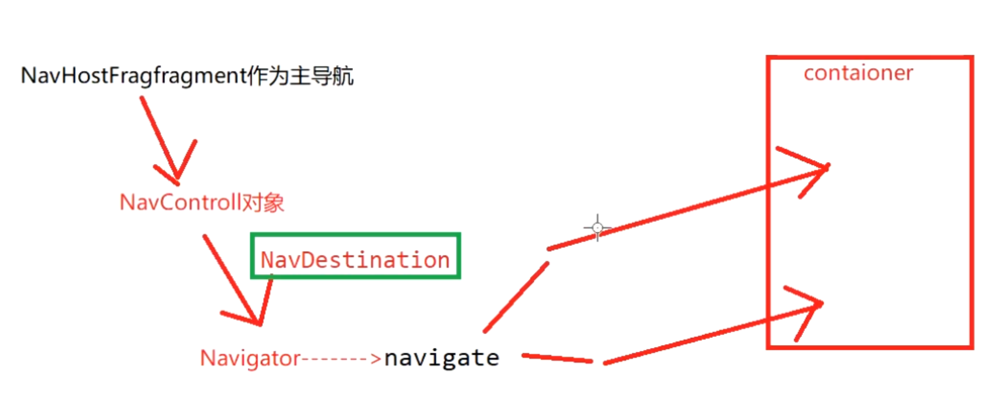

## 1、Navigation是什么？
	- Navigation 主要用于处理Activity和Fragment 等导航问题
	- 是一组用于简化 Android 导航的库插件和工具
- # 2、[[Navigation-原理面试]]
	- 
	- ## 首先：Navigation有三个重要角色
		- 1、==**导航图-Navigation graph，是定义导航信息的xml**==。比如==**导航路径，跳转动画**==
		- 2、[[#red]]==**主导航-NavHostFragment**==是一个空的容器，始化一些导航相关的信息，持有了NavController，导航控制器
		- 3、[[#green]]==**导航控制器-NavController，解析类图，维护回退栈**==。
	- 1、NavHostFragment作为主导航，先绑定到Activity，空容器，是实际显示内容的第一页，不过没数据，用户看不到
	- 2、NavHostFragment初始化的时候，
		- 1、创建NavHostController，而NavHostController初始化的时候会创建导航器Navigator，真正的导航会交给他处理。
		  2、将xml，id传入[[#red]]==**NavHostController里解析导航图xml，**==生成导航图对象，保存导航相关信息
		  3、[[#red]]==**同时解析出第一个目的地。进行导航展示。**==这时候就会显示我们在导航图里设置的第一个显示的Fragment
	- 3、NavController真正的导航工作是交给[[#blue]]==**Navigator导航器的**==，根据==**具体导航信息**==NavDestination。获取具体导航器，进行导航
		- 1、如果是Fragment的导航，会使用FragmentNavigator进行导航，内部还是使用的事务，进行Replace。
		- 2、如果是Activity的导航，会使用ActivityNavigator.内部使用的是startActivity的api。进行跳转
	- 4、==**NavController内部维护了一个回退栈**==，每导航一次，加入栈一次。当back键回退时。会拿到上一层进行返回