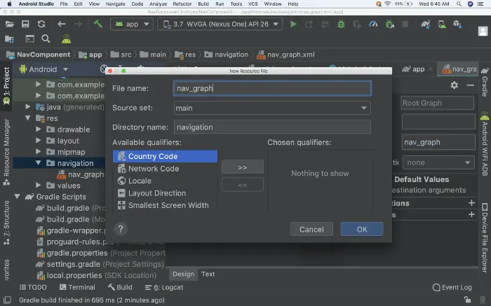

- 让我们通过创建一个简单的例子来看看 Navigation 组件是如何工作的。 接下来将创建一个带有两个 Fragment 的简单 Activity 来看看如何使用 Navigation 组件实现Fragment 之间的导航。
- ## 第1步：新建Androidx项目
	- 创建一个基于 AndroidX 的新项目。AndroidX 是 Android 团队用于在 Jetpack 中开发、测试、打包、版本和发布库的开源项目。可以在 AndroidX 概览 中查看更多信息。
- ## 第2步：添加配置
  collapsed:: true
	- 在 build.gradle 中添加依赖
		- ```xml
		  dependencies {
		    def nav_version = "2.3.0-alpha02"
		  
		    // Java language implementation
		    implementation "androidx.navigation:navigation-fragment:$nav_version"
		    implementation "androidx.navigation:navigation-ui:$nav_version"
		  
		    // Kotlin
		    implementation "androidx.navigation:navigation-fragment-ktx:$nav_version"
		    implementation "androidx.navigation:navigation-ui-ktx:$nav_version"
		  
		    // Dynamic Feature Module Support
		    implementation "androidx.navigation:navigation-dynamic-features-fragment:$nav_version"
		  
		    // Testing Navigation
		    androidTestImplementation "androidx.navigation:navigation-testing:$nav_version"
		  }
		  ```
	- 这些是针对不同需求的不同依赖项。根据需求进行选择。
- ## 第3步：res里新建navigation目录，创建导航图XML
  collapsed:: true
	- 要将导航图添加到您的项目：
		- 右键单击 res 目录并选择 New > Android Resource File，出现 New Resource File 对话框
		- 输入文件名，例如：nav_graph
		- 在 Resource type 的下拉列表中选择 Navigation，然后单击确定
			- 
	- 当添加第一个导航图时，Android Studio 会在 res 目录中创建一个导航资源文件夹，该文件夹中包含导航图资源文件。创建的文件看起来像这样：
		- ```
		  <?xml version="1.0" encoding="utf-8"?>
		  <navigation xmlns:android="http://schemas.android.com/apk/res/android"
		      xmlns:app="http://schemas.android.com/apk/res-auto"
		      android:id="@+id/nav_graph">
		  </navigation>
		  ```
	- <navigation> 元素是导航图的根元素。当向图表添加目的地和连接操作时，会添加相应的 <destination> 和 <action> 元素作为子元素。如果有嵌套的图形，将显示为子 <navigation> 元素。
	- ## 示例代码
		- ```xml
		  <?xml version="1.0" encoding="utf-8"?>
		  <navigation xmlns:android="http://schemas.android.com/apk/res/android"
		      xmlns:app="http://schemas.android.com/apk/res-auto"
		      xmlns:tools="http://schemas.android.com/tools"
		      android:id="@+id/nav_graph_main.xml"
		      app:startDestination="@id/page1Fragment">
		    
		      // 声明第一个Fragment，标识id为page1Fragment
		      <fragment
		          android:id="@+id/page1Fragment"
		          android:name="com.example.lsn4_navigationdemo.MainPage1Fragment"
		          android:label="fragment_page1"
		          tools:layout="@layout/fragment_main_page1">
		          <!--
		              action:程序中使用id跳到destination对应的类
		          -->
		          <action
		              android:id="@+id/action_page2"
		              app:destination="@id/page2Fragment" />
		      </fragment>
		      <fragment
		          android:id="@+id/page2Fragment"
		          android:name="com.example.lsn4_navigationdemo.MainPage2Fragment"
		          android:label="fragment_page2"
		          tools:layout="@layout/fragment_main_page2">
		          <action
		              android:id="@+id/action_page1"
		              app:destination="@id/page1Fragment" />
		          <action
		              android:id="@+id/action_page3"
		              app:destination="@id/page3Fragment" />
		      </fragment>
		  
		      <!--    <navigation-->
		      <!--        android:id="@+id/nav_graph_page3"-->
		      <!--        app:startDestination="@id/page3Fragment">-->
		      <fragment
		          android:id="@+id/page3Fragment"
		          android:name="com.example.lsn4_navigationdemo.MainPage3Fragment"
		          android:label="fragment_page3"
		          tools:layout="@layout/fragment_main_page3"
		          >
		          <action
		              android:id="@+id/action_page2"
		              app:destination="@id/page2Fragment"/>
		      </fragment>
		  
		  
		  </navigation>
		  ```
	- ## 1、app:startDestination 设置启动后打开的第一个Fragment的id,在下边声明的id
	- ## 2、<fragment 标签标识声明的Fragment
		- 2-1、id：通过这个跳转
		- 2-2、name：为Fragment的全包名
		- 2-3、label：添加一个Fragment 标识
		- 2-4、layout：Fragment的布局文件layout
	- ## 3、<action标签
		- id：action的id。程序中跳转用
		- [[navigation-destination目的地]]:。也是传入Fragment的id
		- ```xml
		      <!--
		              action:程序中使用id跳到destination对应的类
		          -->
		          <action
		              android:id="@+id/action_page2" 
		              app:destination="@id/page2Fragment" />
		  ```
- ## 第4步：添加 NavHost 到 Activity 的 XML 文件中
  collapsed:: true
	- 使用示例
		- ```xml
		  <?xml version="1.0" encoding="utf-8"?>
		  <LinearLayout xmlns:android="http://schemas.android.com/apk/res/android"
		      xmlns:app="http://schemas.android.com/apk/res-auto"
		      xmlns:tools="http://schemas.android.com/tools"
		      android:layout_width="match_parent"
		      android:layout_height="match_parent"
		      android:orientation="vertical"
		      tools:context=".MainActivity">
		      <!--
		      app:defaultNavHost="true"
		      拦截系统back键
		      -->
		      <androidx.fragment.app.FragmentContainerView
		          android:id="@+id/my_nav_host_fragment"
		          android:layout_width="match_parent"
		          android:layout_height="wrap_content"
		          android:layout_weight="9"
		          android:name="androidx.navigation.fragment.NavHostFragment"
		          app:layout_constraintBottom_toBottomOf="parent"
		          app:layout_constraintLeft_toLeftOf="parent"
		          app:layout_constraintRight_toRightOf="parent"
		          app:layout_constraintTop_toTopOf="parent"
		          app:defaultNavHost="true"
		          app:navGraph="@navigation/nav_graph_main"/>
		      <com.google.android.material.bottomnavigation.BottomNavigationView
		          android:id="@+id/nav_view"
		          android:layout_width="match_parent"
		          android:layout_weight="1"
		          android:layout_height="wrap_content"
		          app:itemTextColor="#ff0000"
		          app:menu="@menu/menu"/>
		  </LinearLayout>
		  ```
	- [[nav_host_fragment]] 中包含：
	- [[#red]]==**navGraph：声明导航图的xml**==
- ## 第5步：[[NavHost 添加到Activity上]]
	- [[navigation-destination目的地]]
	- 现在将 NavHost 添加到 activity_main XML 文件中：
		- ```xml
		  <androidx.constraintlayout.widget.ConstraintLayout
		      xmlns:android="http://schemas.android.com/apk/res/android"
		      xmlns:app="http://schemas.android.com/apk/res-auto"
		      xmlns:tools="http://schemas.android.com/tools"
		      android:layout_width="match_parent"
		      android:layout_height="match_parent"
		      tools:context=".MainActivity">
		  
		      <fragment
		          android:id="@+id/nav_host_fragment"
		          android:name="androidx.navigation.fragment.NavHostFragment"
		          android:layout_width="match_parent"
		          android:layout_height="match_parent"
		          app:defaultNavHost="true"
		          app:navGraph="@navigation/nav_graph" />
		  
		  </androidx.constraintlayout.widget.ConstraintLayout>
		  ```
	- MainActivity 的代码如下：
		- ```kotlin
		  package com.example.navigationsample
		  
		  import android.support.v7.app.AppCompatActivity
		  import android.os.Bundle
		  import androidx.navigation.findNavController
		  
		  class MainActivity : AppCompatActivity() {
		      override fun onCreate(savedInstanceState: Bundle?) {
		          super.onCreate(savedInstanceState)
		          setContentView(R.layout.activity_main)
		      }
		      override fun onSupportNavigateUp() = findNavController(R.id.nav_host_fragment).navigateUp()
		  }
		  ```
	- 就是这样 - 我们完成了。
	- 点击运行按钮并查看 Navigation 组件的神奇之处：
	  collapsed:: true
		- 
	- 通过按钮的点击事件实现 Fragment 的跳转，可以看到没有使用 Fragment transaction：
		- ```kotlin
		  btn_next.setOnClickListener {
		      view.findNavController()
		          .navigate(R.id.action_fragment1_to_fragment2)
		  }
		  ```
	- 我们需要找到 NavController 并为其提供我们在 XML 中指定的操作 ID。
-
- # 代码跳转写法对比
	- 1、使用action，跳转和回退上一步
		- ```java
		  btn.setOnClickListener(new View.OnClickListener() {
		    @Override
		    public void onClick(View view) {
		      Navigation.findNavController(view).navigate(R.id.action_page2);
		      //回退上一步
		      //                Navigation.findNavController(view).navigateUp();
		    }
		  });
		  ```
		- 1-1、a->b,使用action 传入id，进行跳转
			- ```java
			      Navigation.findNavController(view).navigate(R.id.action_page2);
			  
			  ```
		- 1-2、b返回a
			- a、拦截回退键app:defaultNavHost="true"
			- b、传入id跳回去
			- 还可以使用
			- ```java
			      //                Navigation.findNavController(view).navigateUp();
			  
			  ```