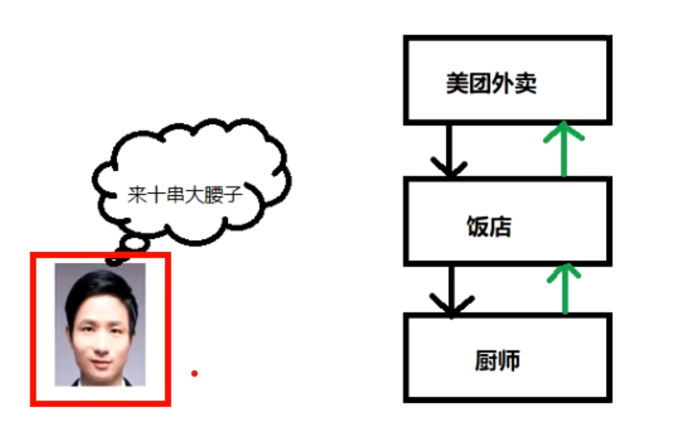

- # 一、概念
	- OkHttp最核心的工作是在 getResponseWithInterceptorChain() 中进行，在进入这个方法分析之前，我们先来了解什么是责任链模式，因为此方法就是利用的责任链模式完成一步步的请求。
	- 责任链顾名思义就是由一系列的负责者构成的一个链条，类似于工厂流水线，你们懂的，很多同学的男朋友/女朋友就是这么来的。
- # 二、责任链模式
  collapsed:: true
	- ## 使用场景
		- [[#red]]==**客户只需要将请求发给责任链即可，无须关心请求的处理细节和请求的传递。责任链将请求的发送者和处理者解耦**==
	- **为请求创建了一个接收者对象的链**。
	- 这种模式给予请求的类型，对请求的发送者和接收者进行解耦。
	- 在这种模式中，通常每个接收者都包含对另一个接收者的引用。如果一个对象不能处理该请求，那么它会把相同的请求传给下一个接收者，依此类推。比如
	  collapsed:: true
		- > 七夕节刚过去。周周同学（我也不知道为什么第一个想到的就是周周同学）在读书的时候就是单身狗一条，看到自习室每天都很多美女后，每天晚上跑去自习都干同一件事情。周周每天晚上都坐到自习室最后一排，找张纸条写上：“Hi,可以做我的女朋友吗？我的特长就是特别的长，如果不愿意请向前传”。纸条就一个接一个的传上去了，最后传给了扫地阿姨。最后和扫地阿姨过上了幸福的生活，这真是一个....令人高兴的故事。
	- ## 例子1
		- 那整个过程是什么样子的呢？
		  collapsed:: true
			- ```java
			  	//传送者
			      abstract class Transmit{
			          //责任链中下一个传递者
			          protected Transmit nextTransmit;
			          
			          boolean request(String msg);
			          
			          public void setNextTransmit(Transmit transmit){
			              nextTransmit = transmit;
			          }
			      }
			      public class Zero extends Transmit{
			          public boolean request(String msg){
			              System.out.println("Zero接到纸条,会心一笑");
			              boolean resp = nextTransmit.request(msg);
			              return resp;
			          }
			      }
			      public class Alvin extends Transmit{
			          public boolean request(String msg){
			              System.out.println("Alvin接到纸条,伤心欲绝”);
			              boolean resp = nextTransmit.request();
			              return resp;
			          }
			      }
			      public class Lucy extends Transmit{
			          public boolean request(String msg){
			              System.out.println("Lucy 王翠花阿姨接到纸条，兴高采烈");
			              return true;
			          }
			      }
			      private static Transmit getTransmits(){
			          Transmit zero = new Zero();
			          Transmit alvin = new Alvin();
			          Lucy lucy = new Lucy();
			          zero.setNextTransmit(alvin);
			          alvin.setNextTransmit(lucy);
			          return errorLogger;
			      }
			      public static void main(String[] args) {
			          Transmit transmit = getTransmits();
			          transmit.request("Hi,可以做我的女朋友吗？");
			      }
			  ```
	- ## 例子2
	  collapsed:: true
		- 
	- 在责任链模式中，每一个对象对其下家的引用而接起来形成一条链。请求在这个链上传递，直到链上的某一个对象决定处理此请求。客户并不知道链上的哪一个对象最终处理这个请求，系统可以在不影响客户端的 情况下动态的重新组织链和分配责任。处理者有两个选择：承担责任或者把责任推给下家。一个请求可以最终不被任何接收端对象所接受。
	-
- ## 三、拦截器入口函数 getResponseWithInterceptorChain
	- ### 同步执行入口在  realCall.execute
	  collapsed:: true
		- ```java
		    override fun execute(): Response {
		      check(executed.compareAndSet(false, true)) { "Already Executed" }
		  
		      timeout.enter()
		      callStart()
		      try {
		        client.dispatcher.executed(this)
		        return getResponseWithInterceptorChain()
		      } finally {
		        client.dispatcher.finished(this)
		      }
		    }
		  ```
	- ### 异步执行入口在AsyncCall 的run
	  collapsed:: true
		- ```java
		  override fun run() {
		        threadName("OkHttp ${redactedUrl()}") {
		          var signalledCallback = false
		          timeout.enter()
		          try {
		            val response = getResponseWithInterceptorChain()
		            signalledCallback = true
		            responseCallback.onResponse(this@RealCall, response)
		          } catch (e: IOException) {
		            if (signalledCallback) {
		              // Do not signal the callback twice!
		              Platform.get().log("Callback failure for ${toLoggableString()}", Platform.INFO, e)
		            } else {
		              responseCallback.onFailure(this@RealCall, e)
		            }
		          } catch (t: Throwable) {
		            cancel()
		            if (!signalledCallback) {
		              val canceledException = IOException("canceled due to $t")
		              canceledException.addSuppressed(t)
		              responseCallback.onFailure(this@RealCall, canceledException)
		            }
		            throw t
		          } finally {
		            client.dispatcher.finished(this)
		          }
		        }
		      }
		    }
		  ```
		-
	- ### [[getResponseWithInterceptorChain]]
- # 三、[[拦截器流程]]