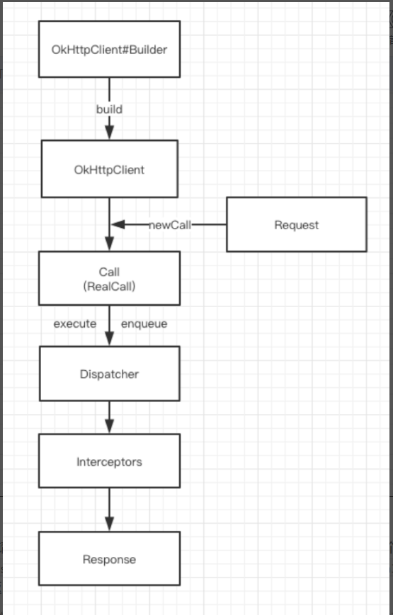

# 1、同步请求和异步请求的区别？
collapsed:: true
	- ## 同步请求
		- 同步会阻塞当前线程，
		- 场景，一次请求的响应结果是下次请求的参数。自己开线程去处理
	- ## 异步请求
		- 异步继续执行，需要回调回来
- # 2、RealCall基础相关
  collapsed:: true
	- ## 1、每次请求都会new一个realCall
	- ## 2、一个realCall对象只能执行一次，会有判断
	  collapsed:: true
		- ```java
		    @Override public void enqueue(Callback responseCallback) {
		      // 一个RealCall只能执行一次
		      synchronized (this) {
		        if (executed) throw new IllegalStateException("Already Executed");
		        executed = true;
		      }
		      transmitter.callStart();
		      client.dispatcher().enqueue(new AsyncCall(responseCallback));
		    }
		  ```
- # 3、分发器Dispatcher
	- ## 1、分发器dispatch干嘛的？
		- 内部维护队列与线程池，完成请求调配
	- ## 2、[[调度器异步请求流程]]
	- ## 3、调度器执行异步任务判断，相同host不能超过5个为什么？
	  collapsed:: true
		- 1、它可能参考 谷歌等浏览器是设置
		- 2、为了防止访问 服务器的过渡开销吧
	- ## 3、分发器一共使用了多少个队列:3个
		- ####  同步：runningSyncCalls
		- 异步：runningAsyncCalls   readyAsyncCalls
	- ## 4、同步suncRunning队列 和 异步的 ready 和 Asyncrunning队列 为啥用双向队列？
	  collapsed:: true
		- 双向队列  头尾 都可以插入删除。为了扩展吧，之前看源码没有这部分操作
	- ## 5、异步请求中，怎么把请求放入Running队列？
		- 遍历ready队列，当正在请求数量小于64 && 同一主机请求小于5 个 时 可以放入
	- ## 6、任务执行完，ready中的任务怎么添加到Running中的
		- 任务执行完，会调用finished 把 Running队列的这个执行完的任务移除掉，再次遍历ready队列，满足上述两个条件就会加入Running队列
	- ## 7、分发器线程池的工作行为》
		- 无等待 最大并发。核心线程0 普通线程最大 无容量等待队列。全靠Runing队列64个限制
	- ## 8、 [[OkhttpClient可设置单例，也可不使用单例，带来的线程池问题？]]
- # 4、拦截器
	- ## 1、拦截器干嘛的？
	  collapsed:: true
		- 五大默认拦截器完成整个请求过程
	- ## 2、addinterceptors和 add networkInterceptors区别
	  id:: 64ba01db-34dd-49f4-ba70-50942da43957
	  collapsed:: true
		- 1、是否执行不同
			- addinterceptors 一定执行，networkInterceptors 不一定执行（除了webSocket判断，如果有中断或者缓存，这不会执行）
			  id:: 64ba2f08-f53f-4cd4-ae0c-08a114b25caa
		- 2、执行时机前后不同。导致添加自定义拦截器比如log的
			- addinterceptors 第一个拿到请求request 最后一个拿到响应，
				- 加在这里请求未经过  内置拦截器完整拼接，可能不全
			- 
			-
	- ## 3、[[重试重定向拦截器面试题]]
	- ## 4、桥接拦截器的作用
	  collapsed:: true
		- 前置工作：补全请求头
		- 中置工作：向后传递请求
		- 后置工作
			- 1、处理cookie，缓存 以便下次用
			- 2、Gzip解压缩
	- ## 5、[[缓存拦截器面试题]]
	- ## 6、[[连接拦截器面试题]]连接池的复用与清理
- # 5、OKhttp中一次异步请求是怎样的？
	- 1、okhttpClient.newCall(request)  返回的是一个 RealCall 对象
	- 2、然后执行realCall.enqueue  实际里边调用的是  dispatcher .enqueue  将网络请求放到后台线程执行
	- 3、在后台线程  通过  getResponseWithInterceptorChain()  获取返回的响应response 放在callback 里回调回来
	- ## 参考整体流程
		- {:height 877, :width 555}
- # 6、[[okhttp里的源码怎么处理Https证书的]]