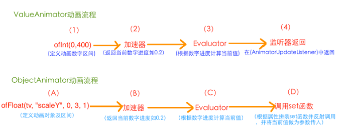

# 父类：ValueAnimator
- # 一、api
  collapsed:: true
	- | [ObjectAnimator](http://www.android-doc.com/reference/android/animation/ObjectAnimator.html)  | [clone](#clone())() 创建并返回此对象的副本。 |
	  | [String](http://www.android-doc.com/reference/java/lang/String.html)  | [getPropertyName](#getPropertyName())() 获取将被激活的属性的名称。 |
	  | [Object](http://www.android-doc.com/reference/java/lang/Object.html)  | [getTarget](#getTarget())() 该动画将激活其属性的目标对象。 |
	  | static <T> [ObjectAnimator](http://www.android-doc.com/reference/android/animation/ObjectAnimator.html)  | [ofFloat](#ofFloat(T, android.util.Property<T, java.lang.Float>, float...))(T target, [Property](http://www.android-doc.com/reference/android/util/Property.html)<T, [Float](http://www.android-doc.com/reference/java/lang/Float.html)> property, float... values) 构建并返回一个objectanimator动画之间的浮点值。 |
	  | static [ObjectAnimator](http://www.android-doc.com/reference/android/animation/ObjectAnimator.html)  | [ofFloat](#ofFloat(java.lang.Object, java.lang.String, float...))([Object](http://www.android-doc.com/reference/java/lang/Object.html) target, [String](http://www.android-doc.com/reference/java/lang/String.html) propertyName, float... values) 构建并返回一个objectanimator动画之间的浮点值。 |
	  | static <T> [ObjectAnimator](http://www.android-doc.com/reference/android/animation/ObjectAnimator.html)  | [ofInt](#ofInt(T, android.util.Property<T, java.lang.Integer>, int...))(T target, [Property](http://www.android-doc.com/reference/android/util/Property.html)<T, [Integer](http://www.android-doc.com/reference/java/lang/Integer.html)> property, int... values) 构建并返回一个int值了objectanimator之间。 |
	  | static [ObjectAnimator](http://www.android-doc.com/reference/android/animation/ObjectAnimator.html)  | [ofInt](#ofInt(java.lang.Object, java.lang.String, int...))([Object](http://www.android-doc.com/reference/java/lang/Object.html) target, [String](http://www.android-doc.com/reference/java/lang/String.html) propertyName, int... values) 构建并返回一个int值了objectanimator之间的值 |
	  | static <T, V> [ObjectAnimator](http://www.android-doc.com/reference/android/animation/ObjectAnimator.html)  | [ofObject](#ofObject(T, android.util.Property<T, V>, android.animation.TypeEvaluator<V>, V...))(T target, [Property](http://www.android-doc.com/reference/android/util/Property.html)<T, V> property, [TypeEvaluator](http://www.android-doc.com/reference/android/animation/TypeEvaluator.html)<V> evaluator, V... values) 构建并返回一个objectanimator了对象之间的值。 |
	  | static [ObjectAnimator](http://www.android-doc.com/reference/android/animation/ObjectAnimator.html)  | [ofObject](#ofObject(java.lang.Object, java.lang.String, android.animation.TypeEvaluator, java.lang.Object...))([Object](http://www.android-doc.com/reference/java/lang/Object.html) target, [String](http://www.android-doc.com/reference/java/lang/String.html) propertyName, [TypeEvaluator](http://www.android-doc.com/reference/android/animation/TypeEvaluator.html) evaluator, [Object...](http://www.android-doc.com/reference/java/lang/Object.html) values) . 构建并返回一个objectanimator了对象之间的值 |
	  | static [ObjectAnimator](http://www.android-doc.com/reference/android/animation/ObjectAnimator.html)  | [ofPropertyValuesHolder](#ofPropertyValuesHolder(java.lang.Object, android.animation.PropertyValuesHolder...))([Object](http://www.android-doc.com/reference/java/lang/Object.html) target, [PropertyValuesHolder...](http://www.android-doc.com/reference/android/animation/PropertyValuesHolder.html) values) 构建并返回一个objectanimator激励对象中指定的值的集合之间的propertyvalueholder。 |
	  | void  | [setAutoCancel](#setAutoCancel(boolean))(boolean cancel) autocancel控件是否自动取消当年objectanimator will be with the same objectanimator any other is started和性能指标。 |
	  | [ObjectAnimator](http://www.android-doc.com/reference/android/animation/ObjectAnimator.html)  | [setDuration](#setDuration(long))(long duration) 设置动画的长度。 |
	  | void  | [setFloatValues](#setFloatValues(float...))(float... values) 设置将在两个动画之间浮动的值。 |
	  | void  | [setIntValues](#setIntValues(int...))(int... values) 设置将在两个动画之间激活的int值 |
	  | void  | [setObjectValues](#setObjectValues(java.lang.Object...))([Object...](http://www.android-doc.com/reference/java/lang/Object.html) values) 设置此动画之间的动画值。 |
	  | void  | [setProperty](#setProperty(android.util.Property))([Property](http://www.android-doc.com/reference/android/util/Property.html) property) 设置将为动画的属性。 |
	  | void  | [setPropertyName](#setPropertyName(java.lang.String))([String](http://www.android-doc.com/reference/java/lang/String.html) propertyName) 设置将为动画的属性的名称。 |
	  | void  | [setTarget](#setTarget(java.lang.Object))([Object](http://www.android-doc.com/reference/java/lang/Object.html) target) 设置目标对象，该对象的属性将由此动画激活。 |
	  | void  | [setupEndValues](#setupEndValues())() 此方法告诉对象使用适当的信息提取动画的结束值。 |
	  | void  | [setupStartValues](#setupStartValues())() 这个方法告诉对象使用适当的信息来提取动画的起始值。 |
	  | void  | [start](#start())() 启动动画。. |
	  | [String](http://www.android-doc.com/reference/java/lang/String.html)  | [toString](#toString())() . 返回一个字符串，该字符串包含对这个对象的简洁易读的描述 |
- # 二、构造函数和示例
  collapsed:: true
	- ```java
	  public static ObjectAnimator ofFloat(Object target, String propertyName, float... values)   
	  第一个参数用于指定这个动画要操作的是哪个控件
	  第二个参数用于指定这个动画要操作这个控件的哪个属性
	  第三个参数是可变长参数，这个就跟ValueAnimator中的可变长参数的意义一样了，
	  就是指这个属性值是从哪变到哪。像我们上面的代码中指定的就是将textview的alpha属性从0变到1再变到0；
	  ```
	- # 1、渐变:alpha
	  collapsed:: true
		- ```java
		  ObjectAnimator  animator = ObjectAnimator.ofFloat(tv,"alpha",1,0,1);  
		  animator.setDuration(2000);  
		  animator.start(); 
		  ```
	- # 2、旋转    操作控件的属性名字分别为
	  collapsed:: true
		- rotation是绕Z轴旋转     rotationX是绕X轴旋转    rotationY是Y轴
			- ```java
			  ObjectAnimator animator = ObjectAnimator.ofFloat(tv,"rotation",0,180,0);  
			  animator.setDuration(2000);  
			  animator.start(); 
			  ```
	- # 3、缩放
	  collapsed:: true
		- setScaleX(float scaleX):在X轴上缩放，scaleX表示缩放倍数
		- setScaleY(float scaleY):在Y轴上缩放，scaleY表示缩放倍数
			- ```java
			  ObjectAnimator animator = ObjectAnimator.ofFloat(tv, "scaleX", 0, 3, 1);  
			  animator.setDuration(2000);  
			  animator.start();  
			  从0倍放大到3倍，然后再还原到1倍的原始状态
			  ```
	- # 4、移动
		- setTranslationX(float translationX) :表示在X轴上的平移距离,以当前控件为原点，向右为正方向，参数translationX表示移动的距离。
		- setTranslationY(float translationY) :表示在Y轴上的平移距离，以当前控件为原点，向下为正方向，参数translationY表示移动的距离。
		- ```java
		  ObjectAnimator animator = ObjectAnimator.ofFloat(tv, "translationX", 0, 200, -200,0);  
		  animator.setDuration(2000);  
		  animator.start();  
		  ```
- # 三、使用前提
  collapsed:: true
	- **使用前提：**
	- 1、要使用ObjectAnimator来构造对画，[[#red]]==**要操作的控件中，必须存在对应的属性的set方法**== 
	  2、setter 方法的命名必须以骆驼拼写法命名，即set后每个单词首字母大写，其余字母小写，即类似于setPropertyName所对应的属性为propertyName
- # 四、原理解析
	- 
- # 五、处理自定义view的属性动画，**该view的属性动画要自己写好set****ter****函数**
  collapsed:: true
	- **(1)、拼接set函数的方法：**
		- setScalePointX(float ),那我们在写属性时可以写成”scalePointX”或者写成“ScalePointX”都是可以的，
	- （2）如何确定函数的参数类型
		- **构造****传入的和****  ****    ****自定义的参数类型要一致**
	- （3）调用set函数以后怎么办
		- 自己在set函数里写具体的逻辑
	- （4）set函数调用频率是多少：
		- 会每隔十几毫秒会被调用一次。
	- ## 自定义ObjectAnimator属性
		- 自定义view的set属性函数
			- ```java
			  Void  setPointRadius(int radius){
			     mPoint.setRadius(radius);
			     invalidate();    //必须重新绘制view
			  }
			  ```
	- ## 何时需要实现对应属性的get函数这三个方法中的
		- 当且仅当动画的只有一个过渡值时，系统才会调用对应属性的get函数来得到动画的初始值。
		- ```java
		  public static ObjectAnimator ofFloat(Object target, String propertyName, float... values)  
		  public static ObjectAnimator ofInt(Object target, String propertyName, int... values)  
		  public static ObjectAnimator ofObject(Object target, String propertyName,TypeEvaluator evaluator, Object... values)  
		  
		  ```
- # 六、常用函数
  collapsed:: true
	- ## 1、使用ArgbEvaluator改变控件的背景颜色
	  collapsed:: true
		- ```java
		  public void setBackgroundColor(int color);  
		  ArgbEvaluator的返回值是Integer类型，所以我们要使用ArgbEvaluator的话，构造ObjectAnimator时必须使用ofInt()
		  使用
		          ObjectAnimator animator = ObjectAnimator.ofInt(view, "BackgroundColor",0xffff00ff,0xffffff00,0xffff00ff);
		          animator.setDuration(8000);
		          animator.setEvaluator(new ArgbEvaluator());
		          animator.start();
		  ```
	- ## 2、基本常用函数
		- ```java
		  /** 
		   * 设置动画时长，单位是毫秒 
		   */  
		  ValueAnimator setDuration(long duration)  
		  /** 
		   * 获取ValueAnimator在运动时，当前运动点的值 
		   */  
		  Object getAnimatedValue();  
		  /** 
		   * 开始动画 
		   */  
		  void start()  
		  /** 
		   * 设置循环次数,设置为INFINITE表示无限循环 
		   */  
		  void setRepeatCount(int value)  
		  /** 
		   * 设置循环模式 
		   * value取值有RESTART，REVERSE， 
		   */  
		  void setRepeatMode(int value)  
		  /** 
		   * 取消动画 
		   */  
		  void cancel()  
		  监听器的
		  /** 
		   * 监听器一：监听动画变化时的实时值 
		   */  
		  public static interface AnimatorUpdateListener {  
		      void onAnimationUpdate(ValueAnimator animation);  
		  }  
		  //添加方法为：public void addUpdateListener(AnimatorUpdateListener listener)  
		  /** 
		   * 监听器二：监听动画变化时四个状态 
		   */  
		  public static interface AnimatorListener {  
		      void onAnimationStart(Animator animation);  
		      void onAnimationEnd(Animator animation);  
		      void onAnimationCancel(Animator animation);  
		      void onAnimationRepeat(Animator animation);  
		  }  
		  //添加方法为：public void addListener(AnimatorListener listener) 
		  
		  
		  （3）、插值器与Evaluator
		  /** 
		   * 设置插值器 
		   */  
		  public void setInterpolator(TimeInterpolator value)  
		  /** 
		   * 设置Evaluator 
		   */  
		  public void setEvaluator(TypeEvaluator value)    
		  ```
- # 七、实践
  collapsed:: true
	- 1、知道objectAnimator的原理了可以不使用AnimatorSet实现组合动画，
	  collapsed:: true
		- ```java
		  public void rotateyAnimRun(final View view)  
		  {  
		      ObjectAnimator anim = ObjectAnimator//  
		              .ofFloat(view, "zdd", 1.0F,  0.0F)//  
		              .setDuration(500);//  
		      anim.start();  
		      anim.addUpdateListener(new AnimatorUpdateListener()  
		      {  
		          @Override  
		          public void onAnimationUpdate(ValueAnimator animation)  
		          {  
		              float cVal = (Float) animation.getAnimatedValue();  
		              view.setAlpha(cVal);  
		              view.setScaleX(cVal);  
		              view.setScaleY(cVal);  
		          }  
		  });
		  ```
		- 其实就是监听动画更新   objectAnimator最后调用的就是set函数   这里 手动调用多个就行了。
		- 把设置属性的那个字符串，随便写一个该对象没有的属性，就是不管~~咱们只需要它按照时间插值和持续时间计算的那个值，我们自己手动调用~
	- 2、使用PropertyValueHolder
	  collapsed:: true
		- **其中的方法**[ofPropertyValuesHolder](#ofPropertyValuesHolder(java.lang.Object, android.animation.PropertyValuesHolder...))
		- 构建并返回一个objectanimator激励对象中指定的值的集合之间的propertyvalueholder
		- 参数一遥操作的view    参数 二可以传入多个PropertyValuesHolder
		- ```java
		      public void propertyValuesHolder(View view)  
		          {  
		              PropertyValuesHolder pvhX = PropertyValuesHolder.ofFloat("alpha", 1f,  
		                      0f, 1f);  
		              PropertyValuesHolder pvhY = PropertyValuesHolder.ofFloat("scaleX", 1f,  
		                      0, 1f);  
		              PropertyValuesHolder pvhZ = PropertyValuesHolder.ofFloat("scaleY", 1f,  
		                      0, 1f);  
		              ObjectAnimator.ofPropertyValuesHolder(view, pvhX, pvhY,pvhZ).setDuration(1000).start();  
		          }  
		  ```