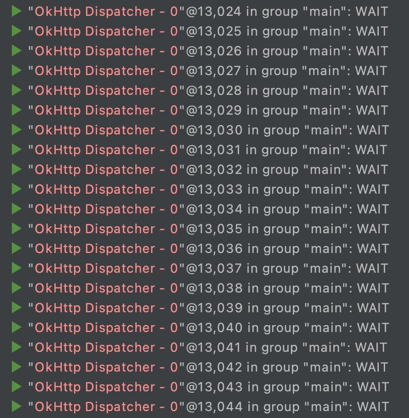

- # 一、简介
	- HTTP是现代应用程序用来交换数据和媒体的网络方式。高效地执行HTTP能让资源加载更快并节省带宽。
	  OkHttp是一个高效的HTTP客户端，具有一下默认特性：
		- 支持HTTP/2，允许请求共用同一个socket连接
		  连接池可以减少请求延迟
		  透明的GZIP压缩减小了响应数据的大小
		  缓存响应内容，避免完全重复的请求
- # 二、OkHttpClient
  collapsed:: true
	- OkHttp对外提供了 OkHttpClient 类来配置网络请求的参数以及执行网络请求
	- 在使用中，[[#red]]==OkHttpClient 可以使用单例也可以不使用单例==，对此官方并未有特别的指导说明
	- 这两种方式的主要区别在于 OkHttpClient 对象的创建，对于单例模式，每个请求都使用同一个 OkHttpClient 对象，毫无疑问在构建 OkHttpClient 对象的速度上单例模式更有优势，当然这种速度上的优势并不明显。
	- 除此之外，主要在于线程的开销上面，创建多个 OkHttpClient 对象是否会加大线程开销？
	- 带着这个疑问我们来看下 OkHttp 中的线程
- # 三、OkHttp的线程池
	- 网络请求的示例代码如下：
		- ```kotlin
		  OkHttpClient client = new OkHttpClient();
		  Request request = new Request.Builder()
		      .url(url)
		      .build();
		  
		  // 同步请求
		  Response response = client.newCall(request).execute()
		  
		  // 异步请求
		  client.newCall(request).enqueue(new Callback() {
		      @Override
		      public void onResponse(@NotNull Call call, @NotNull Response response) throws IOException {
		      }
		  
		      @Override
		      public void onFailure(@NotNull Call call, @NotNull IOException e) {
		      }
		  });
		  ```
	- OkHttpClient 通过调用 newCall(Request) 方法生成执行网络请求的 Call，Call 类是一个接口，实际执行网络请求的 RealCall 类
	- Call 提供了同步和异步两种请求方式的API，同步请求会在当前线程直接执行网络请求，不会开新线程，当然也不会使用线程池，我们可以忽略掉这种请求方式，只需要关注异步请求即可
	- ### OkHttp的异步请求的线程池
	  collapsed:: true
		- OkHttp的异步请求流程如下图：
			- 
		- 从请求流程中可以看出，OkHttp提供了 Dispatcher 类来对请求进行调度，Dispatcher 默认提供了一个线程池，请求会在该线程池中执行，同时 OkHttpClient 提供了一个指定 Dispatcher 的API，调用方可以指定线程池
		- Dispatcher 类进行请求调度的关键代码如下：
			- ```kotlin
			  private boolean promoteAndExecute() {
			    List<AsyncCall> executableCalls = new ArrayList<>();
			    boolean isRunning;
			    synchronized (this) {
			      // 遍历请求等待队列
			      for (Iterator<AsyncCall> i = readyAsyncCalls.iterator(); i.hasNext(); ) {
			        AsyncCall asyncCall = i.next();
			        // 正在执行的请求数量已达最大限制，不再执行新请求
			        if (runningAsyncCalls.size() >= maxRequests) break; // Max capacity.
			        // 同Host下正在执行的请求数量已达最大限制，不再执行新请求
			        // 实际最大可执行的数量为maxRequestsPerHost + 1
			        if (runningCallsForHost(asyncCall) >= maxRequestsPerHost) continue; // Host max capacity.
			  
			        i.remove();
			        // 可以执行的请求放入executableCalls，并添加到正在执行的请求队列
			        executableCalls.add(asyncCall);
			        runningAsyncCalls.add(asyncCall);
			      }
			      isRunning = runningCallsCount() > 0;
			    }
			    // 执行请求
			    for (int i = 0, size = executableCalls.size(); i < size; i++) {
			      AsyncCall asyncCall = executableCalls.get(i);
			      asyncCall.executeOn(executorService());
			    }
			    return isRunning;
			  }
			  ```
		- Dispatcher 类使用 maxRequests、maxRequestsPerHost 这两个参数来限制同时执行的请求的数量
		- 默认的线程池配置如下：
			- ```java
			  public synchronized ExecutorService executorService() {
			    if (executorService == null) {
			      executorService = new ThreadPoolExecutor(0, Integer.MAX_VALUE, 60, TimeUnit.SECONDS, new SynchronousQueue<Runnable>(), Util.threadFactory("OkHttp Dispatcher", false));
			    }
			    return executorService;
			  }
			  ```
		- Dispatcher 在 OkHttpClient 中进行创建，也就是每一个 OkHttpClient 对象对应一个 Dispatcher，因此我们可以得出结论：
			- 在直接使用 OkHttpClient 执行请求的场景下，如果创建多个 OkHttpClient 对象，会生成对应数量的线程池，对应着也会生成相应数量的线程，每个请求都在自己的线程池中执行，实际上线程池也就失去了意义
		- 我们可以写个简单的代码进行下验证：
			- ```java
			  // 创建OkHttpClient对象
			  private OkHttpClient createOkHttpClient() {
			    ThreadFactory threadFactory = new ThreadFactory() {
			      int index = 0;
			      @Override
			      public Thread newThread(Runnable runnable) {
			        return new Thread(runnable, "OkHttp Dispatcher - " + (index++));
			      }
			    };
			    Dispatcher dispatcher = new Dispatcher(new ThreadPoolExecutor(0, Integer.MAX_VALUE,
			        60, TimeUnit.SECONDS, new SynchronousQueue<Runnable>(), threadFactory));
			    okHttpClient = new OkHttpClient.Builder().dispatcher(dispatcher).build();
			    return okHttpClient;
			  }
			  
			  // 执行请求
			  private void executeRequest() {
			    Request request = new Request.Builder().url("http://app.58.com").build();
			    createOkHttpClient().newCall(request).enqueue(...);
			  }
			  
			  // 执行100次
			  for (int i = 0; i < 100; i++) {
			    executeRequest();
			  }
			  ```
		- OkHttpClient使用单例时线程如下：
			- 
		- OkHttpClient创建多个时线程如下：
			- 
	- ### 58网络库的线程池
	  collapsed:: true
		- 58网络库基于 OkHttp、RxJava 实现，由于 OkHttpClient 实例唯一，因此不存在创建多个 OkHttpClient 的场景
		- 58网络库执行请求的关键代码如下：
			- ```java
			  // 生成请求的Observable
			  public <T> rx.Observable<T> exec(RxRequest<T> request) {
			    Observable<T> requestObservable = mBuilder.getRequestObservableFactory()
			        .createRequestObservable(request);
			    return requestObservable;
			  }
			  
			  public <T> Observable<T> createRequestObservable(RxRequest<T> request) {
			    RxOkhttpCall<T> call = new RxOkhttpCall<T>(mOkHttpHandler, request);
			    return Observable.create(new RxRequestOnSubscribe<T>(call));
			  }
			  
			  // RxRequestOnSubscribe 中调用 RxOkhttpCall 来执行请求
			  public class RxOkhttpCall<T> implements RxCall<T> {
			    public T exec() throws Throwable {
			      Request request = RequestAdapter.getOkhttpRequest(mRxRequest, mOkHttpHandler.getCommonHeader().get(mRxRequest.getUrl()));
			      entity.setRequest(request);
			      OkHttpHandler.getInstance().doRequest(entity);
			      return RequestAdapter.parseResponse(mRxRequest,entity);
			    }
			  }
			  
			  // 最终调用 OkHttp 执行网络请求的方法
			  public class OkHttpHandler {
			    public void doRequest(BaseOkHttpEntity entity) {
			      Call call = genCall(entity);
			      entity.setCall(call);
			      try {
			        // 调用 OkHttp 的 Call.execute() 执行请求
			        entity.setResponse(call.execute());
			      } catch (Exception e) {
			        entity.setException(e);
			      }
			    }
			  }
			  ```
		- 从上述的代码可以看出，58网络库最终是通过调用 OkHttp 的同步请求方法执行网络请求，由于 OkHttp 的同步请求并不会开启新线程，因此最终请求是执行在 RxJava 的线程池中
		- 而 RxJava 的线程池是单例对象，可以推断出，在使用 RxJava 执行请求时，即使创建多个 OkHttpClient 的实例也不会存在过多的线程开销
		- 事实是否如此，我们再写个代码进行下验证：
		  collapsed:: true
			- ```java
			  // 使用58网络库执行请求
			  private void executeRequest() {
			    RxRequest<String> request = new RxRequest<>();
			    request.setUrl("http://app.58.com");
			    RxHttpManager.getHttpEngine()
			        .exec(request)
			        .subscribeOn(Schedulers.io())
			        .observeOn(AndroidSchedulers.mainThread())
			        .subscribe(...);
			  }
			  
			  // 执行100次
			  for (int i = 0; i < 100; i++) {
			    executeRequest();
			  }
			  ```
		- 执行100次请求的线程开销如下：
		  collapsed:: true
			- 
		- 通过线程的名称可以看出，所有线程都执行在 RxJava 的 io 线程池中。这里需要注意的是，由于 RxJava 的 io 线程池对线程数量无限制，短时间内有大量请求时也会造成线程数暴增
		-
	- ### Retrofit中的线程池
		- Retrofit 官方提供了多种异步框架，也支持自定义，这里我们基于 RxJava1 来进行分析
		- 先看下相关的关键代码：
			- ```java
			  final class RxJavaCallAdapter<R> implements CallAdapter<R, Object> {
			    @Override
			    public Object adapt(Call<R> call) {
			      OnSubscribe<Response<R>> callFunc = isAsync
			          // 调用OkHttp的异步请求
			          ? new CallEnqueueOnSubscribe<>(call)
			          // 调用OkHttp的同步请求
			          : new CallExecuteOnSubscribe<>(call);
			      OnSubscribe<?> func = new BodyOnSubscribe<>(callFunc);
			      Observable<?> observable = Observable.create(func);
			      return observable;
			    }
			  }
			  
			  // 调用OkHttp的异步请求
			  final class CallEnqueueOnSubscribe<T> implements OnSubscribe<Response<T>> {
			    private final Call<T> originalCall;
			    @Override
			    public void call(Subscriber<? super Response<T>> subscriber) {
			      Call<T> call = originalCall.clone();
			      call.enqueue(new Callback<T>() {...});
			    }
			  }
			  
			  final class OkHttpCall<T> implements Call<T> {
			    @Override
			    public void enqueue(final Callback<T> callback) {
			      okhttp3.Call call;
			      // 调用OkHttp的异步请求
			      call.enqueue(new okhttp3.Callback() { ... });
			    }
			  }
			  
			  // 调用OkHttp的同步请求
			  final class CallExecuteOnSubscribe<T> implements OnSubscribe<Response<T>> {
			    private final Call<T> originalCall;
			    @Override
			    public void call(Subscriber<? super Response<T>> subscriber) {
			      Call<T> call = originalCall.clone();
			      try {
			        response = call.execute();
			      } catch (Throwable t) {
			      }
			    }
			  }
			  
			  final class OkHttpCall<T> implements Call<T> {
			    @Override
			    public Response<T> execute() throws IOException {
			      okhttp3.Call call;
			      // 调用OkHttp的同步请求
			      return parseResponse(call.execute());
			    }
			  }
			  
			  ```
		- RxJavaCallAdapterFactory 对外提供了两个创建的API：
			- create()：调用 OkHttp 的 Call.execute() 方法同步执行请求，使用RxJava的io线程执行网络请求
			- createAsync()：调用 OkHttp 的 Call.enqueue() 方法异步执行请求，使用OkHttp的线程池执行网络请求
		- 我们可以推断出：
			- 当使用 create() 方法创建 RxJavaCallAdapter 时，由于使用 RxJava 的线程池，因此创建多个 OkHttpClient 对象也不会引起过多的线程开销
			- 当使用 createAsync() 方法创建 RxJavaCallAdapter 时，由于在OkHttp的线程池中执行请求，因此创建多个 OkHttpClient 对象会导致生成对应数量的线程池，线程会过度开销
		- 接下来还是通过代码进行下验证，结果如下：
		- 使用create()创建RxJavaCallAdapter：
			- 
		- 使用createAsync()创建RxJavaCallAdapter：
			- 
		- 从上面运行的结果可以看出，当使用 createAsync() 方法时，如果创建多个 OkHttpClient 对象，不仅会创建 RxJava 的io线程，还会创建同样数量的 OkHttp 的 Dispatcher 线程
		-
- # 四、OkHttp的ConnectionPool
	- 看到这里，我们似乎能得出结论，在使用 RxJava 时，由于 OkHttp 执行在 RxJava 的 io 线程池中，即使创建多个 OkHttpClient 对象也不会引起过多的内存开销
	- 我们再仔细看下在这种场景下的线程列表，会发现除了创建大量的 RxJava 的 io 线程之外，还存在同样数量的 OkHttp ConnectionPool 线程：
		- 
	- Okhttp 将客户端和服务端之间通信的链接抽象成 Connection 类，ConnectionPool 就是用来管理这些链接复用的，作用是在一定时间内可以复用 Connection
	- ConnectionPool 类的源码注释中已经很详细的进行了说明：
		- ```java
		  /**
		   * 管理HTTP和HTTP/2连接的重用，以减少网络延迟。相同Address的HTTP请求可以共享同一个Connection。
		   * 这个类实现了保持哪些连接开放以供将来使用的策略。
		   *
		   * Manages reuse of HTTP and HTTP/2 connections for reduced network latency. HTTP requests that
		   * share the same {@link Address} may share a {@link Connection}. This class implements the policy
		   * of which connections to keep open for future use.
		   */
		  public final class ConnectionPool {
		    /**
		     * 用于清除过期连接的后台线程。每个连接池最多只能运行一个线程。线程池允许对自身进行回收。
		     *
		     * Background threads are used to cleanup expired connections. There will be at most a single
		     * thread running per connection pool. The thread pool executor permits the pool itself to be
		     * garbage collected.
		     */
		    private static final Executor executor = new ThreadPoolExecutor(0 /* corePoolSize */,
		        Integer.MAX_VALUE /* maximumPoolSize */, 60L /* keepAliveTime */, TimeUnit.SECONDS,
		        new SynchronousQueue<Runnable>(), Util.threadFactory("OkHttp ConnectionPool", true));
		  }
		  ```
	- 从源码中我们可以知道，每一个 OkHttpClient 对象都会生成一个链接池的管理类：ConnectionPool，ConnectionPool 类里面有一个线程池，这个线程池用来执行清除过期链接的任务
	- 创建过多的 OkHttpClient 对象会导致创建很多 ConnectionPool 的线程池，增大线程开销
- # 五、总结
	- 在使用 RxJava 或 Retrofit 时，尽量要将 OkHttpClient 做成单例，避免过多的线程开销，同时在短时间内执行大量请求时要注意 RxJava 的 io 线程池的特性。
	- 