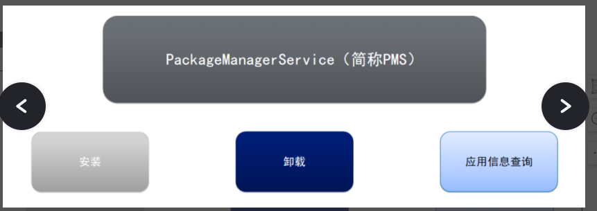

- 
- # 一、概述
  collapsed:: true
	- ## 包的理解：
		- 每一个应用的唯一标识 package
		- 每一个应用 == 一个包
		- 每一个应用 == 一个进程
		- 每一个应用 == Linux Uid用户
	- ## PKMS:
		- 概念：对所有的应用（包）的管理服务
		- 职责：
			- 
			- 负责应用程序的
			- 1、**安装**
			- 2、**卸载**，
			- 3、信息查询：
				- 比如我们Launcher桌面应用，所有应用的信息,图标等，都需要查询PKMS
		- ### PKMS整体概述信息
		  collapsed:: true
			- Android系统启动时，会启动（应用程序管理服务器PKMS），此服务负责扫描系统中特定的目录，寻找里面的APK格式的文件，并对这些文件进行解析，然后得到应用程序相关信息，最后完成应用程序的安装
			- PKMS在安装应用过程中, 会全面解析应用程序的AndroidManifest.xml文件, 来得到Activity,**Service, BroadcastReceiver, ContextProvider ****等信息****, ****在结合****PKMS**服务就可以在****OS****中正常的使用应用程序了
			- **在****Android****系统中****, ****系统启动时由****SystemServer****启动****PKMS****服务****, ****启动该服务后会执行应用程序的安装**过程
		- ### [[PKMS核心功能职责]]
- # 二、一部曲-PKMS角色位置
  collapsed:: true
	- **PKMS****是属于****Binder**机制的服务端角色
	- ==客户端程序想和PKMS通信，需要借助IPackageManager.aidl这个桥梁 进行binder通信==
	- 
	- PKMS binder通信流程：以context.getPackageManager().getPackageInfo("com.xxx",0)获取包名信息
		- 1、客户端可通过Context.getPackageManager()获得ApplicationPackageManager（继承了PM）对象,内部的持有mPm为 IPackageManager（AIDL接口）调用getPackageInfo方法
		- 2、而mPM指向的是Proxy代理，当调用到mPM.方法后，将会调用到IPackageManager的Proxy代理方法，
		- 3、然后通过Binder机制中的mRemote与服务端PackageManagerService通信 并调用到PackageManagerService的对应getPackageInfo方法；
- # 三、[[二部曲-PKMS启动过程分析]]
- # 四、[[三部曲-APK的扫描]]
- # 五、[[四部曲-APK的安装]]
- # 六、[[五部曲-PKMS之权限扫描]]
- # 七、权限管理
	- # [[requestPermissions权限申请源码流程解析]]
	- # [[checkPermission权限检测源码]]
- # [[PKMS面试题]]
- # 参考
	- # [PKMS](https://www.mdnice.com/writing/0d1ee2b2768e40f682ae10a3349c3efe)
	- # [PackageManagerService启动详解(四)之Android包信息体和解析器(上)](https://blog.csdn.net/tkwxty/article/details/114137504)