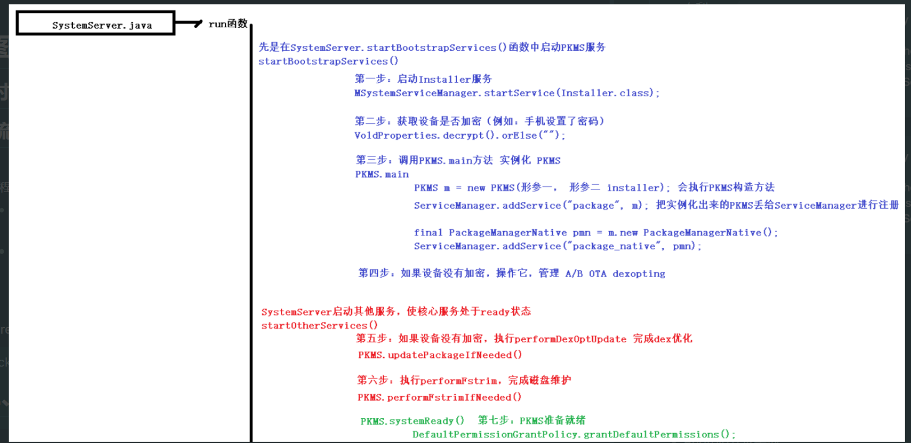

- 背景：大致流程图
  collapsed:: true
	- 
- 
- # main()函数主要工作
  collapsed:: true
	- main()
		- ```java
		  public static PackageManagerService main(Context context, Installer installer,
		  										boolean factoryTest, boolean onlyCore) {
		      // (1)检查Package编译相关系统属性
		      PackageManagerServiceCompilerMapping.checkProperties();
		      //(2)调用PackageManagerService构造方法, 同学们可以参考【PKMS构造方法】
		      PackageManagerService m = new PackageManagerService(context, installer,
		      factoryTest, onlyCore);
		      //(3)启用部分应用服务于多用户场景
		      m.enableSystemUserPackages();
		      //(4)往ServiceManager中注册”package”和”package_native”。
		      ServiceManager.addService("package", m);
		      final PackageManagerNative pmn = m.new PackageManagerNative();
		      ServiceManager.addService("package_native", pmn);
		      return m;
		  }
		  ```
- ## (1) 检查Package编译相关系统属性
- ## (2) 调用[[PackageManagerService构造方法]][[#red]]==重点分析==
- ## (3) 启用部分应用服务于多用户场景
- ## (4) 往ServiceManager中注册”package”和”package_native”。两个服务
-