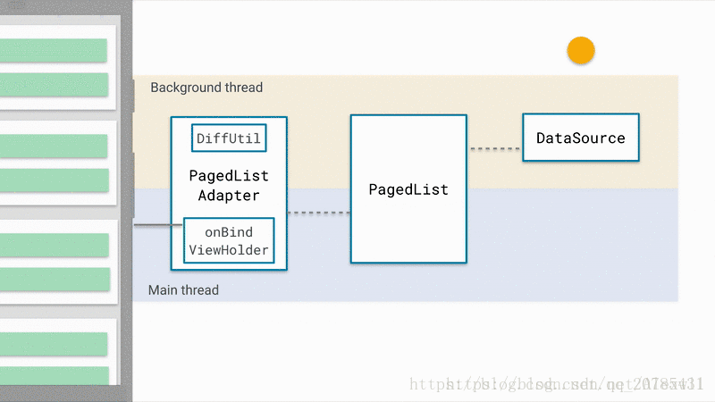
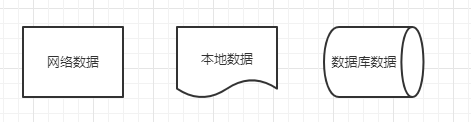
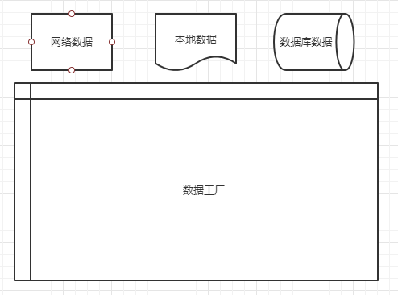
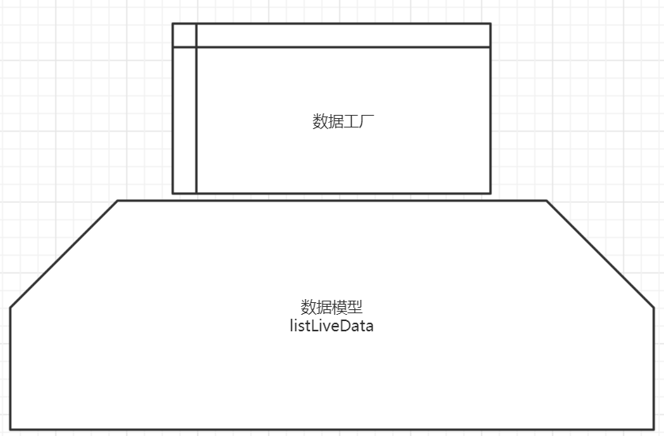
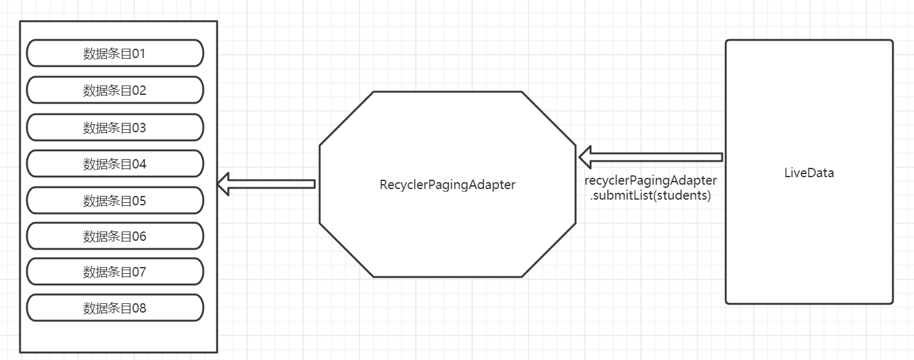
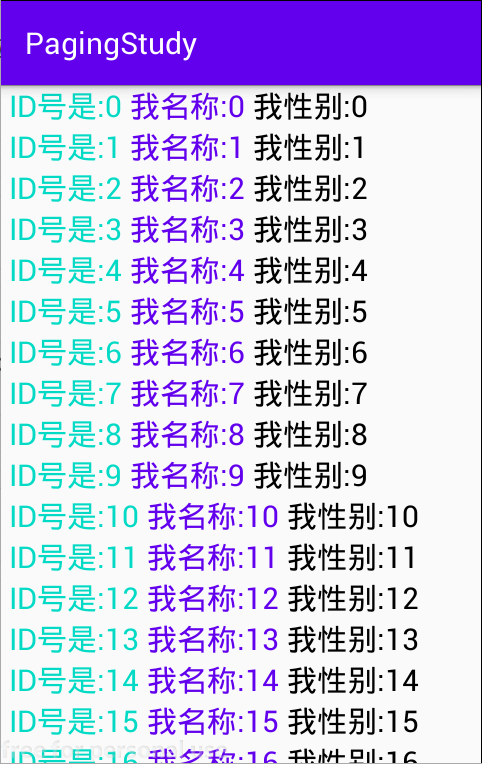

# 角色
collapsed:: true
	- 角色一：DataSource（是数据源，包含了多种形式，例如：Room来源，PositionalDataSource来源，PageKeyedDataSource来源，ItemKeyedDataSource来源）
	- 角色二：PagedList（是UIModel数据层，通过Factory的方式拿到数据源）
	- 角色三：PagedAdapter（同学们注意，不再是之前使用RecycleView的那种适配器了，而是和Paging配套的PagedListAdapter）
	- 角色四：RecycleView（是同学们之前学的RecycleView，只不过setAdapter的时候，绑定的适配器是 PagedAdapter）
	- 
- # 角色详解
  collapsed:: true
	- ## 角色1 数据源：
		- 数据源就是数据的来源，可以有多种来源渠道，例如：“网络数据”，“本地数据”，“数据库数据”
		  
	- ## 角色2 数据工厂：
		- 创建 管理 数据源 的工厂，为什么有一个工厂，除了可以去创建数据源之外，为了后续的扩展
		- 
	- ## 角色3 数据模型:
		- 数据模型其实就是 ViewModel，用来管理数据
		  
		  ```java
		  PagedList: 数据源获取的数据最终靠PagedList来承载。
		  对于PagedList,我们可以这样来理解，它就是一页数据的集合。
		  每请求一页，就是新的一个PagedList对象。
		  ```
		- 
	- ## 角色4 适配器：
		- ```
		  同学们：这个Adapter就是一个RecyclerView的Adapter。
		  不过我们在使用paging实现RecyclerView的分页加载效果，
		  不能直接继承RecyclerView的Adapter，而是需要继承PagedListAdapter。
		  ```
		- LiveData观察到的数据，把感应到的数据 给 适配器，适配器又绑定了 RecyclerView，那么RecyclerView的列表数据就改变了
		- 
	- ## 展示结果：
		- 
- # Paging的各个角色职责:
  collapsed:: true
	- DataSource：数据的来源
	- DataSource.Factory：工厂类提供DataSource的实例，在自定义DataSource时使用
	- PagedList：
		- 数据集散中心，根据需要向DataSource索取加载数据，并将得到的数据传递到PagedListAdapter
	- PagedListAdapter：
		- 数据适配器，这里除了起到普通界面加载适配器的作用外，更重要的是根据滑动显示的坐标，起到了确定什么时候要求向PagedList加载数据
	- DiffUtil.ItemCallback：判断数据是否发生改变以确定界面是否更新
- # 数据源详解：
  collapsed:: true
	- DataSource是一个抽象类，但是我们不能直接继承它实现它的子类。但是Paging库里提供了它的三个子类供我们继承用于不同场景的实现：
	-
	- 第一种：PositionalDataSource<T>：适用于目标数据总数固定，通过特定的位置加载数据，这里Key是Integer类型的位置信息，T即Value。 比如从数据库中的1200条开始加在20条数据。
	-
	- 第二种：ItemKeyedDataSource<Key, Value>：适用于目标数据的加载依赖特定item的信息， 即Key字段包含的是Item中的信息，比如需要根据第N项的信息加载第N+1项的数据，传参中需要传入第N项的ID时，该场景多出现于论坛类应用评论信息的请求。
	-
	- 第三种：PageKeyedDataSource<Key, Value>：适用于目标数据根据页信息请求数据的场景，即Key字段是页相关的信息。比如请求的数据的参数中包含类似next / pervious页数的信息。