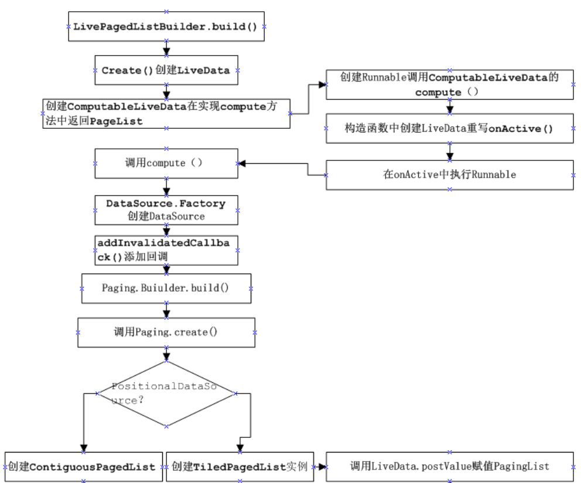

# [[类之关系]]
- # 初始化工作：
  collapsed:: true
	- 
- 开始查看 ”private final LiveData<PagedList<Student>> listLiveData;“ 此变量是如何创建的：
	- ```java
	  public StudentViewModel() {
	        StudentDataSourceFactory factory = new StudentDataSourceFactory();
	        this.listLiveData = new LivePagedListBuilder<Integer, Student>(factory, 20)
	                .build();
	  }
	  ```
- 点击进入build函数分析：
	- ```java
	  @NonNull
	  @SuppressLint("RestrictedApi")
	  public LiveData<PagedList<Value>> build() {
	    return create(mInitialLoadKey, mConfig, mBoundaryCallback, mDataSourceFactory,
	            ArchTaskExecutor.getMainThreadExecutor(), mFetchExecutor);
	  }
	  ```
- 进入create函数分析：
	- 使用LivePagedListBuilder配置Factory和Config，然后调用build创建实例，在build方法中直接调用了create（）方法创建LiveData
	  collapsed:: true
		- ```java
		  @AnyThread
		    @NonNull
		    private static <Key, Value> LiveData<PagedList<Value>> create(
		            @Nullable final Key initialLoadKey,
		            @NonNull final PagedList.Config config,
		            @Nullable final PagedList.BoundaryCallback boundaryCallback,
		            @NonNull final DataSource.Factory<Key, Value> dataSourceFactory,
		            @NonNull final Executor notifyExecutor,
		            @NonNull final Executor fetchExecutor) {
		        
		        // 同学们注意：在这里创建ComputableLiveData抽象类 
		        return new ComputableLiveData<PagedList<Value>>(fetchExecutor) { 
		  
		            @Nullable
		            private PagedList<Value> mList; 
		            @Nullable
		            private DataSource<Key, Value> mDataSource;
		  
		            private final DataSource.InvalidatedCallback mCallback =
		                    new DataSource.InvalidatedCallback() {
		                        @Override
		                        public void onInvalidated() {
		                            invalidate();
		                        }
		                    };
		  
		            // 同学们注意，在这里重写compute方法，   是我们需要的PagedList<Value>
		            @Override
		            protected PagedList<Value> compute() { 
		                @Nullable Key initializeKey = initialLoadKey;
		                if (mList != null) {
		                    //noinspection unchecked
		                    initializeKey = (Key) mList.getLastKey();
		                }
		  
		                do {
		                    if (mDataSource != null) {
		                        mDataSource.removeInvalidatedCallback(mCallback);
		                    }
		                    // 从Builder中传入的Factory中创建DataSource
		                    mDataSource = dataSourceFactory.create();
		                    mDataSource.addInvalidatedCallback(mCallback);
		                   // 创建PagedList
		                    mList = new PagedList.Builder<>(mDataSource, config)
		                            .setNotifyExecutor(notifyExecutor)
		                            .setFetchExecutor(fetchExecutor)
		                            .setBoundaryCallback(boundaryCallback)
		                            .setInitialKey(initializeKey)
		                            .build();
		                } while (mList.isDetached());
		                return mList;
		            }
		        }.getLiveData();
		    }
		  ```
	- 在create（）中直接返回了ComputableLiveData的实例，在ComputableLiveData实例重写的compute中执行了一些主要操作：
	  ​	一：调用传入的Factory的create（）创建DataSource实例
	  ​	二：创建并返回PagedList实例
	  ​	三：PagedList.build（） & PagedList.create()  就是如下代码（细节）:
- ```java
  mList = new PagedList.Builder<>(mDataSource, config)
                            .setNotifyExecutor(notifyExecutor)
                            .setFetchExecutor(fetchExecutor)
                            .setBoundaryCallback(boundaryCallback)
                            .setInitialKey(initializeKey)
                            .build();
  ```
- ```java
  public PagedList<Value> build() {
          // TODO: define defaults, once they can be used in module without android dependency
          if (mNotifyExecutor == null) {
              throw new IllegalArgumentException("MainThreadExecutor required");
          }
          if (mFetchExecutor == null) {
              throw new IllegalArgumentException("BackgroundThreadExecutor required");
          }
  - //noinspection unchecked
          return PagedList.create(
                  mDataSource,
                  mNotifyExecutor,
                  mFetchExecutor,
                  mBoundaryCallback,
                  mConfig,
                  mInitialKey);
      }
  ```
- PagedList的创建过程，在PagedList.build（）中调用了PagedList.create()，所以真正的创建是在create（）中发生的:
  collapsed:: true
	- ```java
	  private static <K, T> PagedList<T> create(...) {
	        if (dataSource.isContiguous() || !config.enablePlaceholders) {
	            ......
	            return new ContiguousPagedList<>(contigDataSource,
	                    notifyExecutor,
	                    fetchExecutor,
	                    boundaryCallback,
	                    config,
	                    key,
	                    lastLoad);
	        } else {
	            return new TiledPagedList<>((PositionalDataSource<T>) dataSource,
	                    notifyExecutor,
	                    fetchExecutor,
	                    boundaryCallback,
	                    config,
	                    (key != null) ? (Integer) key : 0);
	        }
	    }
	  ```
- 从上面的代码中看出根据 条件（dataSource.isContiguous() || !config.enablePlaceholders）的不同分别创建ContiguousPagedList和TiledPagedList，其实这里就是区分上面的**三个自定义DataSource的类型（三个数据源）**，如果是PositionalDataSource创建TiledPagedList，其他的返回ContiguousPagedList，我们依次查看三个DataSource中的isContiguous()方法：
- PositionalDataSource类中的：
	- ```java
	  @Override
	  boolean isContiguous() {
	    return false;
	  }
	  ```
- ItemKeyedDataSource和PageKeyedDataSource都继承与ContiguousDataSource，只查看ContiguousDataSource类中的：
	- ```java
	  @Override
	  boolean isContiguous() {
	    return true;
	  }
	  ```
- 又回来,从 **.build开始看:**
- new ComputableLiveData有什么用 与 何时执行compute函数, 这两个疑问，查看ComputableLiveData源码，发现在ComputableLiveData的构造函数中创建LiveData实例，下面查看Runnable接口中执行了哪些逻辑：
	- ```java
	  public ComputableLiveData(@NonNull Executor executor) {
	        mExecutor = executor;
	        mLiveData = new LiveData<T>() {
	            @Override
	            protected void onActive() {
	                mExecutor.execute(mRefreshRunnable);
	            }
	        };
	    }
	  ```
	- ```java
	  final Runnable mRefreshRunnable = new Runnable() {
	        @WorkerThread
	        @Override
	        public void run() {
	            boolean computed;
	            do {
	                computed = false;
	                // compute can happen only in 1 thread but no reason to lock others.
	                if (mComputing.compareAndSet(false, true)) {
	                    // as long as it is invalid, keep computing.
	                    try {
	                        T value = null;
	                        while (mInvalid.compareAndSet(true, false)) {
	                            computed = true;
	                            // 同学们 这里会执行 compute(); 函数
	                            // 调用了compuet创建了PagedList
	                            value = compute();
	                        }
	                        if (computed) {
	                            // 设置LiveData的值
	                            mLiveData.postValue(value);
	                        }
	                    } finally {
	                        // release compute lock
	                        mComputing.set(false);
	                    }
	                }
	  		.......
	            } while (computed && mInvalid.get());
	        }
	    };
	  ```
- 在mRefreshRunnable中调用了ComputableLiveData的compute（）方法创建了PagedList，所以此处的Value就是PagedList，然后为mLiveData初始化赋值PagedList
  细心的同学会留意到，在上面的create（）方法最后一句调用了getLiveData()获取到的就是ComputableLiveData构造函数中创建的LIveData：
	- ```java
	    @SuppressWarnings("WeakerAccess")
	    @NonNull
	    public LiveData<T> getLiveData() {
	        return mLiveData;
	    }
	  ```
- <u>到这里为止，LiveData<PagedList>终于创建完成了</u>
- ### 数据的加载工作：
  collapsed:: true
	- ContiguousPagedList 作为触发点：
	- 当我们自定义实现ItemKeySource时，创建的PagedList实际为ContiguousPagedList，查看ContiguousPagedList构造函数源码：
	- ```java
	  ContiguousPagedList(
	          @NonNull ContiguousDataSource<K, V> dataSource,
	          @NonNull Executor mainThreadExecutor,
	          @NonNull Executor backgroundThreadExecutor,
	          @Nullable BoundaryCallback<V> boundaryCallback,
	          @NonNull Config config,
	          final @Nullable K key,
	          int lastLoad) {
	      super(new PagedStorage<V>(), mainThreadExecutor, backgroundThreadExecutor,
	              boundaryCallback, config);
	      mDataSource = dataSource;
	      mLastLoad = lastLoad;
	  - if (mDataSource.isInvalid()) {
	          detach();
	      } else {
	          mDataSource.dispatchLoadInitial(key,
	                  mConfig.initialLoadSizeHint,
	                  mConfig.pageSize,
	                  mConfig.enablePlaceholders,
	                  mMainThreadExecutor,
	                  mReceiver);
	      }
	      mShouldTrim = mDataSource.supportsPageDropping()
	              && mConfig.maxSize != Config.MAX_SIZE_UNBOUNDED;
	  }
	  ```
- 在构造函数中执行一下逻辑，所以继续追踪代码：
  collapsed:: true
	- 第一点：创建PagedStorage实例，主要根据滑动的位置显示是否要继续加载数据
	- 第二点：调用DataSource.dispatchLoadInitial方法，此时使用的时ItermKeyDataSource的dispatchLoadInitial	方法
	- ```java
	  @Override
	    final void dispatchLoadInitial(@Nullable Key key, int initialLoadSize, int pageSize,
	            boolean enablePlaceholders, @NonNull Executor mainThreadExecutor,
	            @NonNull PageResult.Receiver<Value> receiver) {
	        LoadInitialCallbackImpl<Value> callback =
	                new LoadInitialCallbackImpl<>(this, enablePlaceholders, receiver);
	        loadInitial(new LoadInitialParams<>(key, initialLoadSize, enablePlaceholders), callback);
	        callback.mCallbackHelper.setPostExecutor(mainThreadExecutor);
	    }
	  ```
- 上面代码在ItermKeyDataSource的dispatchLoadInitial（）方法中调用了抽象函数loadInitial（），根据前面的学习我们知道在 loadInitial() 中设置了初始化的网络请求，到此实现了Paging组件初始化数据的加载
- ### 数据的显示工作：
  collapsed:: true
	- 在自定义ItemDataSource的loadInitial（）中加载数据后，调用了callback.onResult(it?.data!!.datas!!)方法，此处的callback是LoadInitialCallback的实现类**LoadInitialCallbackImpl**，在onResult（）方法中又调用了LoadCallbackHelper.dispatchResultToReceiver（）
		- ```java
		  static class LoadInitialCallbackImpl<Key, Value> extends LoadInitialCallback<Key, Value> {
		      final LoadCallbackHelper<Value> mCallbackHelper;
		      private final PageKeyedDataSource<Key, Value> mDataSource;
		      private final boolean mCountingEnabled;
		      LoadInitialCallbackImpl(@NonNull PageKeyedDataSource<Key, Value> dataSource,
		              boolean countingEnabled, @NonNull PageResult.Receiver<Value> receiver) {
		          mCallbackHelper = new LoadCallbackHelper<>(
		                  dataSource, PageResult.INIT, null, receiver);
		          mDataSource = dataSource;
		          mCountingEnabled = countingEnabled;
		      }
		  - @Override
		      public void onResult(@NonNull List<Value> data, @Nullable Key previousPageKey,
		              @Nullable Key nextPageKey) {
		          if (!mCallbackHelper.dispatchInvalidResultIfInvalid()) {
		              mDataSource.initKeys(previousPageKey, nextPageKey);
		              mCallbackHelper.dispatchResultToReceiver(new PageResult<>(data, 0, 0, 0));
		          }
		      }
		  ```
- 狙击点：**LoadCallbackHelper.dispatchResultToReceiver（）**
  collapsed:: true
	- ```java
	  void dispatchResultToReceiver(final @NonNull PageResult<T> result) {
	          Executor executor;
	          synchronized (mSignalLock) {
	              if (mHasSignalled) {
	                  throw new IllegalStateException(
	                          "callback.onResult already called, cannot call again.");
	              }
	              mHasSignalled = true;
	              executor = mPostExecutor;
	          }
	  - if (executor != null) {
	              executor.execute(new Runnable() {
	                  @Override
	                  public void run() {
	                      mReceiver.onPageResult(mResultType, result);
	                  }
	              });
	          } else {
	              mReceiver.onPageResult(mResultType, result);
	          }
	      }
	  ```
- 在dispatchResultToReceiver（）方法中，调用PageResult.Receiver.onPageResult()方法，这里的mReceiver是在调用 mDataSource.dispatchLoadInitial（）时传入的最后一个参数，他的实现在ContiguousPagedList中匿名创建：
  collapsed:: true
	- ```java
	  final PageResult.Receiver<T> mReceiver;
	  - // mSignalLock protects mPostExecutor, and mHasSignalled
	      private final Object mSignalLock = new Object();
	      private Executor mPostExecutor = null;
	      private boolean mHasSignalled = false;
	  - LoadCallbackHelper(@NonNull DataSource dataSource, @PageResult.ResultType int resultType,
	              @Nullable Executor mainThreadExecutor, @NonNull PageResult.Receiver<T> receiver) {
	          mDataSource = dataSource;
	          mResultType = resultType;
	          mPostExecutor = mainThreadExecutor;
	          mReceiver = receiver;
	      }
	  ```
- ContiguousPagedList:
  collapsed:: true
	- ```java
	  private PageResult.Receiver<V> mReceiver = new PageResult.Receiver<V>() {
	        // Creation thread for initial synchronous load, otherwise main thread
	        // Safe to access main thread only state - no other thread has reference during construction
	        @AnyThread
	        @Override
	        public void onPageResult(@PageResult.ResultType int resultType,
	                @NonNull PageResult<V> pageResult) {
	  - List<V> page = pageResult.page;
	            if (resultType == PageResult.INIT) {
	                mStorage.init(pageResult.leadingNulls, page, pageResult.trailingNulls,
	                        pageResult.positionOffset, ContiguousPagedList.this);
	                if (mLastLoad == LAST_LOAD_UNSPECIFIED) {
	                    // Because the ContiguousPagedList wasn't initialized with a last load position,
	                    // initialize it to the middle of the initial load
	                    mLastLoad =
	                            pageResult.leadingNulls + pageResult.positionOffset + page.size() / 2;
	                }
	            } else if (resultType == PageResult.APPEND) {
	                mStorage.appendPage(page, ContiguousPagedList.this);
	            } else if (resultType == PageResult.PREPEND) {
	                mStorage.prependPage(page, ContiguousPagedList.this);
	            } else {
	                throw new IllegalArgumentException("unexpected resultType " + resultType);
	            }
	  - }
	        }
	    };
	  ```
- 在onPageResult（）方法中根据resultType的类型执行操作，PageResult的三个数据类型分别对应者ItemKeyDataSource的三个方法：
  
  loadInitial：对应初始化状态PageResult.INIT
  loadBefore：对应初始化状态PageResult.PREPEND
  loadAfter：对应初始化状态PageResult.APPEND
- 此出分析初始化，回调的类型为PageResult.INIT，调用了PagedStorage的init（）方法：
	- ```java
	  mStorage.init(pageResult.leadingNulls, page, pageResult.trailingNulls,
	                      pageResult.positionOffset, ContiguousPagedList.this);
	  ```
	- ```java
	  void init(int leadingNulls, @NonNull List<T> page, int trailingNulls, int positionOffset,
	          @NonNull Callback callback) {
	      init(leadingNulls, page, trailingNulls, positionOffset);
	      callback.onInitialized(size());
	  }
	  ```
- 在init（）方法中首先调用另一个init（）方法记录加载的位置，并保存加载的数据, 然后调用callback.onInitialized(），在onInitialzed（）方法中调用了notifyInserted（），在notifyInserted（）中遍历mCallbacks回调callback的onInserted（）
	- ```java
	  interface Callback {
	        void onInitialized(int count);
	        void onPagePrepended(int leadingNulls, int changed, int added);
	        void onPageAppended(int endPosition, int changed, int added);
	        void onPagePlaceholderInserted(int pageIndex);
	        void onPageInserted(int start, int count);
	        void onPagesRemoved(int startOfDrops, int count);
	        void onPagesSwappedToPlaceholder(int startOfDrops, int count);
	        void onEmptyPrepend();
	        void onEmptyAppend();
	    }
	  ```
- 继续追踪源码:
	- ```java
	  ContiguousPagedList:
	  public void onInitialized(int count) {
	      notifyInserted(0, count);
	  }
	  PagedList:
	  void notifyInserted(int position, int count) {
	      if (count != 0) {
	          for (int i = mCallbacks.size() - 1; i >= 0; i--) {
	              Callback callback = mCallbacks.get(i).get();
	              if (callback != null) {
	                  callback.onInserted(position, count);
	              }
	          }
	      }
	  }
	  PagedList 的 接口:
	  public abstract void onInserted(int position, int count);
	  ```
- 以上源码, 让我们明白了:
	- 一: 加载的数据保存在PagedStorage中，并记录了加载的位置信息
	- 二: 加载完成后根据数据的变化，回调callback.onInserted（）通知数据改变的数量和位置
- ## **终于看到曙光了:**
	- 那CallBack是从哪来的呢？应该是哪里需要哪里才会注册回调，想想数据位置的变化在哪个地方能用得着，哪个地方优惠根据position和count处理呢？答案就在PagedListAdapter中    终于要看到 **PagedListAdapter** 了
- 当然  下面我们也可以简单的追踪下代码  **能否到 PagedListAdapter**
- AsyncPagedListDiffer:
- ```java
  public AsyncPagedListDiffer(@NonNull ListUpdateCallback listUpdateCallback, @NonNull AsyncDifferConfig<T> config) {
      class NamelessClass_1 extends Callback {
          NamelessClass_1() {
          }
  - public void onInserted(int position, int count) {
              AsyncPagedListDiffer.this.mUpdateCallback.onInserted(position, count);
          }
  - public void onRemoved(int position, int count) {
              AsyncPagedListDiffer.this.mUpdateCallback.onRemoved(position, count);
          }
  - public void onChanged(int position, int count) {
              AsyncPagedListDiffer.this.mUpdateCallback.onChanged(position, count, (Object)null);
          }
      }
  ```
- ListUpdateCallback:
	- ```
	  public interface ListUpdateCallback {
	   ......
	    void onInserted(int position, int count);
	  ```
- AdapterListUpdateCallback:
	- ```
	  @Override
	  public void onInserted(int position, int count) {
	  	mAdapter.notifyItemRangeInserted(position, count);
	  }
	  ```
- ## **逆向方式，同学们自己去看文字**
- # 逆向源码收尾:
  collapsed:: true
	- 在我们开始写的使用Paging的实例中，使用submitList（）设置数据，而submiList（）直接调用了mDiffer.submitList(pagedList)：
		- ```java
		  public void submitList(PagedList<T> pagedList) {
		        mDiffer.submitList(pagedList);
		  }
		  ```
		- ```java
		  public void submitList(final PagedList<T> pagedList) {
		        if (mPagedList == null && mSnapshot == null) {
		            // fast simple first insert
		            mPagedList = pagedList;
		            pagedList.addWeakCallback(null, mPagedListCallback);
		            return;
		        } 
		    }
		  ```
	- 这里就调用了addWeakCallback（）添加Callback实例mPagedListCallback
		- ```java
		  private PagedList.Callback mPagedListCallback = new PagedList.Callback() {
		      @Override
		      public void onInserted(int position, int count) {
		          mUpdateCallback.onInserted(position, count);
		      }
		  - @Override
		      public void onRemoved(int position, int count) {
		          mUpdateCallback.onRemoved(position, count);
		      }
		  - @Override
		      public void onChanged(int position, int count) {
		          // NOTE: pass a null payload to convey null -> item
		          mUpdateCallback.onChanged(position, count, null);
		      }
		  };
		  ```
	- 上面源码中, mPagedListCallback的onInserted（）直接回调mUPdateCallback.onInserted（），这里的mUPdateCallback正是在PagedListAdapter的构造函数中创建Differ，而在AsyncPagedListDiffer的构造函数中直接初始化了AdapterListUpdateCallback对象
		- ```java
		  public AsyncPagedListDiffer(@NonNull RecyclerView.Adapter adapter,
		            @NonNull DiffUtil.ItemCallback<T> diffCallback) {
		        mUpdateCallback = new AdapterListUpdateCallback(adapter);
		        mConfig = new AsyncDifferConfig.Builder<T>(diffCallback).build();
		  }
		  ```
	- 所以程序执行到AdapterListUpdateCallback中，在AdapterListUpdateCallback.onInserted（）中直接调用传入的Adapter的notifyItemRangeInserted(position, count)实现数据更新，这里的Adapter就是
-