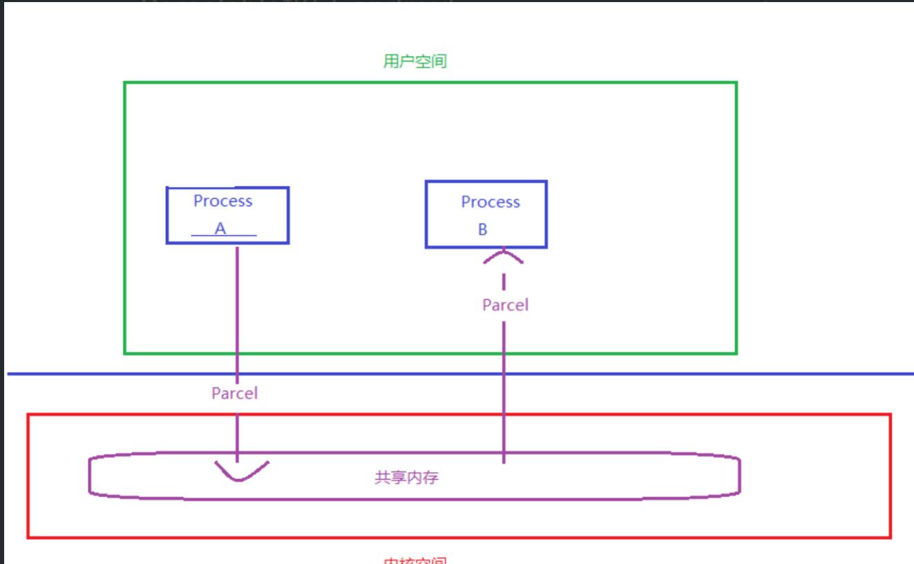

- # 一、简介
	- Parcelable是Android为我们提供的序列化的接口,Parcelable相对于Serializable的使用相对复杂一些,但Parcelable的效率相对Serializable也高很多,这一直是Google工程师引以为傲的,有时间的可以看一下Parcelable和Serializable的效率对比 Parcelable vs Serializable 号称快10倍的效率
	- Parcelable是Android SDK提供的，它是基于内存的，由于内存读写速度高于硬盘，因此Android中的跨进程对象的传递一般使用Parcelable
- # 二、Parcelable入门
	- ```java
	  public class Course implements Parcelable {
	      private String name;
	      private float score;
	      ...
	      /**
	      * 描述当前 Parcelable 实例的对象类型
	      * 比如说，如果对象中有文件描述符，这个方法就会返回上面的
	      CONTENTS_FILE_DESCRIPTOR
	      * 其他情况会返回一个位掩码
	      * @return
	      */
	      @Override
	      public int describeContents() {
	          return 0;	
	      }
	      /**
	      * 将对象转换成一个 Parcel 对象
	      * @param dest 表示要写入的 Parcel 对象
	      * @param flags 示这个对象将如何写入
	      */
	      @Override
	      public void writeToParcel(Parcel dest, int flags) {
	          dest.writeString(this.name);
	          dest.writeFloat(this.score);
	      }
	      protected Course(Parcel in) {
	          this.name = in.readString();
	          this.score = in.readFloat();
	      }
	      /**
	      * 实现类必须有一个 Creator 属性，用于反序列化，将 Parcel 对象转换为 Parcelable
	      * @param <T>
	      */
	  	public static final Parcelable.Creator<Course> CREATOR = newParcelable.Creator<Course>() {
	          //反序列化的方法，将Parcel还原成Java对象
	          @Override
	          public Course createFromParcel(Parcel source) {
	                  return new Course(source);
	          }
	          //提供给外部类反序列化这个数组使用。
	          @Override
	          public Course[] newArray(int size) {
	               return new Course[size];
	          }
	       };
	  }
	  ```
- # 三、Parcel的简介
  collapsed:: true
	- 在介绍之前我们需要先了解Parcel是什么?Parcel翻译过来是打包的意思,其实就是包装了我们需要传输的数据,然后在Binder中传输,也就是用于跨进程传输数据
	- 简单来说，Parcel提供了一套机制，可以将序列化之后的数据写入到一个共享内存中，其他进程通过Parcel可以从这块共享内存中读出字节流，并反序列化成对象,下图是这个过程的模型。
	- 
	- Parcel可以包含原始数据类型（用各种对应的方法写入，比如writeInt(),writeFloat()等），可以包含Parcelable对象，它还包含了一个活动的IBinder对象的引用，这个引用导致另一端接收到一个指向这个IBinder的代理IBinder。Parcelable通过Parcel实现了read和write的方法,从而实现序列化和反序列化
- # 四、[[Parcelable与Serializable的性能比较]]