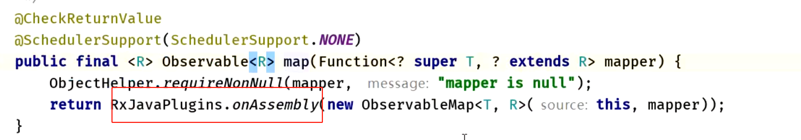

- ## hook点，rx每个操作都有RxJavaPlugins.onAssembly
  collapsed:: true
	- 例如：
	  collapsed:: true
		- create方法
			- ```java
			      public static <T> Observable<T> create(ObservableOnSubscribe<T> source) {
			          ObjectHelper.requireNonNull(source, "source is null");
			          return RxJavaPlugins.onAssembly(new ObservableCreate<T>(source));
			      }
			  ```
		- map方法
			- 
	-
- ## onAssembly源码:
  collapsed:: true
	- 含义：onObservableAssembly这个是自定义的hook函数，每次调用rx操作时，（如果设置了hook）都先执行这个hook函数
	- ```java
	      /**
	       * Calls the associated hook function.
	       * @param <T> the value type
	       * @param source the hook's input value
	       * @return the value returned by the hook
	       */
	      @SuppressWarnings({ "rawtypes", "unchecked" })
	      @NonNull
	      public static <T> Observable<T> onAssembly(@NonNull Observable<T> source) {
	          Function<? super Observable, ? extends Observable> f = onObservableAssembly;
	          if (f != null) {
	              return apply(f, source);
	          }
	          return source;
	      }
	  ```
- ## 怎么设置hook函数
  collapsed:: true
	- ```java
	         //
	          // 我想用了多少给 Map操作   flatMap
	          // Hook之前的监听
	          RxJavaPlugins.setOnObservableAssembly(new Function<Observable, Observable>() {
	              @Override
	              public Observable apply(Observable observable) throws Exception {
	                  Log.d(Flag.TAG, "apply: 整个项目 全局 监听 到底有多少地方使用 RxJava:" + observable);
	  
	                  // 伪代码
	                  /*if (observable  === ObservableMap)
	                      return null;*/
	  
	                  return observable; // 不破坏人家的功能
	              }
	          });
	  
	  ```
- # 结论
	- 很多操作符，都会经过onAssembly监听