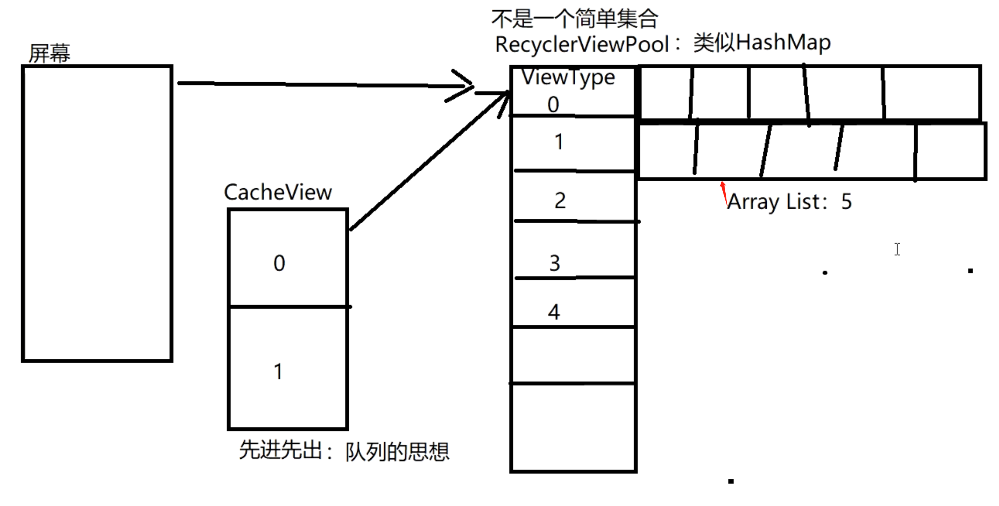

- 
- Recyclerview缓存池的缓存
- 1、pool 的数据结构他是个  SparseArray（key 只为int的 map）key 为 ViewType value 为 ArrayList
- 2、每个ArrayList最多存储5个。
- 3、RecyclerView提供了这种缓存形式，支持多个RecyclerView之间复用View，也就是说通过自定义Pool我们甚至可以实现整个应用内的RecyclerView的View的复用
- 