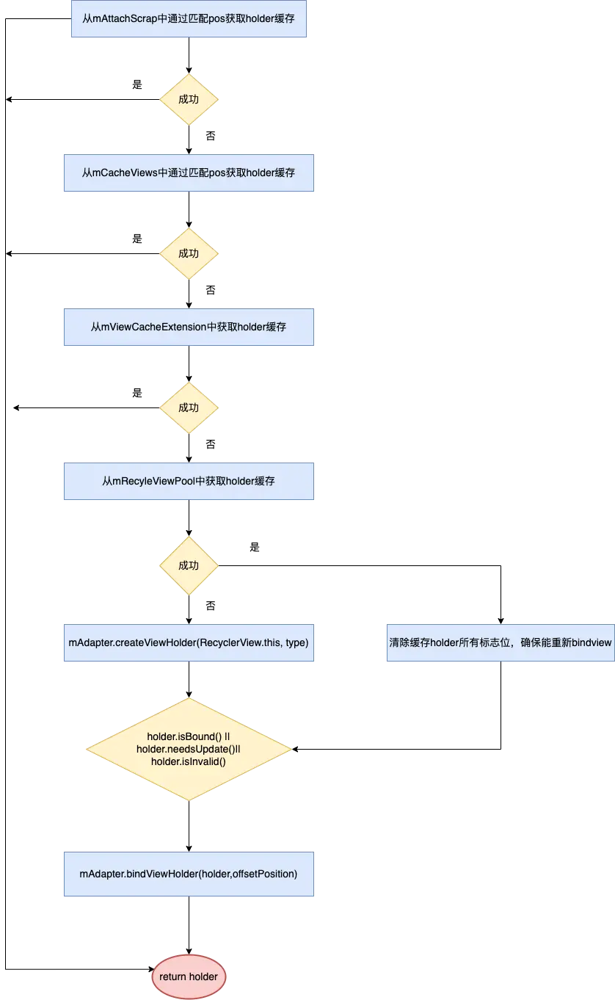
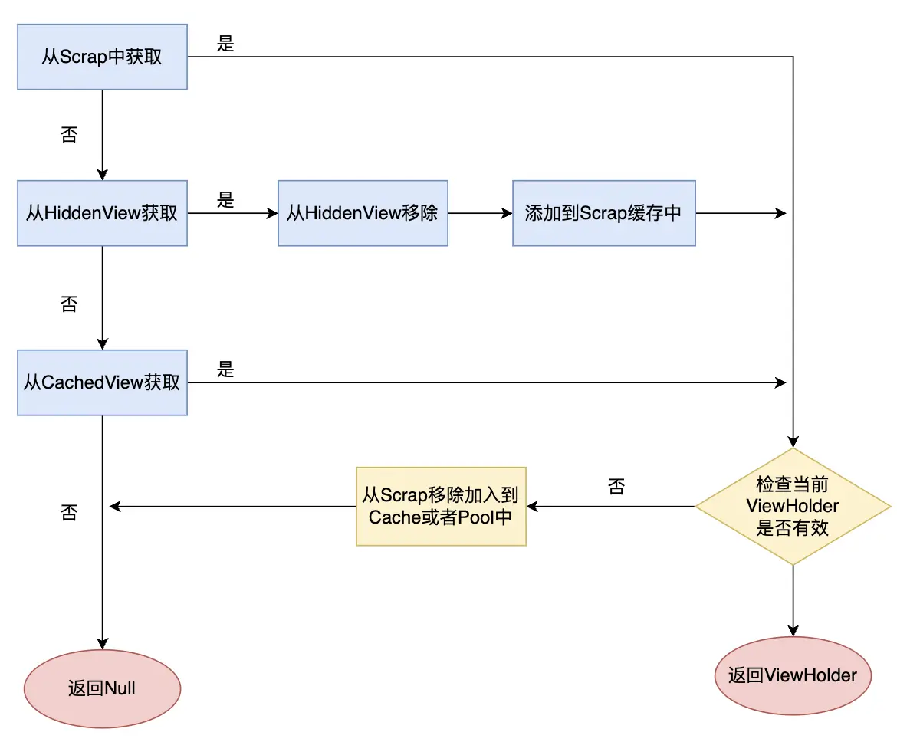
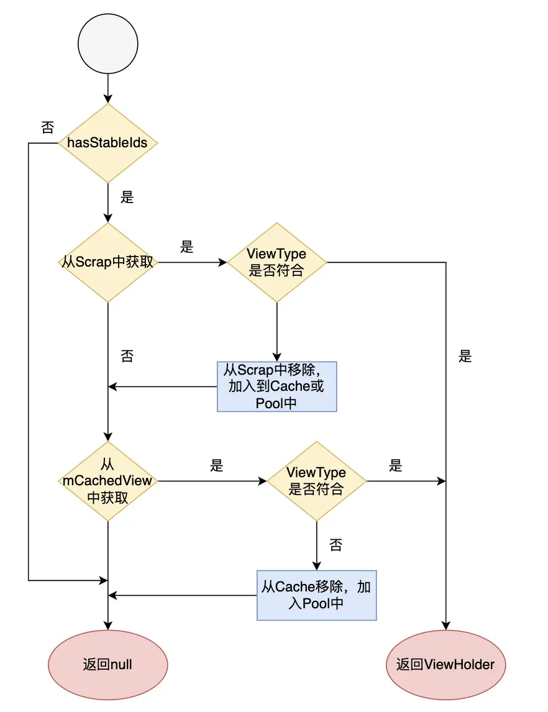
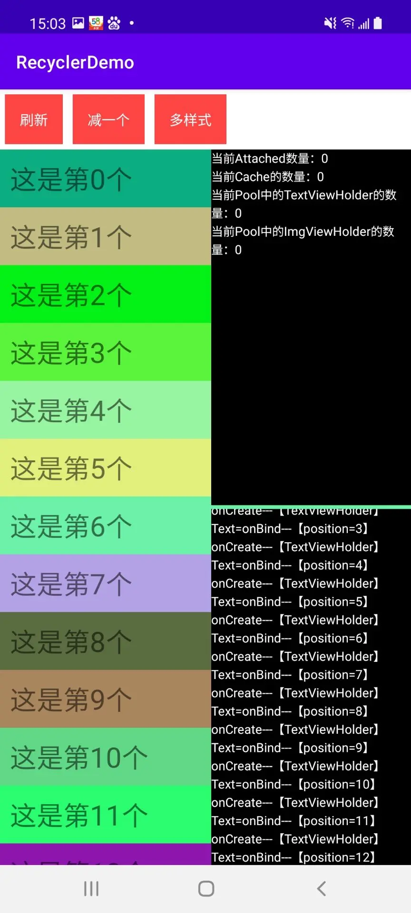
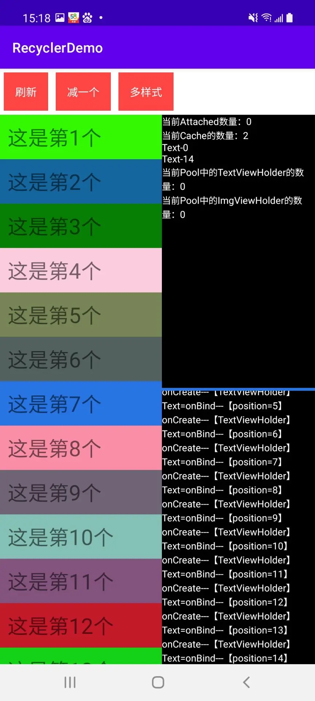
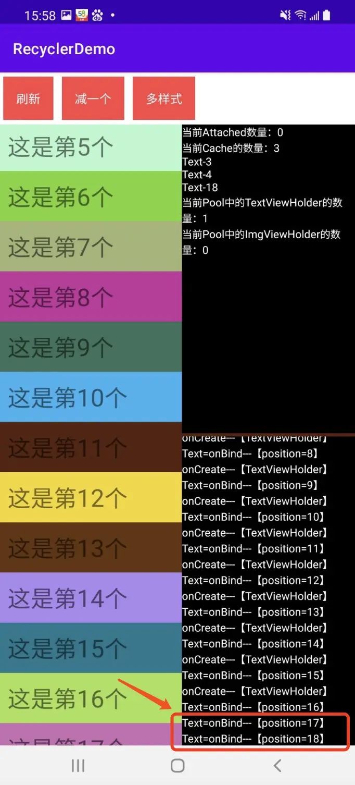

# 前言
	- 原生列表视图RecyclerView，最重要的亮点是其巧妙灵活的视图缓存策略，使其在渲染性能上体现出明显优势，这篇文章从源码的角度深入理解缓存机制以及和ListView相比较，优势体现在何处
- # 缓存机制
	- 首先使用时涉及几个核心类，LayoutManager、Adapter、ViewHolder、Recycler之间的关系，如何产生的关联
	  分析RecyclerView的onMeasure和onLayout方法，RecyclerView的绘制交给了LayoutManager。以LinearLayoutManager为例
		- ```
		  View next(RecyclerView.Recycler recycler) {
		              if (mScrapList != null) {
		                  return nextViewFromScrapList();
		              }
		              final View view = recycler.getViewForPosition(mCurrentPosition);
		              mCurrentPosition += mItemDirection;
		              return view;
		          }
		  ```
	- 核心方法执行路径：LinearLayoutManager.next方法 => recycleView.getViewForPosition=> 最终调用位置：tryGetViewHolderForPositionByDeadline
	- 通过分析源码可知，从两个维度分析得到结论：四级缓存，四次尝试
	  mAttachScrap：一级缓存，缓存屏幕内ViewHolder、mChangedScrap缓存变更ViewHolder
	  mCacheView：  二级缓存，可以理解为即将进入屏幕内的缓存，从mCacheView取用的holder不需要再次bind，默认缓存数量是2，验证时数量为3
	  mViewCacheExtension ：三级缓存，自定义缓存
	  mRecyclePool ：四级缓存，缓存复用需要重新bind，RecycleView 特性。和ListView不同的地方。支持多个RecyclerView之间复用ViewHolder
		- {:height 1172, :width 716}
- ## 四次尝试
  collapsed:: true
	- 第一次尝试:核心方法getScrapOrHiddenOrCachedHolderForPosition方法来获取ViewHolder，并检验holder的有效性，如果无效，则从mAttachedScrap中移除，并加入到mCacheViews或者Pool中，并且将holder至null，走下一级缓存判断
		- ⚠️：没有获取type
			- 
	- 第二次尝试
		- 和第一次整体流程差不多，核心方法getScrapOrCachedViewForId，重点：内部调用了mAdapter.getItemViewType(offsetPosition)，多了对id和type的校验
		- 
	- 第三次尝试，开发者可自定制的缓存，源码未做实现
		- ```
		  public abstract static class ViewCacheExtension {
		      public abstract View getViewForPositionAndType(Recycler recycler, int position, int type);
		  }
		  ```
	- 第四次尝试，对应于Pool，和ListView不同的地方，RecyclerView提供了这种缓存形式，支持多个RecyclerView之间复用View，也就是说通过自定义Pool我们甚至可以实现整个应用内的RecyclerView的View的复用
- # Demo验证时机
  collapsed:: true
	- 1.反射获取RecyclerView的成员变量mRecycler并获取Recycler的成员变量，设置OnLayout和OnScroll监听
	  collapsed:: true
		- ```
		  Field mRecycler =
		                      Class.forName("androidx.recyclerview.widget.RecyclerView").getDeclaredField("mRecycler");
		              mRecycler.setAccessible(true);
		              RecyclerView.Recycler recyclerInstance = (RecyclerView.Recycler) mRecycler.get(rcy);
		  
		              Class<?> recyclerClass = Class.forName(mRecycler.getType().getName());
		              Field mViewCacheMax = recyclerClass.getDeclaredField("mViewCacheMax");
		              Field mAttachedScrap = recyclerClass.getDeclaredField("mAttachedScrap");
		              Field mChangedScrap = recyclerClass.getDeclaredField("mChangedScrap");
		              Field mCachedViews = recyclerClass.getDeclaredField("mCachedViews");
		              Field mRecyclerPool = recyclerClass.getDeclaredField("mRecyclerPool");
		              mViewCacheMax.setAccessible(true);
		              mAttachedScrap.setAccessible(true);
		              mChangedScrap.setAccessible(true);
		              mCachedViews.setAccessible(true);
		              mRecyclerPool.setAccessible(true);
		  
		              int mViewCacheSize = (int) mViewCacheMax.get(recyclerInstance);
		              ArrayListWrapper mAttached =
		                      (ArrayListWrapper<RecyclerView.ViewHolder>) mAttachedScrap.get(recyclerInstance);
		              ArrayList<RecyclerView.ViewHolder> mChanged =
		                      (ArrayList<RecyclerView.ViewHolder>) mChangedScrap.get(recyclerInstance);
		              ArrayListWrapper<RecyclerView.ViewHolder> mCached =
		                      (ArrayListWrapper<RecyclerView.ViewHolder>) mCachedViews.get(recyclerInstance);
		              RecyclerView.RecycledViewPool recycledViewPool =
		                      (RecyclerView.RecycledViewPool) mRecyclerPool.get(recyclerInstance);
		  ```
	- 2.在adapter的onCreateViewHolder和onBindViewHolder分别输出日志
		- 2.1）首次运行，demo截图：
		  collapsed:: true
			- 
			- 所有的item都执行了onCreateViewHolder和onBindViewHolder，各项缓存为0
		- 2.1）向上滑动一个item position = 0的位置滑出屏幕，如图：即将滑入屏幕的position = 14的位置，创建并放进mCachedViews中，而position = 0进入缓存mCachedViews中
		  collapsed:: true
			- 
		- 2.2）position = 0的位置再次划入屏幕时，从mCachedViews缓存中获取ViewHolder，没有执行onCreateViewHolder和onBindViewHolder方法
		  collapsed:: true
			- 
		- 那么分析下为何不执行再次绑定方法，分析源码，找到核心校验逻辑：
		- 当缓存的ViewHolder和所需要的position相同的并且有效才可以复用，在执行bind校验时是绑定状态。因此不需要重新bind
		  collapsed:: true
			- ```
			  final int cacheSize = mCachedViews.size();
			              for (int i = 0; i < cacheSize; i++) {
			                  final ViewHolder holder = mCachedViews.get(i);
			                  // invalid view holders may be in cache if adapter has stable ids as they can be
			                  // retrieved via getScrapOrCachedViewForId
			                  if (!holder.isInvalid() && holder.getLayoutPosition() == position
			                          && !holder.isAttachedToTransitionOverlay()) {
			                      if (!dryRun) {
			                          mCachedViews.remove(i);
			                      }
			                      if (DEBUG) {
			                          Log.d(TAG, "getScrapOrHiddenOrCachedHolderForPosition(" + position
			                                  + ") found match in cache: " + holder);
			                      }
			                      return holder;
			                  }
			              }
			  ```
		- 2.3）向上快速滑动，观察到只执行了onBindViewHolder方法，未执行onCreateViewHolder
		  collapsed:: true
			- 
		- 分析源码确认绑定时机：当未执行过绑定时，需要更新，失效时再次执行绑定
		  collapsed:: true
			- ```
			  (!holder.isBound() || holder.needsUpdate() || holder.isInvalid()) {
			                  if (DEBUG && holder.isRemoved()) {
			                      throw new IllegalStateException("Removed holder should be bound and it should"
			                              + " come here only in pre-layout. Holder: " + holder
			                              + exceptionLabel());
			                  }
			                  final int offsetPosition = mAdapterHelper.findPositionOffset(position);
			                  bound = tryBindViewHolderByDeadline(holder, offsetPosition, position, deadlineNs);
			              }
			  ```
		- 而此时的ViewHolder是从RecycledViewPool中获取的，而获取之后进行了标识位重置，因此再次执行bind方法符合预期。
		  collapsed:: true
			- ```
			  holder = getRecycledViewPool().getRecycledView(type);
			                      if (holder != null) {
			                          holder.resetInternal();
			                          if (FORCE_INVALIDATE_DISPLAY_LIST) {
			                              invalidateDisplayListInt(holder);
			                          }
			                      }
			  ```
		- 那么什么时候，会将holder缓存到RecycledViewPool中，当需要缓存的数量大于等于mViewCacheMax时，最初被加入mCachedViews的item会被加入到RecycledViewPool中
			- ```
			  if (cachedViewSize >= mViewCacheMax && cachedViewSize > 0) {
			                          recycleCachedViewAt(0);
			                          cachedViewSize--;
			                      }
			  ```
- # RecyclerView局部刷新
	- 以notifyItemChanged(1)为例，验证刷新之后执行的动作：最终会调用requestLayout()，使整个RecyclerView重新绘制，过程为：onMeasure()-->onLayout()-->onDraw()
	- onLayout 方法执行关键步骤： dispatchLayoutStep1() ：预处理，记录各项状态数值。此时，修改了需要刷新的ViewHolder的cmd状态机标志位为ViewHolder.FLAG_UPDATE
	- dispatchLayoutStep2()：真正测量布局大小，位置，核心函数为layoutChildren()，fill方法-> 执行layoutChunk->recycler.getViewForPosition，
	- 屏幕内无需刷新的ViewHolder缓存到mAttachScrap列表
	- 而需要刷新的ViewHolder缓存到mChangedScrap，
	- 当调用到tryGetViewHolderForPositionByDeadline时，从mAttachScrap取出的ViewHolder无需再次bind，从mChangedScrap取出的ViewHolder执行bind方法，使得bindview只调用一次
- # 对比listView
  collapsed:: true
	- 两级缓存
		- 负责缓存管理类是RecycleBin
		- mActiveViews：缓存的是View而非ViewHolder，mActiveViews类比于mAttachedScrap，快速重用屏幕内View，无需createView和bindView
		- mScrapViews:  类比于mCachedViews ，mReyclerViewPool缓存的是屏幕外的View，mCachedViews通过对应position精准获取ViewHolder，数据源不变，无需再次bind， mScrapViews中获取的View每次都调用getView方法，因此需要重新bindView
		  collapsed:: true
			- ```
			  final View scrapView = mRecycler.getScrapView(position);
			          final View child = mAdapter.getView(position, scrapView, this);
			          if (scrapView != null) {
			              if (child != scrapView) {
			                  // Failed to re-bind the data, return scrap to the heap.
			                  mRecycler.addScrapView(scrapView, position);
			              } else if (child.isTemporarilyDetached()) {
			                  outMetadata[0] = true;
			  
			                  // Finish the temporary detach started in addScrapView().
			                  child.dispatchFinishTemporaryDetach();
			              }
			          }
			  ```
	- 缓存区别
		- ListView中通过pos获取的是view，即pos-->view；
		  RecyclerView中通过pos获取的是ViewHolder，即pos --> (view，viewHolder，flag)
	- 刷新区别
		- ListView是将所有的mActiveViews都移入了二级缓存mScrapViews，都需要重新bind，而RecyclerView是通过修改ViewHolder标志位，调用getViewForPosition通过识别标志判断是否重新bindView