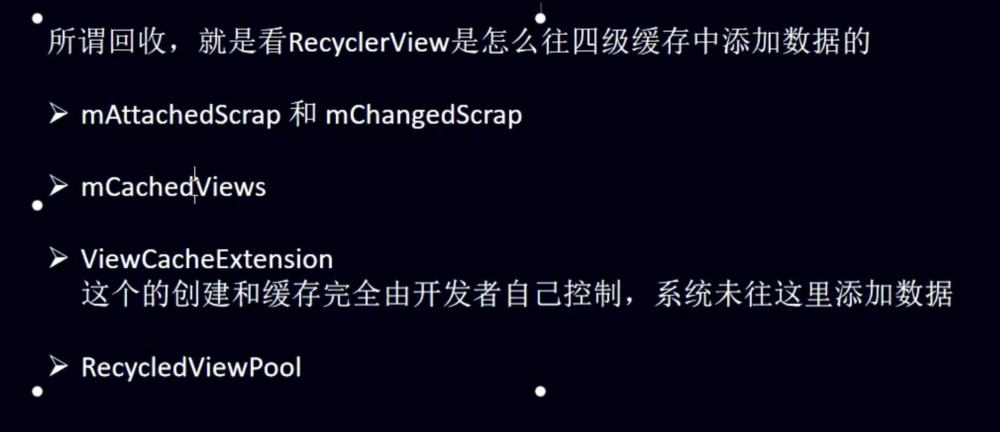
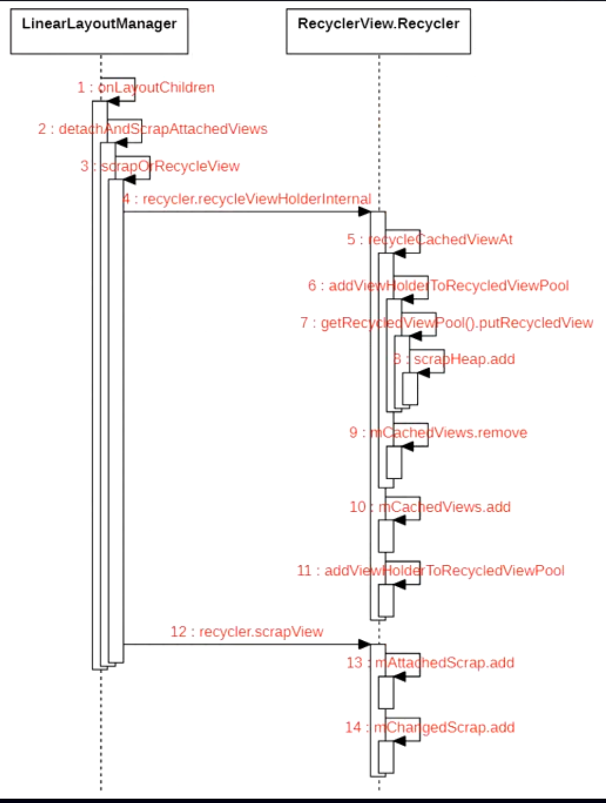

# 回收的目的？
collapsed:: true
	- 
- ## 情形1、滑动刷新布局的时候，在LinearLayoutManager onLayoutChildren中,
	- ## 调用连
		- onLayoutChildren
		- detachAndScrapAttachedViews
		- scrapOrRecycleView
			- [[recycleViewHolderInternal]]--处理 CacheView和RecyclerViewPool缓存的
			- [[recycler.scrapView(view)]] --处理mAttachedScrap 和 mChangedScrap
			- 自定义缓存 系统不管处理
	- # 时序图
	  collapsed:: true
		- 
		  id:: 64cf63b5-9ea0-4187-99d4-b0c28ffa13d8